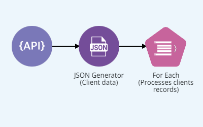
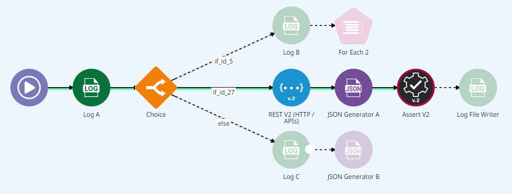
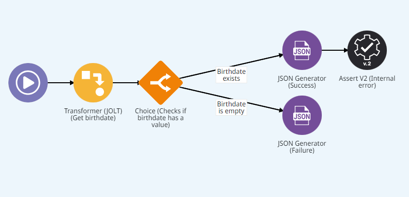
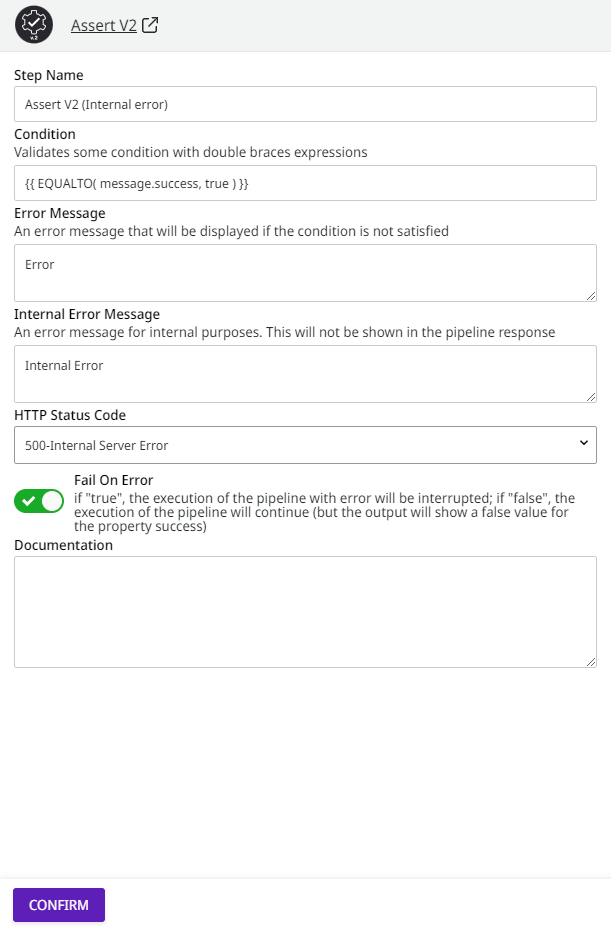
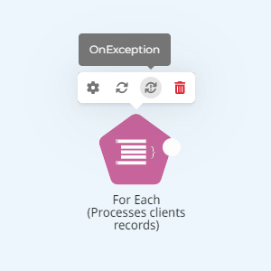
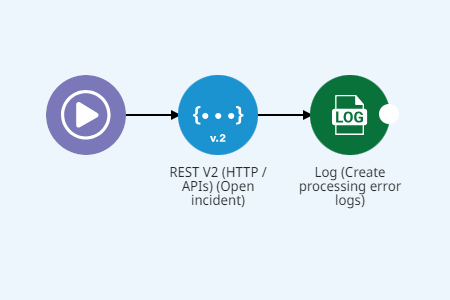

# Subpipelines


To access the subpipelines and use the features presented in this article, you need the permission PIPELINE:CREATE. Learn more in the[ documentation about Roles](https://docs.digibee.com/documentation/administration/new-access-control/access-control-roles).


Subpipelines are subflows of the pipeline that are connected and triggered by a component of the main flow, for example, [**For Each**](../../components/logic/for-each/).

Imagine a process called "Validation of Client Data". This process receives client data through the REST endpoint and then verifies that each client record contains the required data.

To iterate through the collection of records, we'll use the **For Each (Processes clients records)** component.

<figure><figcaption></figcaption></figure>

Each time a component that can iterate through collections is added to a pipeline, 2 subpipelines are created: **OnProcess** and **OnException**.

## **OnProcess** <a href="#onprocess" id="onprocess"></a>

This subpipeline implements the subflow that processes each element in the collection. The **OnProcess** can be accessed from the component's menu:

<figure><figcaption></figcaption></figure>

In the case of the "Validation of Client Data" process, the **OnProcess** subpipeline handles all the records of the clients collection individually and checks whether the "Date of birth" attribute is filled in each of them:

<figure><figcaption></figcaption></figure>

At the end of each execution of the **onProcess** subpipeline, a success attribute is returned indicating whether the execution succeeded or failed. By default, this attribute is returned with a value "false". Thus, you must explicitly indicate when the execution went as expected.

In the "Validation of Client Data" process, the following success message is returned by the **JSON Generator (Success)** component when the "Date of birth" attribute is filled in:

```
{"success": true}
```

If the "Date of birth" attribute is empty, the **JSON Generator (Failure)** component returns the attribute with the value `"false"`:

```
{"success": false}
```

In this case, an exception is generated via the **Assert (Internal Error)** component:

<figure><figcaption></figcaption></figure>

The **Fail On Error** attribute indicates that execution of the pipeline flow will be interrupted and an exception will be thrown if the Assert component condition is not validated.


If the exception is thrown by a component of a subpipeline, the execution of the **OnException** subpipeline is started. On the other hand, if the exception is thrown by a component in the main flow, the error causes the execution to stop.


## **OnException** <a href="#onexception" id="onexception"></a>

This subpipeline implements the flow that handles an exception to the execution of the **OnProcess** subpipeline. The **OnException** can be accessed from the component's menu:

<figure><figcaption></figcaption></figure>

When the **OnException** is executed in the “Validation of Client Data” process, a request is made to a REST endpoint that records the incident and generates an error message in the [Pipeline logs](../../monitor/pipeline-logs.md) page.

<figure><figcaption></figcaption></figure>


The use of **OnException** is optional, but strongly recommended. Several Digibee Integration Platform components support the **Fail On Error** attribute and allow error handling and recovery strategies to be implemented through **OnException**, making the pipeline much more robust and resilient.


To learn more, read the [article Pipeline](./).
