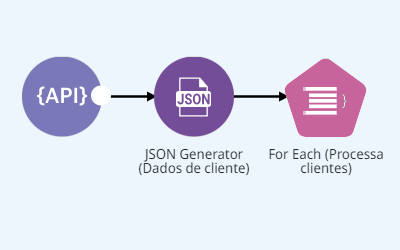
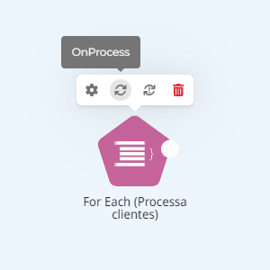
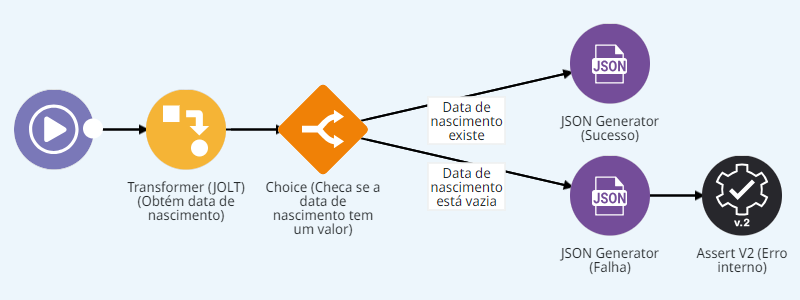
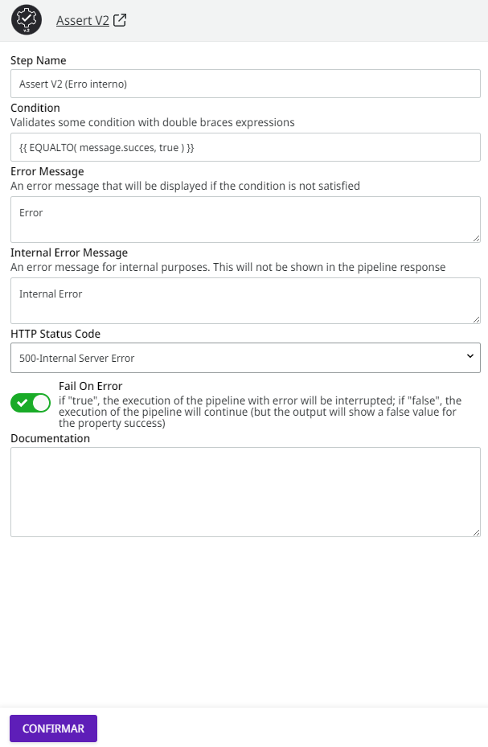
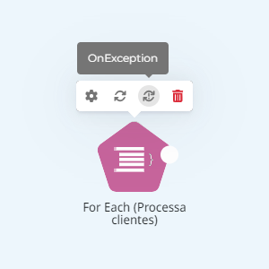
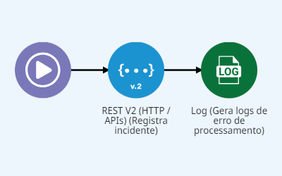

# Subpipelines


Para acessar os _subpipelines_ e usar as funcionalidades presentes nesse artigo, você precisa ter a permissão PIPELINE:CREATE. Aprenda mais na[ documentação sobre Papéis](https://docs.digibee.com/documentation/v/pt-br/administration/new-access-control/papeis-do-controle-de-acesso).


_Subpipelines_ são subfluxos do _pipeline_ necessariamente vinculados e disparados por um componente do fluxo principal, por exemplo, o [**For Each**](../../components/logic/for-each/).

Vamos imaginar um processo chamado “Validação de Dados de Cliente”. Esse processo obtém os dados dos clientes através do _endpoint_ REST e então verifica se cada registro de cliente possui os dados necessários.

Para iterar pela coleção de registros, usaremos o componente **For Each (Processa clientes)**.

<figure><figcaption></figcaption></figure>

Toda vez que um componente com capacidade de iterar por coleções é adicionado a um _pipeline_, dois _subpipelines_ são criados: **OnProcess** e **OnException**.

### **OnProcess** <a href="#onprocess" id="onprocess"></a>

Este _subpipeline_ implementa o subfluxo que processa cada item da coleção. Ele tem seu próprio canvas, que pode ser acessado pelo menu do componente:

<figure><figcaption></figcaption></figure>

No caso do processo “Validação de Dados de Cliente”, o _subpipeline_ **OnProcess** trata todos os registros da coleção de clientes individualmente e verifica se o atributo “Data de Nascimento” está preenchido em cada um deles:

<figure><figcaption></figcaption></figure>

Ao término de cada execução do _subpipeline_ **OnProcess**, um atributo _success_ é retornado, indicando se houve sucesso ou falha na execução. Por padrão, esse atributo é retornado com valor `“false”`. Assim, você precisa informar explicitamente quando a execução ocorrer conforme esperado.

No processo “Validação de Dados de Cliente”, a seguinte resposta de sucesso será retornada pelo componente **JSON Generator (Sucesso)** quando o atributo “Data de Nascimento” estiver preenchido:

```
{"success": true}
```

Caso o atributo “Data de Nascimento” esteja vazio, o componente **JSON Generator (Falha)** retorna o atributo com valor `“false”`:

```
{"success": false}
```

Nesse caso, é gerada uma exceção através do componente **Assert (Erro Interno)**:

<figure><figcaption></figcaption></figure>

O atributo **Fail On Error** indica que a execução do fluxo do _pipeline_ será interrompida e será lançada uma exceção caso a condição do componente _Assert_ não for validada.


Quando a exceção é gerada por um componente de um _subpipeline_, a execução do _subpipeline_ **OnException** é iniciada. Por outro lado, se a exceção decorrer de um componente do fluxo principal, a execução do _pipeline_ será interrompida por erro.


### **OnException** <a href="#onexception" id="onexception"></a>

Este _subpipeline_ implementa o fluxo que trata uma exceção na execução do _subpipeline_ **OnProcess**. Ele tem seu próprio canvas, que pode ser acessado pelo menu do componente:

<figure><figcaption></figcaption></figure>

Quando o **OnException** é executado no processo “Validação de Dados de Cliente”, uma chamada é feita a um _endpoint_ REST, registrando o incidente e gerando uma mensagem de erro na página [_Pipeline logs_](../../monitor/pipeline-logs.md).

<figure><figcaption></figcaption></figure>


A utilização do **OnException** é opcional, no entanto, é uma prática fortemente recomendada. Diversos componentes da Digibee Integration Platform suportam o atributo **Fail On Error** e permitem que estratégias de tratamento de erro e recuperação sejam implementadas através do **OnException**, tornando o _pipeline_ muito mais robusto e resiliente.


Para saber mais, leia o [artigo ](https://docs.digibee.com/documentation/v/pt-br/build/pipelines)[_Pipeline_](https://docs.digibee.com/documentation/v/pt-br/build/pipelines).
