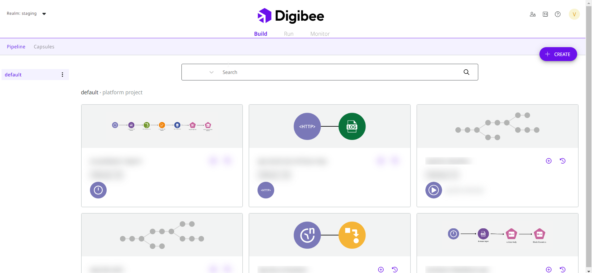
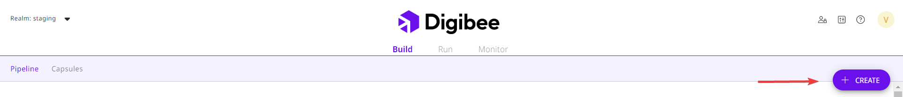
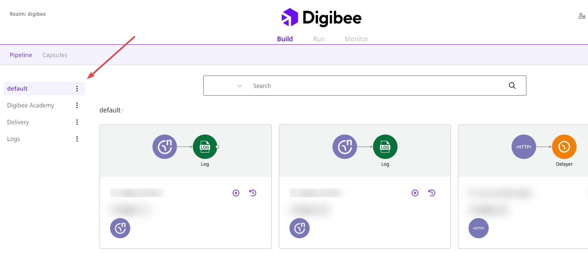
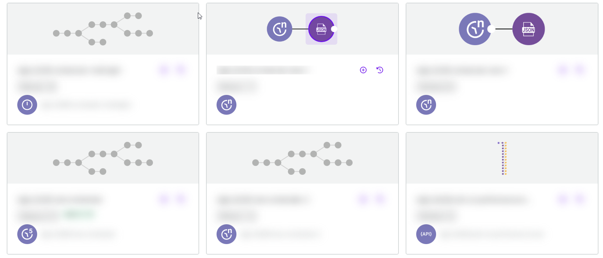

# Visão geral de Build

Na página de Build, você pode criar e gerenciar _pipelines_ e projetos.&#x20;

## Build layout

Ao selecionar Build, o layout da página aparece como mostrado na figura abaixo. \
\
Nesta página, você pode ver o botão **CRIAR** no canto superior direito, a lista de **Projetos** no canto esquerdo e a lista de _pipelines_ na parte inferior. No canto superior esquerdo estão _**Pipeline**_ e **Cápsulas**. \
\
Ao selecionar _Pipeline,_ os projetos e _pipelines_ criados são exibidos. No meio da tela você encontrará todos os _pipelines_ criados. \
\
Ao selecionar Cápsulas, as Cápsulas criadas também serão exibidas. No canto direito você encontrará o botão **CRIAR**.&#x20;

Nas próximas seções, você aprenderá mais sobre cada ferramenta.

<figure><figcaption></figcaption></figure>

## Botão CRIAR

Você pode clicar no botão **CRIAR** no canto superior direito da tela para criar um novo pipeline ou projeto. Você também pode encontrar o botão CRIAR na tela Run.

<figure><figcaption></figcaption></figure>

### Como criar um pipeline

Para criar um _pipeline_ em nosso Canvas:

1. Clique no botão CRIAR no canto superior direito da tela. &#x20;
2. Selecione **Pipeline.**

Para saber mais sobre o Canvas, leia a nossa [documentação](https://docs.digibee.com/documentation/v/pt-br/build/new-canvas-beta-restricted).&#x20;

<figure><figcaption></figcaption></figure>

### Como criar um projeto

Para criar um novo projeto, siga os seguintes passos:

1. Selecione **Projeto**. Projetos são pastas onde você pode armazenar seus pipelines.&#x20;
2. Insira o nome e a descrição do projeto no formulário lateral.
3. Atribua o projeto a usuários específicos.
4. Após selecionar e preencher os campos, clique em **Salvar** e seu projeto estará criado.

<figure><figcaption></figcaption></figure>


Se você marcar **Selecionar todos os usuários**, todos os usuários em seu domínio poderão acessar o novo projeto e, portanto, os pipelines nele.


Se você deseja que apenas determinados grupos tenham acesso ao seu projeto, clique em **Grupo associados** e selecione os grupos aos quais deseja conceder acesso ao seu projeto.

## Projetos

No canto esquerdo da tela Build, você verá uma lista de projetos aos quais você tem acesso e dentro de cada projeto você encontrará os pipelines que foram criados. [Para saber mais sobre projetos e como eles funcionam, leia este artigo sobre Projetos.](https://docs.digibee.com/documentation/v/pt-br/build/projetos)

<figure><figcaption></figcaption></figure>

### Lista de pipelines

Quando você clica em um projeto, os pipelines desse projeto são exibidos em ordem alfabética. Você verá o nome e a versão de cada pipeline, bem como botões para criar uma nova versão do pipeline e visualizar seu histórico de construção.&#x20;

[Você pode aprender mais sobre o histórico de versões de pipelines neste artigo.](https://docs.digibee.com/documentation/v/pt-br/build/pipelines/historico-de-versoes-de-pipelines)

<figure><figcaption></figcaption></figure>

## Cápsulas

Perto de Pipeline no lado esquerdo, temos Cápsulas. É funcionam como se os componentes disponíveis na plataforma fossem átomos e as cápsulas fossem moléculas que agrupam os átomos em tarefas mais complexas para resolver um determinado problema. [Para saber mais sobre isso, leia nosso artigo sobre Cápsulas](https://docs.digibee.com/documentation/v/pt-br/build/capsulas).&#x20;

<figure><figcaption></figcaption></figure>

