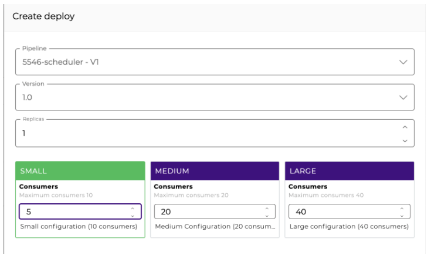

# DB V2

**DB V2** executes Select, Insert, Delete and Update operations and also makes Procedures calls, returning the values to a JSON structure. To see all the databases supported by this component, read the [Supported databases documentation](https://docs.digibee.com/documentation/platform/supported-databases).

## Parameters

Take a look at the configuration parameters of the component. Parameters supported by [Double Braces expressions](../../../build/double-braces/) are marked with `(DB)`.

<table data-full-width="true"><thead><tr><th width="147">Parameter</th><th width="359">Description</th><th width="140.75">Default value</th><th>Data type</th></tr></thead><tbody><tr><td><strong>Operation</strong></td><td>Operation to be performed (Query or Procedure).</td><td>Query</td><td>String</td></tr><tr><td><strong>Account</strong></td><td>Account to be used by the component to connect. Supported accounts: Basic and Kerberos.</td><td>N/A</td><td>String</td></tr><tr><td><strong>Database URL</strong></td><td>Define a Database URL.</td><td>jdbc:mysql://35.223.175.97/db-training</td><td>String</td></tr><tr><td><strong>SQL Statement</strong> <code>(DB)</code></td><td>Accepts any SQL statement supported by the underlying database. Double braces expressions are allowed. E.g.: {{ message.id }}.</td><td>SELECT DATE_FORMAT(SYSDATE(), '%Y-%m-%d') as DATA</td><td>String</td></tr><tr><td><strong>Batch</strong></td><td>If the option is enabled, batch processing of some statements is performed.</td><td>False</td><td>Boolean</td></tr><tr><td><strong>Rollback On Error</strong></td><td>If this option is enabled, the commits of operations are performed only if all of them are successful. Otherwise, a rollback of all batch operations is performed.</td><td>False</td><td>Boolean</td></tr><tr><td><strong>Batch Items</strong></td><td>If <strong>Batch</strong> is enabled, specify the batch items.</td><td>N/A</td><td>String</td></tr><tr><td><strong>Fail On Error</strong></td><td>If the option is enabled, the execution of the pipeline with error will be stopped; otherwise, the pipeline execution continues, and the result will show the value false for the "success" property.</td><td>False</td><td>Boolean</td></tr><tr><td><strong>Blob As File</strong></td><td>If the option is enabled, all the BLOB parameters for Query or Procedure operations are expected to receive the file path.</td><td>N/A</td><td>Boolean</td></tr><tr><td><strong>Clob As File</strong></td><td>If the option is enabled, all the CLOB parameters for Query or Procedure operations are expected to receive the file path.</td><td>False</td><td>Boolean</td></tr><tr><td><strong>Charset</strong></td><td>Name of the character code for the file reading (standard UTF-8).</td><td>UTF-8</td><td>String</td></tr><tr><td><strong>Custom Connection Properties</strong></td><td>Specific connection and database properties defined by the user.</td><td>N/A</td><td>String</td></tr><tr><td><strong>Type Properties</strong></td><td>Click on the <strong>Add</strong> button to activate the following additional parameters: <strong>Key</strong>, <strong>Type</strong>, <strong>Out Parameter Name</strong>, and <strong>Parameter Type</strong>.</td><td>N/A</td><td>Options of Type Properties</td></tr><tr><td><strong>Key</strong></td><td>Refers to a property declared through Double Braces expression in the SQL Statement in case of Procedures and INSERT Queries that handles CLOB/BLOB data types. See more about this parameter in the section below.</td><td>N/A</td><td>Integer</td></tr><tr><td><strong>Type</strong></td><td>The data type of the property that is declared in the SQL Statement.</td><td>VARCHAR</td><td>String</td></tr><tr><td><strong>Out Parameter Name</strong></td><td>Defines the name of the Out Parameter in case of an OUT or INOUT Parameter Type.</td><td>N/A</td><td>String</td></tr><tr><td><strong>Parameter Type</strong></td><td><p>Defines the usage type of the property declared in the SQL Statement.<br></p><p>The options are IN, OUT or INOUT.</p></td><td>IN</td><td>String</td></tr><tr><td><strong>Keep Connection</strong></td><td>If the option is enabled, the database connections will be kept for no more than 30 minutes; otherwise, they'll be kept for 5 minutes.</td><td>True</td><td>Boolean</td></tr><tr><td><strong>Advanced</strong></td><td>Allows to define a query to be executed before the query defined in SQL Statement to ensure that the connection to the database is established and errors are avoided.</td><td>False</td><td>Boolean</td></tr><tr><td><strong>Pool Size By Actual Consumers</strong></td><td>If the option is enabled, the number of pooled connections is equal to the number of consumers configured in the pipeline deployment. If the option is disabled, the pool size is determined by the pipeline deployment size, regardless of the number of consumers.</td><td>False</td><td>Boolean</td></tr><tr><td><strong>Exclusive DB Pool</strong></td><td>If the option is enabled, a new non-shared pool is always created for the sole use by this component. If the option is disabled, a pool might be shared between components if the URL is the same.</td><td>False</td><td>Boolean</td></tr><tr><td><strong>Output Column From Label</strong></td><td>For some databases, if your Select uses an alias, you must enable this flag so that the column name is displayed exactly like the alias.</td><td>False</td><td>Boolean</td></tr><tr><td><strong>Connection Test Query</strong></td><td>SQL statement to be used before each connection is established. This is an optional parameter and should be used with databases that do not provide reliable connection status information.</td><td>N/A</td><td>String</td></tr><tr><td><strong>Raw SQL Statement</strong> <code>(DB)</code></td><td>If the option is active, the SQL Statement parameter allows the use of dynamic queries through Double Braces statements. When using this functionality, you must ensure that the pipeline has security measures against unwanted SQL statements (SQL Injection). See more about this parameter in the <a href="./#raw-sql-statement">section</a> below.</td><td>False</td><td>Boolean</td></tr><tr><td><strong>Use Dynamic Account</strong></td><td>When the option is active, the component will use the account dynamically. When deactivated, it will use the account statically.</td><td>False</td><td>Boolean</td></tr><tr><td><strong>Account Name</strong></td><td>Account name to be set. The name of the account is generated dynamically via the Store Account component.</td><td>N/A</td><td>String</td></tr><tr><td><strong>Scoped</strong></td><td>When the option is active, the stored account is isolated from other sub-processes. In that case, sub-processes will see their own version of the stored account data. To know more about the <strong>Scoped</strong> feature, check out the <a href="https://docs.digibee.com/documentation/platform/pipeline-engine/support-dynamic-accounts-restricted-beta">Dynamic Accounts documentation</a>.</td><td>False</td><td>Boolean</td></tr></tbody></table>



**Important information:**

* When activating the use of credentials, the connection pool is created each time the pipeline is executed and closed when the execution is complete. Connection pools will continue to be communicated between bank connectors if the same setting is applied between them.
* Currently, the **Use Dynamic Account**, **Account Name** and **Scoped** parameters can only be used in Pipeline Engine v2 and are only available in the Restricted Beta phase. To learn more about it, [read the article Beta program.](https://docs.digibee.com/documentation/general/beta-program)
* In situations where an Apache Hive database is used, the Updatecount data may be unavailable due to a system behavior. This information will be available only if the updated row control is enabled on the Apache Hive server. [To learn more about Apache Hive support for the Digibee Integration Platform, refer to Supported databases](https://docs.digibee.com/documentation/platform/supported-databases#apache-hive).


## Parameters additional information

### Key

The **Key** parameter refers to a property declared through Double Braces expression in the SQL Statement in case of Procedures and INSERT Queries that handles CLOB/BLOB data types. Every Double Braces declaration has an index and it must be used to set this parameter.

Example:

`INSERT INTO TABLE (MY_CLOB, MY_BLOB, MY_STRING) VALUES ({{ message.clob }}, {{ message.blob }}, {{ message.string }})`

In this case, we have index 0 for `{{ message.clob }}`, 1 for `{{ message.blob }}` and 2 for `{{ message.string }}` .

### Raw SQL Statement

To bring more flexibility when using **DB V2**, we can activate the **Raw SQL Statement** option, previously configure a query, and reference it through Double Braces in the SQL Statement parameter as follows:

#### **Query previously defined via Template Transformer**

<figure><figcaption></figcaption></figure>

#### **Raw SQL Statement activation**

<figure><figcaption></figcaption></figure>

#### **Query referenced in SQL Statement parameter**

<figure><figcaption></figcaption></figure>


**Important:** as a good practice, we strongly recommend that, when activating the **Raw SQL Statement** option, the queries are previously defined using the [Template Transformer](https://docs.digibee.com/documentation/components/tools/template-transformer) component. The use of **Template Transformer** allows validating parameters through FreeMarker technology and also parameter declaration through Double Braces. These parameters are not resolved by **Template Transformer** but by the component **DB V2**, which by default configures and validates the parameters of the SQL statement beforehand (PreparedStatement). By applying these security measures, you reduce the risks of attacks like SQL Injection.


In the image below, we have an example of recommended use of the component on the left (with the Double Braces in the WHERE clause, highlighted in green); and another example of non-recommended use on the right (with the FreeMarker in the WHERE clause, highlighted in red), which may pose risks to pipeline safety:

<figure><figcaption></figcaption></figure>

## DB V2 in Action <a href="#technology" id="technology"></a>

### Batch mode <a href="#batch-mode" id="batch-mode"></a>

When it's necessary to make a batch processing of some instructions, you can make calls in batch mode in the queries.

\
**Example**

Let's say you need to inform an array of objects in the component, that will be used in the batch execution:

**Items**

```
[ { "name": "Mathews", "type":"A"}, 
{ "name": "Jules", "type":"A"}, 
{ "name": "Raphael", "type":"B"} ]
```

In the SQL instructions, you must inform it in the following way:

**SQL**

`INSERT INTO TABLE VALUES ( {{ item.name }}, {{ item.type }} )`

When you use Double Braces expressions \{{ item.name \}}, an iteration is made inside the array (informed in items) and a corresponding property is searched inside the object. In that case, the property is "name".

After the execution, 3 registers are inserted. The expected return is:

```
{ 
    "totalSucceeded":3, 
    "totalFailed":0 
}
```

If one of the executions fails, an object will be returned with the "error" property:

```
{ 
    "totalSucceeded":1, 
    "totalFailed":1 
}
```

If one of the executions fails, an object will be returned with the "errors" property:

```
{ 
    "totalSucceeded":1, 
    "totalFailed":1 
    "errors": ["error1", "error2"]
}
```


**Important:** the errors returned in the “errors” property vary according to the database driver. Some drivers don't return all the errors that occurred during the execution in batch mode.


### Rollback On Error <a href="#rollback-on-error" id="rollback-on-error"></a>

If this option is activated, the commits of the operations will be made only if all of them are successful. Otherwise, the rollback of all the batch operations will be made.

If the option is inactive, then the commit and the successful changes by commit will be made even if there's an error between the executions.


**Important:** for some databases, especially for Oracle, it's not possible to return the consolidated number of successful or unsuccessful executions.&#x20;


If an error occurs, an object containing all the errors will be returned (inside the "errors" property) and the consolidated with the -1 value will also be returned:

```
{ 
    "totalSucceeded":-1, 
    "totalFailed":-1, 
    "errors": ["erro1", "error2"], 
    "success": false
}
```

For other databases, as Firebird, the occurrence of errors isn't informed. Therefore, an object with no error can be returned even if there was a failure:

```
{ 
    "totalSucceeded":0, 
    "totalFailed":3
    "errors": ["error1", "error2"], 
    "success": false
}
```

For these error cases in Batch Mode, don't forget to check the "success" property. If it returns "false", it means at least one error occurred during the execution.

## Connection pool <a href="#h_898949fc70" id="h_898949fc70"></a>

By standard, we use a pool based on the configurations of the deployed pipeline. For example, if the pipeline is SMALL, then the pool size will be 10. For MEDIUM the size would be 20 and for LARGE it would be 40.

It's possible to manage the pool size by the deployment time as well. For that, it's necessary to enable the **Pool Size By Actual Consumers** property in the component. With it, what's manually configured in the deployment screen is used.

See in the image below the configuration of a SMALL pipeline with 5 consumers. If you want the pool of the database components (**DB V2** and **Stream DB V3**) to use this size, you'll have to enable the “Pool Size By Actual Consumers” property in every existing component:




**Important:** attention when manually configuring the pool size so there's no deadlock in concurrent calls to the same database.


Our pool is shared between the database components that access the same database inside the pipeline. If an exclusive pool for a determined component is necessary, enable the “Exclusive Pool” property.

## Technology

### Authentication via Kerberos

It's possible to make an authentication via Kerberos in database components. For that, all you have to do is:

* inform a KERBEROS-type account
* configure a Kerberos principal
* configure a keytab (that must be the base64 of the own keytab generated file)

## More usage scenarios with DB V2

See in the following documentation how to use DB V2 in different scenarios:


[db-v2-usage-scenarios.md](db-v2-usage-scenarios.md)


