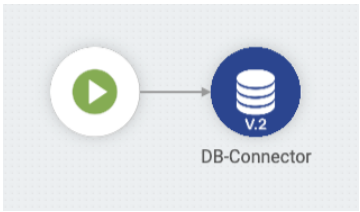
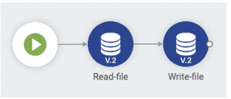

# DB V2 - cenários de uso

Dê uma olhada nos cenários de uso suportados:

### _**Cenário 1: Operação QUERY comando SELECT**_

Digamos que você tenha um banco de dados configurado e uma tabela com dados e que você queira invocar um _**DB V2**_ com uma _query_ com o comando SELECT. Com isso, você terá acesso ao resultado da operação no _pipeline_ através de um JSON.

**Exemplo**



**1.** Crie um _pipeline_ e adicione um componente _**DB V2**_\
**2.** Abra as configurações do componente\
**3.** Selecione a operação QUERY\
**4.** Escolha uma _ACCOUNT_ para poder se autenticar no banco de dados\
**5.** Defina um _DATABASE URL_ (ex.: _jdbc:mysql://myserver/mydb_)\
**6.** Defina um _SQL STATEMENT_  (ex.: _SELECT \* FROM CLIENTES_)\
**7.** Clique em CONFIRMAR para salvar as configurações do componente\
**8.** Conecte o _trigger_ ao _**DB V2**_\
**9.** Execute um teste no _pipeline_ (você pode utilizar o comando CTRL + ENTER)\
**10.** O resultado da _query_ será apresentado:

```
{
  "data": [
    {
      "uf": "SP",
      "codigo": 1,
      "cidade": "Osasco",
      "logradouro": "Rua Laranjeiras",
      "name": "João Bosco",
      "due_date": "2019-03-27",
      "email": "joao.bosco@digibee.com.br",
      "cep": "XXXXX-XXX"
    },
    {
      "uf": "SP",
      "codigo": 2,
      "cidade": "São Paulo",
      "logradouro": "Rua Jõao Bosco",
      "name": "Roberto Carlos",
      "due_date": "2019-03-27",
      "email": "roberto.carlos@digibee.com.br",
      "cep": "XXXXX-XXX"
    }
  ],
  "updateCount": 0,
  "rowCount": 2
}
```

&#x20;    \
O resultado da _query_ retorna um JSON com 3 propriedades em sua raiz: _data_, _updateCount_ e _rowCount_.

* **data:** vetor de objetos representando as linhas retornadas do banco de dados segundo a _query_ definida. Cada elemento desse vetor contém propriedades que representam as colunas definidas na operação SELECT. Se a declaração fosse "_SELECT name FROM CLIENTES_", haveria apenas uma propriedade em cada um dos objetos no vetor _data_.
* **updateCount:** indica quantas linhas da tabela foram afetadas pela _query_ executada. Nesse exemplo o valor seria zero - já que a operação foi SELECT, nenhuma tabela foi afetada.
* **rowCount:** indica quantas linhas foram retornadas pela _query_.

### _**Cenário 2: Operação QUERY comando UPDATE**_

Digamos que você tenha um banco de dados configurado e uma tabela com dados e que você queira invocar um _**DB V2**_ com uma _query_ com a operação UPDATE. Com isso, você terá acesso ao resultado desta operação no _pipeline_ através de um JSON.\
&#x20;        \
**Exemplo**

**1.** Crie um _pipeline_ e adicione um componente _**DB V2**_\
**2.** Abra as configurações do componente\
**3.** Selecione a operação QUERY\
**4.** Escolha uma _ACCOUNT_ para poder se autenticar no banco de dados\
**5.** Defina um _DATABASE URL_ (ex.: _jdbc:mysql://myserver/mydb_)\
**6.** Defina um _SQL STATEMENT_ (ex.: _UPDATE CLIENTES SET uf='SP' WHERE uf is null_)\
**7.** Clique em CONFIRMAR para salvar as configurações do componente\
**8.** Conecte o _trigger_ ao _**DB V2**_\
**9.** Execute um teste no _pipeline_ (você pode utilizar o comando CTRL + ENTER)\
**10.** O resultado da _query_ será apresentado:

```
{  
    "data": null,  
    "updateCount": 5,  
    "rowCount": 0
}
```

* **updateCount:** nesse exemplo, fica confirmada a alteração em 5 linhas da tabela.

### &#x20;_**Cenário 3: Operação QUERY comando DELETE**_

Digamos que você tenha um banco de dados configurado e uma tabela com dados e que você queira invocar um _**DB V2**_ com uma _query_ com a operação DELETE. Com isso, você terá acesso ao resultado desta operação no _pipeline_ através de um JSON.

**Exemplo**

**1.** Crie um _pipeline_ e adicione um componente _**DB V2**_\
**2.** Abra as configurações do componente\
**3.** Selecione a operação QUERY\
**4.** Escolha uma _ACCOUNT_ para poder se autenticar no banco de dados\
**5.** Defina um _DATABASE URL_ (ex.: _jdbc:mysql://myserver/mydb_)\
**6.** Defina um _SQL STATEMENT_  (ex.: _DELETE FROM CLIENTES WHERE codigo='111111'_)\
**7.** Clique em CONFIRMAR para salvar as configurações do componente\
**8.** Conecte o _trigger_ ao _**DB V2**_\
**9.** Execute um teste no _pipeline_ (você pode utilizar o comando CTRL + ENTER)\
**10.** O resultado da _query_ será apresentado:

```
{  
    "data": null,  
    "updateCount": 1,  
    "rowCount": 0
}
```

* **updateCount:** nesse exemplo, fica confirmado que 1 linha da tabela foi apagada.

### _**Cenário 4: Operação QUERY comando INSERT**_

Digamos que você tenha um banco de dados configurado e uma tabela com dados e que você queira invocar um _**DB V2**_ com uma _query_ com a operação INSERT. Com isso, você terá acesso ao resultado da operação no _pipeline_ através de um JSON.\
&#x20;   \
**Exemplo:**

**1.** Crie um _pipeline_ e adicione um componente _**DB V2**_

**2.** Abra as configurações do componente\
**3.** Selecione a operação QUERY\
**4.** Escolha uma _ACCOUNT_ para poder se autenticar no banco de dados\
**5.** Defina um _DATABASE URL_ (ex.: _jdbc:mysql://myserver/mydb_\
**6.** Defina um _SQL STATEMENT_ (ex.: _INSERT INTO CLIENTES (name, email) VALUES ('My Name', '_[_myname@email.com_](mailto:myname@email.com)_')_)\
**7.** Clique em CONFIRMAR para salvar as configurações do componente\
**8.** Conecte o _trigger_ ao _**DB V2**_\
**9.** Execute um teste no _pipeline_ (você pode utilizar o comando CTRL + ENTER)\
**10.** O resultado da _query_ será apresentado:

```
{  
    "data": null,  
    "updateCount": 1,  
    "rowCount": 0
}
```

* **updateCount:** nesse exemplo, fica confirmado que 1 linha foi criada na tabela.

### _**Cenário 5: Manter a conexão em drivers antigos ou com baixa confiabilidade**_

Digamos que você tenha um banco de dados incompatível com JDBC 4.0 ou que falhe em manter uma conexão confiável e que você queira invocar um _**DB V2**_ com uma _query_ qualquer, mas 20 minutos depois fazer a mesma chamada. Com isso, a conexão com o banco de dados não é perdida.\
&#x20;   &#x20;

A opção _ADVANCED > **CONNECTION TEST QUERY**_ permite definir uma _query_ que é executada antes da _query_ definida no SQL STATEMENT para garantir que a conexão foi estabelecida com o banco e evitar falhas.

Essa opção vai permitir que uma nova conexão seja aberta, caso haja falha no teste de conexão. Isso evitará problemas de conexões "presas" e _timeouts_ causados por _queries_ anteriores que receberam erro.

**IMPORTANTE:** essa opção deve ser considerada apenas para bancos de dados mais antigos (com versão de suporte ao jdbc < 4.0).

**1.** Crie um _pipeline_ e adicione um componente _**DB V2**_\
**2.** Abra as configurações do componente\
**3.** Selecione a operação QUERY\
**4.** Escolha uma _ACCOUNT_ para poder se autenticar no banco de dados\
**5.** Defina um _DATABASE URL_ (ex.: _jdbc:mysql://myserver/mydb_)\
**6.** Defina um _SQL STATEMENT_ (ex.: _INSERT INTO CLIENTES (name, email) VALUES ('My Name', '_[_myname@email.com_](mailto:myname@email.com)_')_)\
**7.** Conecte o _trigger_ ao _**DB V2**_\
**8.** Selecione a opção _ADVANCED_ (mais opções serão apresentadas)\
**9.** Defina uma _CONNECTION TEST QUERY_ (ex.: _SELECT version()_)\
**10.** Clique em CONFIRMAR para salvar as configurações do componente\
**11.** Execute um teste no _pipeline_ (você pode utilizar o comando CTRL + ENTER)\
**12.** O resultado da _query_ será apresentado

### _**Cenário 6: Interromper a execução do pipeline em caso de falha**_

Digamos que você tenha um banco de dados configurado e uma tabela com dados e que você queira invocar um _**DB V2**_ com uma QUERY ou PROCEDURE caso a operação falhe na interrupção da execução do _pipeline_.

A opção _FAIL ON ERROR_ permite que o _pipeline_ interrompa a sua execução em caso de falha na invocação do _**DB V2**_.

### _**Cenário 7: Acessar e escrever arquivos no contexto de banco de dados**_

Digamos que você tenha um banco de dados configurado e uma tabela com dados do tipo BLOB e/ou CLOB e que você queira invocar um _DB V2_ com uma QUERY ou PROCEDURE. Com isso, você consegue tanto escrever arquivos disponíveis no _pipeline_ quanto acessar arquivos valores de um campo BLOB e/ou CLOB do banco de dados.

As opções _BLOB AS FILE_ e _CLOB AS FILE_ permitem informar um caminho de arquivo para as operações com colunas do tipo BLOB e CLOB respectivamente - ou seja, invocar o comando INSERT e passar o caminho de um arquivo disponível no _pipeline_ fará com que esse arquivo seja escrito no banco.

Caso o comando seja SELECT, o conteúdo do BLOB/CLOB se torna um arquivo dentro do _pipeline_.

**Exemplo: passo 1 (ler arquivo)**

**1.** Crie um _pipeline_ e adicione um componente _**DB V2**_\
**2.** Abra as configurações do componente\
**3.** Defina o nome como 'Read-file'\
**4.** Selecione a operação QUERY\
**5.** Escolha uma _ACCOUNT_ para poder se autenticar no banco de dados\
**6.** Defina um _DATABASE URL_ (ex.: _jdbc:mysql://myserver/mydb_)\
**7.** Defina um _SQL STATEMENT_ (ex.: SELECT blob FROM CLIENTES WHERE id=78)\
**8.** Ative as opções BLOB AS FILE e/ou _CLOB AS FILE_ (caso a opção _CLOB AS FILE_ seja ativa, um novo campo _CHARSET_ será exibido para que seja configurado o _encoding_ do arquivo)\
**9.** Clique em CONFIRMAR para salvar as configurações do componente\
**10.** Conecte o _trigger_ ao _**DB V2**_ (Read-file)\
**11.** Execute um teste no _pipeline_ (você pode utilizar o comando CTRL + ENTER)\
**12.** O resultado da _query_ será apresentado:

```
{
  "data": [
    {
      "blob": "E4G17F.file",
      "clob": "H2K89G.file"
    }
  ],
  "updateCount": 0,
  "rowCount": 1
}
```

Um arquivo chamado 'E4G17F.file' e outro chamado 'H2K89G.file' foram gerados e disponibilizados no _pipeline_.

**Exemplo: passo 2 (escrever arquivo)**



\
**1.** Adicione um componente _**DB V2**_\
**2.** Abra as configurações do componente\
**3.** Defina o nome como 'Write-file'\
**4.** Selecione a operação QUERY\
**5.** Escolha uma _ACCOUNT_ para poder se autenticar no banco de dados\
**6.** Defina um _DATABASE URL_ (ex.: _jdbc:mysql://myserver/mydb_)\
**7.** Defina um _SQL STATEMENT_ (ex.: _INSERT INTO CLIENTES (blob, clob) VALUES ( \{{ message.data.blob \}}, \{{ message.data.clob \}} )_)

Note que expressões em _Double Braces: \{{ message.data.blob \}}_ e _\{{ message.data.clob \}}_ foram utilizadas_._

Através delas é possível acessar o resultado do último componente. Nesse caso, _data_, que contém os resultados da _query_, foi acessada. Em seguida, _blob_ e _clob,_ que são os nomes dos arquivos gerados, foram acessados. Ou seja, está sendo passado o caminho para o arquivo 'E4G17F.file' e para o arquivo 'H2K89G.file' no comando INSERT para o campo _blob_ e _clob,_ respectivamente.

**8.** Ative a opção _BLOB AS FILE_ e/ou _CLOB AS FILE_ (caso a opção _CLOB AS FILE_ seja ativa, um novo campo _CHARSET_ será exibido para que seja configurado o _encoding_ do arquivo)

**9.** No campo _TYPE PROPERTIES_ clique no botão _ADD_

**10.** Uma seção será apresentada para que você defina os campos:

* _Key_ como _0_ (cada _Double Braces_ possui um índice, sendo que esse se refere ao primeiro)
* _TYPE_ como _BLOB_
* _OUT PARAMETER NAME_ em branco
* _PARAMETER TYPE_ como _in_
* _Key_ como _1_ (cada _Double Braces_ possui um índice, sendo que esse se refere ao segundo)
* _TYPE_ como _CLOB_
* _OUT PARAMETER NAME_ em branco
* _PARAMETER TYPE_ como _in_

**11.** Clique em CONFIRMAR para salvar as configurações do componente\
**12.** Conecte o _**DB V2**_ (Read-file) ao _**DB V2**_ (Write-file)\
**13.** Execute um teste no _pipeline_ (você pode utilizar o comando CTRL + ENTER)\
**14.** O resultado da _query_ será apresentado:

```
{  
    "data": null,  
    "updateCount": 1,  
    "rowCount": 0
}
```

O resultado indica que uma linha da tabela foi afetada. Nesse caso, o primeiro componente (Read-file) leu os conteúdos _blob_ e _clob_ do banco de dados e criou dois arquivos. Em seguida, o componente (Write-file) pegou esses arquivos disponíveis no _pipeline_ e os inseriu no banco de dados em um novo registro.

### _**Cenário 8: Executar uma procedure**_

Digamos que você tenha um banco de dados configurado com uma _procedure_ existente e que você queira invocar um _**DB V2**_ em modo PROCEDURE. Com isso, você consegue executar uma _procedure_ existente e obter o resultado da operação no _pipeline_ através de um JSON.    &#x20;

**Exemplo**

A seguinte _procedure_ deve existir no banco de dados para esse exemplo:

```plsql
CREATE 
PROCEDURE `proc_sum_one`(INOUT `num` INTEGER)
BEGIN   
    SET `num` = `num` + 1;
END
```

&#x20;    \
**1.** Crie um _pipeline_ e adicione um componente _**DB V2**_\
**2.** Abra as configurações do componente\
**3.** Selecione a operação _PROCEDURE_\
**4.** Escolha uma _ACCOUNT_ para poder se autenticar no banco de dados\
**5.** Defina um _DATABASE URL_ (ex.: jdbc:mysql://myserver/mydb)\
**6.** Defina um _SQL STATEMENT_ ( ex.: _call proc\_sum\_one(\{{ message.num \}})_ )\


Note que usamos a expressão em _Double Braces: \{{ message.num \}}_\
Através dela é possível acessar o resultado do último componente.\
\
**7.** No campo _TYPE PROPERTIES_ clique no botão _ADD_\
**8.** Uma seção será apresentada conforme a imagem acima para que você defina os campos:

* _Key_ como _0_ (cada _Double Braces_ possui um índice, sendo que esse se refere ao primeiro)
* _TYPE_ como _INTEGER_
* _OUT PARAMETER NAME_ como _result_ (define o parâmetro resultante da _procedure_)
* _PARAMETER TYPE_ como _INOUT_

**9.** Clique em _CONFIRMAR_ para salvar as configurações do componente\
**10.** Conecte o _trigger_ ao _**DB V2**_\
**11.** Abra o Painel de execução e passe um valor de entrada (ex.: _{ "num": 3 }_)\
**12.** Execute um teste no _pipeline_ (você pode utilizar o comando CTRL + ENTER)\
**13.** O resultado da _query_ será apresentado:

```
{  
    "data": {    
        "result": 4  
    },  
    "success": true
}
```

&#x20;       &#x20;

### _**Cenário 9: Definir propriedades personalizadas de conexão**_

Digamos que você tenha um banco de dados configurado e que você queira invocar um _**DB V2**_. Com isso, você consegue especificar propriedades personalizadas de conexão.\
&#x20;    &#x20;

**Exemplo**

**1.** Abra as configurações do componente\
**2.** Selecione a operação QUERY\
**3.** Escolha uma _ACCOUNT_ para poder se autenticar no banco de dados\
**4.** Defina um _DATABASE URL_ (_ex.: jdbc:mysql://myserver/mydb_)\
**5.** Defina um _SQL STATEMENT_ (e.g.) _SELECT \* FROM CLIENTES_)\
**6.** Defina o campo CUSTOM CONNECTION PROPERTIES (ex.: { "connectTimeout": 1 })\
**7.** Clique em CONFIRMAR para salvar as configurações do componente\
**8.** Conecte o _trigger_ ao _**DB V2**_\
**9.** Execute um teste no _pipeline_ (você pode utilizar o comando CTRL + ENTER)\
**10.** O resultado da _query_ será apresentado:

```
{  
    "success": false,  
    "message": "Could not establish connection to the database",  
    "error": "java.sql.SQLNonTransientConnectionException: Could not connect to address=(host=xxxxx)(port=XXX)(type=master) : null"
}
```

&#x20;    \
Nesse caso, a propriedade específica de conexão _connectTimeout_ foi definida como _1_ (um segundo) para demonstrar que ela foi considerada e gerou um erro de conexão.

### _**Cenário 10: Manter conexão ativa por 5 ou 30 minutos**_

Digamos que você tenha um banco de dados configurado e que você queira invocar um _**DB V2**_. Com isso, você pode optar por manter a conexão com o banco ativa por 5 ou 30 minutos.

A opção _KEEP CONNECTION_ te permite estender o tempo padrão de 5 minutos para 30 minutos de conexão ativa com o banco de dados.

### _**Cenário 11: Ler tipos de dados customizados de um banco de dados Oracle**_

Digamos que você tenha um banco de dados Oracle configurado com uma tabela que contenha dados de um tipo customizado e que você queira invocar um _DB V2_ para consultar esses dados.

**Exemplo**

Você tem a tabela criada com a seguinte estrutura:

```plsql
CREATE TABLE projeto (
    nome VARCHAR2(50),
    coordenador OWNER
);
```

E o tipo customizado OWNER criado da seguinte maneira:

CREATE TYPE OWNER AS OBJECT

```sql
(
    nome VARCHAR2(50), 
    email VARCHAR2(30) 
);
```

Ao executar _query_ abaixo:

```sql
SELECT * FROM projeto
```

Você tem o resultado:

```
{
    "data": [
        {
            "nome": "Projeto Exemplo",
            "owner": [
                "Nome Coordenador",
                "Email Coordenador"
            ]
        }
    ],
    "updateCount": 0,
    "rowCount": 1
}
```

Se o tipo customizado utilizar outros tipos customizado na sua estrutura, você teria o resultado com os dados aninhados da seguinte maneira:

```
{
    "data": [
        {
            "nome": "Projeto Exemplo",
            "owner": [
                "Nome Coordenador",
                "Email Coordenador",
                [
                    "Campo de um 2º tipo customizado",
                    [
                        "Campo de um 3º tipo customizado"
                    ]
                ]
            ]
        }
    ],
    "updateCount": 0,
    "rowCount": 1
}
```


**IMPORTANTE:** consultas de dados customizados não expõem os nomes dos campos informados dentro do tipo customizado, apenas a ordem dos campos.


No exemplo acima, o primeiro elemento do _array_ "owner" corresponde ao campo "nome" e o segundo elemento ao campo "email", ambos definidos nessa respectiva ordem dentro do tipo _OWNER_.Para consultas via _PROCEDURE_, o parâmetro _OUT PARAMETER NAME_ em _TYPE PROPERTIES_ deve receber obrigatoriamente o nome do tipo customizado que, no exemplo acima, seria o valor _OWNER_.

### _**Cenário 12: Enviar tipos de dados customizados para um banco de dados Oracle**_

Digamos que você tenha um banco de dados Oracle configurado com uma tabela que contenha dados de um tipo customizado (_Struct_) e que você queira invocar um _DB V2_ para inserir dados nessa tabela.

&#x20;


**IMPORTANTE**: o componente _DB V2_ não suporta Doubles Braces para resolver dados customizados (_Struct_) utilizando comandos _INSERT e UPDATE_.


&#x20;

**Exemplo**

Você tem os tipos customizados e a tabela criados com as seguintes estruturas:

* CREATE OR REPLACE TYPE CONTACT AS OBJECT

```sql
(
    NAME  VARCHAR2(50),  
    PHONE VARCHAR2(15)
);
```

​

* CREATE OR REPLACE TYPE PERSON AS OBJECT

```sql
(
  ID           NUMBER(10,0),
  NAME         VARCHAR2(50),
  CONTACT_INFO CONTACT
);
```

&#x20;

* CREATE OR REPLACE TYPE DEPARTMENT AS OBJECT

```sql
(
  ID      NUMBER(10,0),
  NAME    VARCHAR2(50)
);
```

​

* CREATE TABLE EMPLOYEE

```sql
(
  PERSON PERSON, 		
  DEPT   DEPARTMENT,
  SALARY NUMBER(12,2)
);
```

&#x20;

Para que esses dados sejam inseridos na tabela, é possível utilizar as seguintes estruturas:

Dados a serem inseridos:

```
  {
  	"personName": "John A.",
  	"contactName": "John",
  	"contactPhone": "99999",
  	"departmentName": "IT"
  }
```

&#x20;

* Através de _INSERT_ a partir do resultado de uma _QUERY_

```sql
INSERT INTO EMPLOYEE
SELECT PERSON(DBMS_RANDOM.VALUE(0,999999), {{ message.personName }}, CONTACT({{ message.contactName }}, {{ message.contactPhone }})),
	   DEPARTMENT(DBMS_RANDOM.VALUE(0,999999), {{ UPPERCASE(message.departmentName) }}),
	   3030.67 SALARY
  FROM DUAL
```

&#x20;

* Através de _PROCEDURE:PROCEDURE_ previamente criada na base de dados

```sql
CREATE OR REPLACE PROCEDURE MY_PROC(DEPT IN DEPARTMENT, EMP IN OUT PERSON) IS
  BEGIN
	 SAL  := 4567.89 * 1.10;
	 INSERT INTO EMPLOYEE VALUES (EMP, DEPT, SAL);	 
  EXCEPTION
  	WHEN OTHERS THEN
  		RAISE_APPLICATION_ERROR(-20001,'An error was encountered - '||SQLCODE||' - ERROR: '||SQLERRM);
  END;
```

&#x20;

* Chamada da _PROCEDURE_

```sql
DECLARE
  	CONT CONTACT;
    DEPT DEPARTMENT;
    SAL  EMPLOYEE.SALARY%TYPE;
BEGIN
    DEPT := DEPARTMENT(TRUNC(DBMS_RANDOM.VALUE(0,999999)), {{ UPPERCASE(message.departmentName) }});
    CONT := CONTACT({{ message.contactName }}, {{ message.contactPhone }});
    EMP  := PERSON(TRUNC(DBMS_RANDOM.VALUE(0,999999)), {{ message.personName }}, CONT);
	  MY_PROC(EMP);
END;
```

&#x20;

* Através de _Script SQL_

```plsql
DECLARE
  	EMP  PERSON;
    CONT CONTACT;
  	DEPT DEPARTMENT;
    SAL  EMPLOYEE.SALARY%TYPE;
  BEGIN
	 DEPT := DEPARTMENT(TRUNC(DBMS_RANDOM.VALUE(0,999999)), {{ UPPERCASE(message.personName) }});
	 CONT := CONTACT({{ message.contactName }}, {{ message.contactPhone }});
	 EMP  := PERSON(TRUNC(DBMS_RANDOM.VALUE(0,999999)), {{ message.personName }}, CONT);
	 SAL  := 4567.89;
	 INSERT INTO EMPLOYEE VALUES (EMP, DEPT, SAL);	 
  EXCEPTION
  	WHEN OTHERS THEN
  		RAISE_APPLICATION_ERROR(-20001,'An error was encountered - '||SQLCODE||' - ERROR: '||SQLERRM);

  END;
```

### _**Cenário 13 - Operação QUERY comando SELECT - Raw SQL**_

Digamos que você tenha um fluxo de integração que precise realizar duas _queries_ diferentes em uma base de dados, dependendo de algumas regras de negócio:

QUERY 1:

```
SELECT * FROM TABLE_1
WHERE ID = 123
```

QUERY 2:

```
SELECT * FROM TABLE_2
WHERE CODE = 'ABC'
```

O **DB V2** conta com a funcionalidade **Raw SQL Statement** que permite que você referencie uma _query_ completa através de uma declaração _Double Braces_, portanto a mesma referência pode ser aplicada a valores diferentes.

Para usar essa funcionalidade, as queries devem ser previamente configuradas por outro componente como o **Template Transformer**, e então referenciadas no **DB V2**.

**Exemplo**

<figure><figcaption></figcaption></figure>

**1.** Crie um pipeline e adicione o _**Template Transformer**_ e o _**DB V2;**_

**2.** Abra as configurações do componente _**Template Transformer**_;

**3.** Ative a opção **Preserve Original**;

**4.** Defina o _body_:

```
SELECT * FROM 
${table}
WHERE 
<#if id?? > 
    ID = {{ message._query.id }} 
</#if>

<#if code??>
    CODE = {{ message._query.code }} 
</#if>
```

**5.** Clique em **Confirm** para salvar as configurações do componente;

**6.** Abra as configurações do componente **DB V2**;

**7.** Selecione a operação **Query**;

**8.** Escolha uma _account_ para permitir a autenticação na base de dados;

**9.** Defina a _Database URL_ (ex.:_`jdbc:mysql://myserver/mydb`_);

**10.** Defina o _SQL Statement_ como `{{ message.query }}`_;_

**11.** Ative a opção **Advanced**;

**12.** Ative a opção **Raw SQL Statement**;

**13.** Clique em **Confirm** para salvar as configurações do componente;

**14.** Conecte o _**Template Transformer**_ ao _**DB V2;**_

**15.** Conecte o _trigger_ ao _**Template Transformer;**_

**16.** Execute um teste no _pipeline_ passando um _payload_ de entrada:

_Payload_ para QUERY 1:

```
{
    "query": {
        "table": "TABLE_1",
        "id": 123
    }
}
```

_Payload_ para QUERY 2:

```
{
    "query": {
        "table": "TABLE_2",
        "code": "ABC"
    }
}>
```

**17.** O resultado é exibido com base na _query_ executada, como mostrado na sequência:

Resultado para QUERY 1:

```
{
    "query": {
        "table": "TABLE_1",
        "id": 123
    }
}
```

Resultado para QUERY 2:

```
{
    "query": {
        "table": "TABLE_2",
        "code": "ABC"
    }
}>
```

O resultado da _query_ retorna um JSON com 3 propriedades em sua raiz: _data_, _updateCount_ e _rowCount_.

* **data:** objeto _array_ representando as linhas retornadas da base de dados, de acordo com a _query_ executada. Cada elemento deste _array_ tem propriedades que representam as colunas definidas na operação **Select**. Caso a declaração seja "_SELECT name FROM TABLE\_1 WHERE ID = 123"_ ou "_SELECT fullName FROM TABLE\_2 WHERE CODE = 'ABC'_", haveria apenas uma propriedade em cada um dos objetos no _array_ de dados.
* **updateCount:** indica quantas linhas da tabela foram afetadas pela _query_ executada. No exemplo acima, o valor seria zero; uma vez que a operação escolhida foi **Select**, nenhuma tabela foi afetada.
* **rowCount:** indica quantas linhas foram retornadas pela _query_.


**IMPORTANTE:** a _query_ a ser referenciada através de _Double Braces_ no _**DB V2**_ pode ser configurada previamente por outros componentes como _**JSON Generator**_ ou _**Transformer (JOLT)**_. Porém, ao usar o _**Template Transformer**_ você pode combiná-la com a tecnologia FreeMarker para validar os dados antes de executar a _target query_ e também aplicar mecanismos para prevenir ataques _SQL injection_ no _pipeline_. A declaração _Double Braces_ não é resolvida pelo **Template Transformer** mas pelo **DB V2**, que por padrão configura e valida os parâmetros da instrução SQL previamente (_PreparedStatement_). Isso significa que usar o _**Template Transformer**_ em conjunto com o _**DB V2**_ é uma forma mais segura e simples de criar _queries_ comparado a outros componentes.

