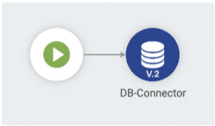
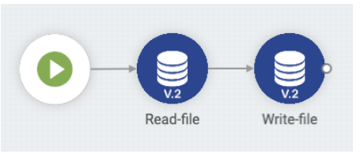

# DB V2 - usage scenarios

Take a look at the supported usage scenarios:

### _**Scenario 1: QUERY operation SELECT command**_

Let's say you have a configured database and a data table and that you want to invoke a _**DB V2**_ with a query with the SELECT command. With it, you'll have access to the operation result in the pipeline through JSON.

**Example**



\
**1.** Create a pipeline and add _**DB V2**_\
**2.** Open the configurations of the component\
**3.** Select the QUERY operation\
**4.** Choose an _ACCOUNT_ to be able to authenticate in the database\
**5.** Define a _DATABASE URL_ (eg.: _jdbc:mysql://myserver/mydb_)\
**6.** Define a _SQL STATEMENT_ (eg.: _SELECT \* FROM CLIENTES_)\
**7.** Click on CONFIRM to save the configurations of the component\
**8.** Connect the trigger to _**DB V2**_\
**9.** Execute a test in the pipeline (you can use the CTRL + ENTER command)\
**10.** The result of the query will be presented:

```
{
  "data": [
    {
      "uf": "SP",
      "codigo": 1,
      "cidade": "Osasco",
      "logradouro": "Rua Laranjeiras",
      "name": "João Bosco",
      "due_date": "2019-03-27",
      "email": "joao.bosco@digibee.com.br",
      "cep": "XXXXX-XXX"
    },
    {
      "uf": "SP",
      "codigo": 2,
      "cidade": "São Paulo",
      "logradouro": "Rua Jõao Bosco",
      "name": "Roberto Carlos",
      "due_date": "2019-03-27",
      "email": "roberto.carlos@digibee.com.br",
      "cep": "XXXXX-XXX"
    }
  ],
  "updateCount": 0,
  "rowCount": 2
}
```

&#x20;    \
The result of the query returns a JSON with 3 properties on its root: _data_, _updateCount_ and _rowCount_.\
&#x20;  &#x20;

* **data:** object array representing the lines returned from the database according to the defined query. Each element of this array has properties that represent the columns defined in the SELECT operation. If the declaration was "_SELECT name FROM CLIENTS_", there'd be only one property in each of the objects in data the array.
* **updateCount:** indicates how many lies of the table were affected by the executed query. With this example the value would be zero - once SELECTED was the operation, no table was affected.
* **rowCount:** indicates how many lines were returned by the query.    &#x20;


### _**Scenario 2: QUERY operation UPDATE command**_

Let's say you have a configured database and a data table and that you want to invoke a _**DB V2**_ with a query with the UPDATE operation. With it, you'll have access to the result of this operation through JSON.

&#x20;  \
**Example**

**1.** Create a pipeline and add a _**DB V2**_\
**2.** Open the configurations of the component\
**3.** Select the QUERY operation\
**4.** Choose an _ACCOUNT_ to be able to authenticate in the database\
**5.** Define a _DATABASE URL_ (eg.: _jdbc:mysql://myserver/mydb_)\
**6.** Define a _SQL STATEMENT_ (eg.: _UPDATE CLIENTES SET uf='SP' WHERE uf is null_)\
**7.** Click on CONFIRM to save the configurations of the component\
**8.** Connect the trigger to _**DB V2**_\
**9.** Execute a test in the pipeline (you can use the CTRL + ENTER command)\
**10.** The result of the query will be presented:

```
{  
    "data": null,  
    "updateCount": 5,  
    "rowCount": 0
}
```

&#x20; &#x20;

* **updateCount:** with this example, the change of 5 lines of the table is confirmed.

### &#x20;    _**Scenario 3: QUERY operation DELETE command**_

Let's say you have a configured database and a data table and that you want to invoke a _**DB V2**_ with a query with the DELETE operation. With it, you'll have access to the result of this operation in the pipeline through JSON.

&#x20;  \
**Example**

**1.** Create a pipeline and add a _**DB V2**_\
**2.** Open the configurations of the component\
**3.** Select the QUERY operation\
**4.** Choose an _ACCOUNT_ to be able to authenticate in the database\
**5.** Define a _DATABASE URL_ (eg.: _jdbc:mysql://myserver/mydb_)\
**6.** Define a _SQL STATEMENT_ (eg.: _DELETE FROM CLIENTES WHERE codigo='111111'_)\
**7.** Click on CONFIRM to save the configurations of the component\
**8.** Connect the trigger to _**DB V2**_\
**9.** Execute a test in the pipeline (you can use the CTRL + ENTER command)\
**10.** The result of the query will be presented:

```
{  
    "data": null,  
    "updateCount": 1,  
    "rowCount": 0
}
```

&#x20;     &#x20;

* **updateCount:** with this example, the exclusion of 1 line of the table is confirmed.


### &#x20;_**Scenario 4: QUERY operation INSERT command**_

Let's say you have a configured database and a data table and that you want to invoke a _**DB V2**_ with a query with the INSERT operation. With it, you'll have access to the result of the operation in the pipeline through JSON.

&#x20;  \
**Example**

**1.** Create a pipeline and add a _**DB V2**_\
**2.** Open the configurations of the component\
**3.** Select the QUERY operation\
**4.** Choose an _ACCOUNT_ to be able to authenticate in the database\
**5.** Define a _DATABASE URL_ (eg.: _jdbc:mysql://myserver/mydb_\
**6.** Define a _SQL STATEMENT_ (eg.: _INSERT INTO CLIENTES (name, email) VALUES ('My Name', '_[_myname@email.com_](mailto:myname@email.com)_')_)\
**7.** Click on CONFIRM to save the configurations of the component\
**8.** Connect the trigger to _**DB V2**_\
**9.** Execute a test in the pipeline (you can use the CTRL + ENTER command)\
**10.** The result of the query will be presented:

```
{  
    "data": null,  
    "updateCount": 1,  
    "rowCount": 0
}
```

&#x20;   &#x20;

* **updateCount:** with this example, the creation of 1 line in the table is confirmed.

&#x20;   &#x20;

### &#x20;_**Scenario 5: Keep the connection open for older or unreliable drivers**_

Let's say you have a database incompatible with JDBC 4.0 or that it fails to keep a trustable connection and that you want to invoke _**DB V2**_ with any query, but 20 minutes after making the same call. With it, the connection with the database isn't lost.\
&#x20;   &#x20;

The option _ADVANCED > **CONNECTION TEST QUERY**_ allows to define a query that is executed before the query defined in SQL STATEMENT to make sure the connection is established with the database and avoid errors.\
&#x20;    &#x20;

This option will allow a new connection to be opened if there's an error in the connection test. It will avoid problems of "stuck" connections and timeouts caused by previous queries that received the error.\
&#x20;   &#x20;

**IMPORTANT:** this option must be considered only for older databases (with support version to jdbc < 4.0).       &#x20;

**1.** Create a pipeline and add a _**DB V2**_\
**2.** Open the configurations of the component\
**3.** Select the QUERY operation\
**4.** Choose an _ACCOUNT_ to be able to authenticate in the database\
**5.** Define a _DATABASE URL_ (eg.: _jdbc:mysql://myserver/mydb_)\
**6.** Define a _SQL STATEMENT_ (eg.: _INSERT INTO CLIENTES (name, email) VALUES ('My Name', '_[_myname@email.com_](mailto:myname@email.com)_')_)\
**7.** Connect the trigger to _**DB V2**_\
**8.** Select the option _ADVANCED_ (more options will be shown)\
**9.** Define a C_ONNECTION TEST QUERY_ (eg.: _SELECT version()_)\
**10.** Click on CONFIRM to save the configurations of the component\
**11.** Execute a test in the pipeline (you can use the CTRL + ENTER command)\
**12.** The result of the query will be presented

&#x20;     &#x20;

### _**Scenario 6: Interrupt the execution of the pipeline in caso of an error**_

Let's say you have a configured database and a data table and that you want to invoke a _**DB V2**_ with a QUERY or PROCEDURE in case the operation fails to interrupt the execution of the pipeline.\
&#x20;   &#x20;

The option _FAIL ON ERROR_ allows the pipeline to interrupt its execution in case of an error when invoking _**DB V2**_.       &#x20;


### _**Scenario 7: Access and write files into the database**_

Let's say you have a configured database and a table with BLOB and/or CLOB data type and that you want to invoke a _DB V2_ with a QUERY or PROCEDURE. With it, you can not only write files available in the pipeline, but also read BLOB and/or CLOB data from a database column as if they were files.

The _BLOB AS FILE/CLOB AS FILE_ option allows to inform a file path for the operations with BLOB-type and CLOB-type columns respectively - which means, invoking the INSERT command and providing the path of files available in the pipeline will make these file to be written in the database.

In case of choosing the SELECT command, the BLOB/CLOB content will become a file inside the pipeline.

&#x20;

**Example: step 1 (read file)**    &#x20;

**1.** Create a pipeline and add a _**DB V2**_\
**2.** Open the configurations of the component\
**3.** Define the name as 'Read-file'\
**4.** Select the QUERY operation\
**5.** Choose an _ACCOUNT_ to be able to authenticate in the database\
**6.** Define a _DATABASE URL_ (eg.: _jdbc:mysql://myserver/mydb_)\
**7.** Define a _SQL STATEMENT_ (eg.: SELECT blob FROM CLIENTES WHERE id=78)\
**8.** Activate the _BLOB AS FILE_ and/or _CLOB AS FILE_ options (if the option CLOB AS FILE is activated, a new field _CHARSET_ will be displayed to inform the file encoding)\
**9.** Click on CONFIRM to dabe the configurations of the component\
**10.** Connect the trigger and _**DB V2**_ (Read-file)\
**11.** Execute a test in the pipeline (you can use the CTRL + ENTER command)\
**12.** The result of the query will be presented:

```
{
  "data": [
    {
      "blob": "E4G17F.file",
      "clob": "H2K89G.file"
    }
  ],
  "updateCount": 0,
  "rowCount": 1
}

```

Two files named 'E4G17F.file' and 'H2K89G.file' were generated and made available in the pipeline.\
&#x20;  &#x20;

**Example: step 2 (write file)**   &#x20;



&#x20;   &#x20;

**1.** Add a _**DB V2**_\
**2.** Open the configurations of the component\
**3.** Define the name as 'Write-file'\
**4.** Select the QUERY option\
**5.** Choose an _ACCOUNT_ to be able to authenticate the database\
**6.** Define a DATABASE URL (eg.: jdbc:mysql://myserver/mydb)\
**7.** Define a SQL STATEMENT (eg.: INSERT INTO CLIENTES (blob, clob) VALUES ( \{{ message.data.blob \}}, \{{ message.data.clob \}} ))

Keep in mind that the Double Braces expressions \{{ message.data.blob \}} and \{{ message.data.blob \}} were used.

Through them you can access the result of the last component - in this, that has the query result was accessed. After that, blob and clob, which are the names of the generated files, were accessed. In other words, the files paths for the 'E4G17F.file' file and the 'H2K89G.file' were provided in the INSERT command for the blob and clob field.

**8.** Activate the _BLOB AS FILE_ and/or _CLOB AS FILE_ options (if the option CLOB AS FILE is activated, a new field _CHARSET_ will be displayed to inform the file encoding)

**9.** In the _TYPE PROPERTIES_ field, click on the _ADD_ button

**10.** A section will be displayed to define the fields:

* _Key_ as _0_ (each _Double Brace_ has an index and it refers to the first one)
* _TYPE_ as _BLOB_
* _OUT PARAMETER NAME_ in blank
* _PARAMETER TYPE_ as _IN_
* _Key_ as _1_ (each _Double Brace_ has an index and it refers to the second one)
* _TYPE_ as _CLOB_
* _OUT PARAMETER NAME_ in blank
* _PARAMETER TYPE_ as _IN_

**11.** Click on CONFIRM to save the configurations of the component\
**12.** Connect the _**DB V2**_ (Read-file) to _**DB V2**_ (Write-file)\
**13.** Execute a test in the pipeline (you can use the CTRL + ENTER command)\
**14.** The result of the query will be presented:

```
{
  "data": null,
  "updateCount": 1,
  "rowCount": 0
}
```

&#x20;      \
The result indicates that a line from the table was affected. In this case, the first component (Read-file) read the bob and clob content of the database and created the files. After that, the component (Write-file) took these available files in the pipeline and inserted it in the database in a new register.

### &#x20;          _**Scenario 8: Execute a procedure**_

Let's say you have a database configured with an existing procedure and that you want to invoke a _**DB V2**_ in PROCEDURE mode. With it, you can execute an existing procedure and obtain the result of the operation in the pipeline through JSON.     &#x20;

&#x20;  \
**Example**

The following procedure must exist in the database for the mentioned example:

```plsql
CREATE 
PROCEDURE `proc_sum_one`(INOUT `num` INTEGER)
BEGIN   
    SET `num` = `num` + 1;
END
```

&#x20;  \
**1.** Create a pipeline and add a _**DB V2**_\
**2.** Open the configuration of the component\
**3.** Select the _PROCEDURE_ operation\
**4.** Choose an _ACCOUNT_ to be able to authenticate in the database\
**5.** Define a _DATABASE URL_ (eg.: jdbc:mysql://myserver/mydb)\
**6.** Define a _SQL STATEMENT_ (eg.: _call proc\_sum\_one(\{{ message.num \}})_)\
\
Keep in mind we use the Double Braces expression_: \{{ message.num \}}_\
Through it you can access the result of the last component.\
\
**7.** On the _TYPE PROPERTIES_ field, click on the _ADD_ button\
**8.** A section will be shown as the image above for you to define the fields:

* _Key_ as _0_ (each _Double Braces_ has an index and it refers to the first one)
* _TYPE_ as _INTEGER_
* _OUT PARAMETER NAME_ as _result_ (defines the result parameter of procedure)
* _PARAMETER TYPE_ as _INOUT_

**9.** Click on _CONFIRM_ to save the configurations of the component\
**10.** Connect the trigger to _**DB V2**_\
**11.** Open the Execution panel and provide the entry value (eg.: _{ "num": 3 }_)\
**12.** Execute a test in the pipeline (you can use the CTRL + ENTER command)\
**13.** The result of the query will be presented:

```
{  
    "data": {    
        "result": 4  
    },  
    "success": true
}
```

### &#x20;    _**Scenario 9: Define personalized connection properties**_

Let's say you have a configured database and that you want to invoke a _**DB V2**_. With it, you can specify personalized connection properties.\
&#x20;         &#x20;

**Example:**

**1.** Open the configurations of the component\
**2.** Select the QUERY option\
**3.** Choose an _ACCOUNT_ to be able to authenticate in the database\
**4.** Define a _DATABASE URL_ (_eg.: jdbc:mysql://myserver/mydb_)\
**5.** Define a _SQL STATEMENT (e.g.: SELECT \* FROM CLIENTES_)\
**6.** Define the CUSTOM CONNECTION PROPERTIES field (eg.: { "connectTimeout": 1 })\
**7.** Click on CONFIRM to dabe the configurations of the component\
**8.** Connect the trigger to _**DB V2**_\
**9.** Execute a test in the pipeline (you can use the CTRL + ENTER command)\
**10.** The result of the query will be presented:

```
{
  "success": false,
  "message": "Could not establish connection to the database",
  "error": "java.sql.SQLNonTransientConnectionException: Could not connect to address=(host=xxxxx)(port=XXX)(type=master) : null"
}
```

&#x20;    \
In this case, the specific connection property _connectTimeout_ was defined as _1_ (one second) to demonstrate it was considered and generated a connection error.\
&#x20;      \
&#x20;      &#x20;

### _**Scenario 10: Keep active connection for 5 or 30 minutes**_

Let's say you have a configured database and that you want to invoke a _**DB V2**_. With it, you can choose if you want to keep the connection with the database active for 5 or 30 minutes.

The option _KEEP CONNECTION_ allows you to extend the standard 5 minutes to 30 minutes of active connection with the database.


### _**Scenario 11: Read custom data types from a Oracle database**_

Let's say you have a configured database with a table that contains a custom type and that you want to invoke a _DB V2_ to view this data.

**Example:**

You have a table created with the following structure:

```plsql
CREATE TABLE project (
    name VARCHAR2(50),
    coordinator OWNER
);
```

And the OWNER custom type is created like:

```plsql
CREATE TYPE OWNER AS OBJECT 
( 
    name VARCHAR2(50),
    email VARCHAR2(30)
);
```

Executing the query below:

```plsql
SELECT * FROM projeto
```

You’ll have the following result:

```
{
    "data": [
        {
            "name": "Example Project",
            "owner": [
                "Coordinator Name",
                "Coordinator Email"
            ]
        }
    ],
    "updateCount": 0,
    "rowCount": 1
}

```

If the custom type uses others custom types in its structure, you’d have the result with data nested as the following way:

```
{
    "data": [
        {
            "name": "Example Project",
            "owner": [
                "Coordinator Name",
                "Coordinator Email",
                [
                    "Field from a 2nd custom type",
                    [
                        "Field from a 3rd custom type"
                    ]
                ]
            ]
        }
    ],
    "updateCount": 0,
    "rowCount": 1
}
```

**IMPORTANT:** custom types don’t expose the fields' names configured inside the custom type, but only the order of those fields. In the example above, the first element of the "owner" array corresponds to the field "name" and the second element to the field "email", both defined in this respective order inside the type OWNER.When reading custom types through PROCEDURES, the OUT PARAMETER NAME property in TYPE PROPERTIES must be configured with the custom type name, so in this example above it would be OWNER.


### _**Scenario 12: Send custom data types from a Oracle database**_

Let's say you have a configured database with a table that contains a custom type (Struct) and that you want to invoke a _DB V2_ to insert data into this table.


**IMPORTANT:** the component _DB V2_ doesn’t support Double Braces to resolve the custom data (_Struct_) using the commands _INSERT_ and _UPDATE_.


**Example**

You have the custom types and the table created with the following structures:

* CREATE OR REPLACE TYPE CONTACT AS OBJECT

```
(  
    NAME  VARCHAR2(50),  
    PHONE VARCHAR2(15)
);
```

​

* CREATE OR REPLACE TYPE PERSON AS OBJECT

```
(
  ID           NUMBER(10,0),
  NAME         VARCHAR2(50),
  CONTACT_INFO CONTACT
);
```

&#x20;

* CREATE OR REPLACE TYPE DEPARTMENT AS OBJECT

```
(
  ID      NUMBER(10,0),
  NAME    VARCHAR2(50)
);
```

​

* CREATE TABLE EMPLOYEE

```
(
  PERSON PERSON, 		
  DEPT   DEPARTMENT,
  SALARY NUMBER(12,2)
);
```

&#x20;

To insert data into this table, the following structures can be used:\


Data to be inserted:

```
  {
  	"personName": "John A.",
  	"contactName": "John",
  	"contactPhone": "99999",
  	"departmentName": "IT"
  }
```

&#x20;

* Through _INSERT_ from a _QUERY_ result

```plsql
INSERT INTO EMPLOYEE
SELECT PERSON(DBMS_RANDOM.VALUE(0,999999), {{ message.personName }}, CONTACT({{ message.contactName }}, {{ message.contactPhone }})),
	   DEPARTMENT(DBMS_RANDOM.VALUE(0,999999), {{ UPPERCASE(message.departmentName) }}),
	   3030.67 SALARY
  FROM DUAL
```

* Through _PROCEDURE:PROCEDURE_ previously created in the database

```plsql
CREATE OR REPLACE PROCEDURE MY_PROC(DEPT IN DEPARTMENT, EMP IN OUT PERSON) IS
  BEGIN
	 SAL  := 4567.89 * 1.10;
	 INSERT INTO EMPLOYEE VALUES (EMP, DEPT, SAL);	 
  EXCEPTION
  	WHEN OTHERS THEN
  		RAISE_APPLICATION_ERROR(-20001,'An error was encountered - '||SQLCODE||' - ERROR: '||SQLERRM);
  END;
```

&#x20;

* _PROCEDURE_ call

```plsql
   DECLARE
  	CONT CONTACT;
    DEPT DEPARTMENT;
    SAL  EMPLOYEE.SALARY%TYPE;
  BEGIN
    DEPT := DEPARTMENT(TRUNC(DBMS_RANDOM.VALUE(0,999999)), {{ UPPERCASE(message.departmentName) }});
    CONT := CONTACT({{ message.contactName }}, {{ message.contactPhone }});
    EMP  := PERSON(TRUNC(DBMS_RANDOM.VALUE(0,999999)), {{ message.personName }}, CONT);
	  MY_PROC(EMP);
  END;

```

&#x20;

* Through _SQL Script_

```plsql
DECLARE
  	EMP  PERSON;
    CONT CONTACT;
  	DEPT DEPARTMENT;
    SAL  EMPLOYEE.SALARY%TYPE;
  BEGIN
	 DEPT := DEPARTMENT(TRUNC(DBMS_RANDOM.VALUE(0,999999)), {{ UPPERCASE(message.personName) }});
	 CONT := CONTACT({{ message.contactName }}, {{ message.contactPhone }});
	 EMP  := PERSON(TRUNC(DBMS_RANDOM.VALUE(0,999999)), {{ message.personName }}, CONT);
	 SAL  := 4567.89;
	 INSERT INTO EMPLOYEE VALUES (EMP, DEPT, SAL);	 
  EXCEPTION
  	WHEN OTHERS THEN
  		RAISE_APPLICATION_ERROR(-20001,'An error was encountered - '||SQLCODE||' - ERROR: '||SQLERRM);

  END;

```

### _**Scenario 13 - QUERY operation SELECT command - Raw SQL**_

Suppose you have an integration flow that needs to perform two different queries on a database depending on some business rules:

QUERY 1:

```
SELECT * FROM TABLE_1
WHERE ID = 123
```

QUERY 2:

```
SELECT * FROM TABLE_2
WHERE CODE = 'ABC'
```

**DB V2** has the **Raw SQL Statement** feature, which allows you to reference a full query through Double Braces declaration. In this way, the same reference can apply different values.

To use this feature, the queries must be previously configured by another component such as _**Template Transformer**_ and then referenced in _**DB V2**_.

**Example**

<figure><figcaption></figcaption></figure>

**1.** Create a pipeline and add _**Template Transformer**_ and _**DB V2**_;

**2.** Open the configurations of the _**Template Transformer**_ component;

**3.** Enable **Preserve Original** option;

**4.** Define the body:

```
SELECT * FROM 
${table}
WHERE 
<#if id?? > 
    ID = {{ message._query.id }} 
</#if>

<#if code??>
    CODE = {{ message._query.code }} 
</#if>
```

**5.** Click on **Confirm** to save the configurations of the component;

**6.** Open the configurations of the component **DB V2**;

**7.** Select the **Query** operation;

**8.** Choose an account to be able to authenticate in the database;

**9.** Define a database URL (eg.: `jdbc:mysql://myserver/mydb`);

**10.** Define the SQL statement as `{{ message.query }}`;

**11.** Activate the **Advanced** option;

**12.** Activate the **Raw SQL Statement** option;

13\. Click on **Confirm** to save the configurations of the component;

**14.** Connect the _**Template Transformer**_ o _**DB V2;**_

**15.** Connect the trigger to the _**Template Transformer;**_

**16.** Execute a test in the pipeline passing an input payload:

Payload for QUERY 1:

```
{
    "query": {
        "table": "TABLE_1",
        "id": 123
    }
}
```

Payload for QUERY 2:

```
{
    "query": {
        "table": "TABLE_2",
        "code": "ABC"
    }
}>
```

**17.** The result is displayed based on the executed query as follows:

Result for QUERY 1:

```
{
    "data": [
        {
            "id": 123,
            "name": "John",
            "role": "Developer",
            ...
        }
    ],
    "updateCount": 0,
    "rowCount": 1
}
```

Result for QUERY 2:

```
{
    "data": [
        {
            "code": "ABC",
		 "fullName": "Paul Smith",
		 "zipCode": "99999",
            ...
        }
    ],
    "updateCount": 0,
    "rowCount": 1
}
```

The result of the query returns a JSON with 3 properties in the root: _data_, _updateCount_ and _rowCount_.

* **data:** object array representing the lines returned from the database according to the executed query. Each element of this array has properties representing the columns defined in the **Select** operation. If the declaration was "_SELECT name FROM TABLE\_1 WHERE ID = 123"_ or "_SELECT fullName FROM TABLE\_2 WHERE CODE = 'ABC'_", there would be only one property in each of the objects in the _data_ array.
* **updateCount:** indicates how many lines of the table were affected by the executed query. In the example above, the value would be zero; once **Select** was the selected operation, no table was affected.
* **rowCount:** indicates how many lines were returned by the query.


**IMPORTANT:** the query to be referenced through Double Braces on _**DB V2**_ can be previously set by other components such as _**JSON Generator**_ or _**Transformer (JOLT)**_. However, by using _**Template Transformer**_ you can combine it with FreeMarker technology to validate the data before executing the target query and also apply mechanisms to prevent SQL Injection attacks on the pipeline. The Double Braces declaration is not resolved by **Template Transformer** but by **DB V2**, which by default configures and validates the parameters of the SQL statement beforehand (PreparedStatement). This means that using _**Template Transformer**_ in addition to **DB V2** is a safer and easier way to create queries compared to other components.

