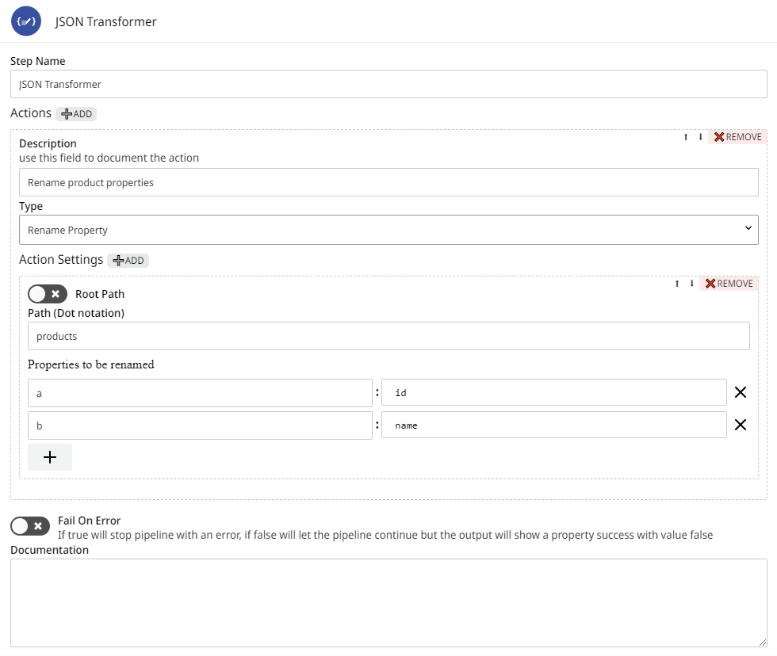
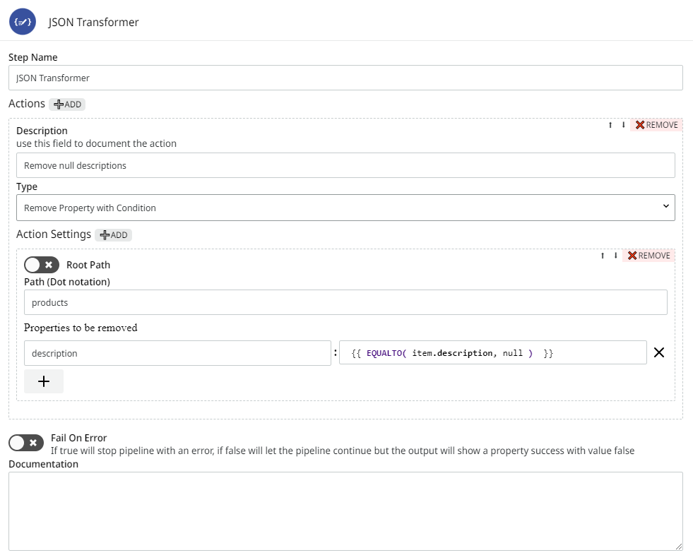

# JSON Transformer

**JSON Transformer** allows transformations in the JSON being processed in your pipeline. With a configuration form you can perform a variety of actions.

## Parameters

Take a look at the configuration options for the component. Parameters supported by [Double Braces expressions](https://docs.digibee.com/documentation/build/double-braces) are marked with `(DB)`.

<table data-full-width="true"><thead><tr><th>Parameter</th><th width="327">Description</th><th>Default value</th><th>Data type</th></tr></thead><tbody><tr><td><strong>Actions</strong></td><td>Add or remove different actions.</td><td>N/A</td><td>Options of Actions</td></tr><tr><td><strong>Description</strong></td><td>This field is used to document the action.</td><td>N/A</td><td>String</td></tr><tr><td><strong>Type</strong></td><td>Set the action that will be executed, such as: <strong>Rename Property</strong>, <strong>Edit Property</strong>, <strong>Remove Property</strong>, and <strong>Remove Property with Condition</strong>. See more details about each action in the section below.</td><td>Rename Property</td><td>String</td></tr><tr><td><strong>Action Settings</strong></td><td>Additional settings related to the selected action.</td><td>N/A</td><td>Options of Action Settings</td></tr><tr><td><strong>Root Path</strong></td><td>Must be activated when the JSON property is in the root of the object. When this option is activated, <strong>Path (Dot Notation)</strong> is not available.</td><td>False</td><td>Boolean</td></tr><tr><td><strong>Path (Dot notation)</strong></td><td>Must be filled when the JSON property isn't in the root of the object. It allows indicating dot notation, which makes it simple to access different JSON levels, including going through the JSON array and object.</td><td>N/A</td><td>String</td></tr><tr><td><strong>Properties to be renamed</strong> <code>(DB)</code></td><td>This parameter is shown only when action <strong>Rename Property</strong> is selected. Must be filled with the key and value you want to rename.</td><td>N/A</td><td>Key-value Pairs</td></tr><tr><td><strong>Values to be edited</strong> <code>(DB)</code></td><td>This parameter is shown only when action <strong>Edit Property</strong> is selected. Must be filled with the key and value you want to edit.</td><td>N/A</td><td>Key-value Pairs</td></tr><tr><td><strong>Properties to be removed</strong> <code>(DB)</code></td><td>This parameter is shown only when actions <strong>Remove Property</strong> or <strong>Remove Property with Condition</strong> are selected. Must be filled with the exact key name of the JSON (in case of <strong>Remove Property</strong>) or key and value you want to remove (in case of <strong>Remove Property with Condition</strong>).</td><td>N/A</td><td>String / Key-value Pairs</td></tr><tr><td><strong>Fail On Error</strong></td><td>If the option is activated, the execution of the pipeline with error will be interrupted; otherwise, the pipeline execution proceeds, but the result will show a false value for the “success” property.</td><td>False</td><td>Boolean</td></tr></tbody></table>

When using Double Braces, the values of the properties to be changed must be accessed with the use of the word "item". With the word "item" it's possible to obtain values of all properties in the same JSON level that's being accessed.

Examples:

```
{{ item.keyName }}
{{ CONCAT(item.customer.id, item.customer.name) }}
{{ FORMATDATE( item.orders.dateAdded, "dd-MM-yyyy", "dd MMM yyyy") }}
```

## Parameters additional information

### Type

* **Rename Property:** Renames the JSON key to a new key, which can consist of a static or dynamic value composed by Double Braces.
* **Edit Property:** Allows the transformation of the values in a property through Double Braces.
* **Remove Property:** Removes properties in any structure of JSON.
* **Remove Property with Condition:** With the logical operators of the functions, you can define a condition so that "true" is returned if the property must be removed.

## Messages flow

### Input

This component doesn't expect any specific input message, only if an expression in Double Braces is informed in some of its fields.

### Output

Because it's a component that transforms the input JSON, the output is the result of the configurations defined by you.

If no property defined in the component configurations is found in JSON, the result will be the same one of the input JSON.

To better understand the messages flow in the Platform, refer to [Messages processing](https://docs.digibee.com/documentation/build/pipelines/messages-processing).

## JSON Transformer in action

See below how the component behaves in certain situations and what its respective configurations are.

### Renaming properties

The properties can be renamed through static or dynamic values composed by Double Braces. These properties can be in an object, array or in the root.

In this example, see how to rename "a" to "id" and "b" to "name". The component configurations must be:

#### Input

```
{
  "products": [
          {
           "a": 1,
           "b": "Table"
          },
          {
           "a": 2,
           "b": "Chair"
          }
  ]
}
```

#### Configurations

<figure><figcaption></figcaption></figure>

#### Output

```
{
  "products": [
          {
           "id": 1,
           "name": "Table"
          },
          {
           "id": 2,
           "name": "Chair"
          }
  ]
}
```

### Editing properties

The values can be transformed by applying Double Braces and functions from the Digibee Integration Platform. This property can be in an object, array or in the root.

It's possible to apply functions such as FORMATDATE, CONCAT, REPLACE, FORMATNUMBER, among others.

To better understand how these resources work, read the article [Double Braces Functions](https://docs.digibee.com/documentation/build/double-braces/double-braces-functions).

In this example, see how to transform the "id" from number to string. The component configurations must be:

#### Input

```
{
  "products": [
          {
           "id": 1,
           "name": "Table"
          },
          {
           "id": 2,
           "name": "Chair"
          }
  ]
}
```

#### Configurations

<figure><figcaption></figcaption></figure>

#### Output

```
{
  "products": [
          {
           "id": "1",
           "name": "Table"
          },
          {
           "id": "2",
           "name": "Chair"
          }
  ]
}
```

### Removing properties with decision conditions

The properties can be removed by using the logical operators of the Double Braces functions. It's possible to define a condition that, when resolved to "true", will indicate that the property must be removed. These properties can be in an object, array or in the root.

In this example, see how to remove "description" with a null value. The component configurations must be:

#### Input

```
{
  "products": [
          {
           "id": 1,
           "name": "Table",
           "description": "Tea Table",   
},
          {
           "id": 2,
           "name": "Chair",
           "description": null
          }
  ]
}
```

#### Configurations

<figure><figcaption></figcaption></figure>

#### Output

```
{
  "products": [
          {
           "id": 1,
           "name": "Table",
           "description": "Tea Table",     
},
          {
           "id": 2,
           "name": "Chair"
          }
  ]
}
```

### Removing properties only by the name

The properties can be removed just by declaring their names in the **Properties to be removed** field. These properties can be in an object, array or in the root.


Some of the parameters above accept Double Braces. To better understand how this language works, read the article [How to reference data using Double Braces](https://docs.digibee.com/documentation/build/how-to-reference-data-using-double-braces).

