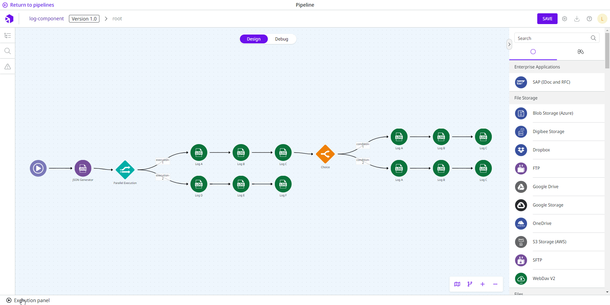

# Log

**Log** allows the creation of log registers within a pipeline. It helps with the creation of step traces.

When you are building a pipeline and testing in the [Execution panel](https://docs.digibee.com/documentation/build/new-canvas-beta-restricted/execution-panel) area, the results are displayed on the **Logs** tab.

<figure><figcaption></figcaption></figure>

​The generated logs are also available under [**Pipeline Logs**](https://docs.digibee.com/documentation/monitor/pipeline-logs) in Monitor.

## Parameters

Take a look at the configuration options for the component. Parameters supported by [Double Braces expressions](https://docs.digibee.com/documentation/build/double-braces) are marked with `(DB)`.

<table data-full-width="true"><thead><tr><th>Parameter</th><th>Description</th><th>Default value</th><th>Data type</th></tr></thead><tbody><tr><td><strong>Log Level</strong></td><td>How the generated log will be classified. The options are: Info, Error, and Warn.</td><td>ERROR</td><td>String</td></tr><tr><td><strong>Message</strong> <code>(DB)</code></td><td>Message that is entered in the log. It's possible to use the Double Braces, which allows you to create a message with data from the pipeline flow (example: “There's been an error when trying to register the client code {{ message.id }}”)</td><td>Error processing message {{ message.$.myField }}</td><td>String</td></tr></tbody></table>


All the line break characters (\n or \r\n) will be removed in the logs list.


## Messages flow

### Input

The component accepts any input message and can use it through Double Braces.

### Output

The component doesn't change any information of the input message. Therefore, the message returns to the following component or is used as the final answer if this component is the last step of the pipeline.

## Sensitive Fields

When sensitive fields are configured in the pipeline or in your realm, these fields will appear in the component output obfuscated with the "\*\*\*" character set.

**Example:**

Imagine that the sensitive field “email” is defined in the pipeline and the **Log** component message is configured as follows:

```
There was an error sending email to {{message.email}} on {{message.dateTime}}
```

The log will be presented as follows:

```
There was an error sending email to *** on 05/07/2021 10: 11: 33: 5120
```


​Obfuscation of sensitive fields requires more processing resources and memory in the pipeline. These additional features are affected by both the number of sensitive fields configured and the size of the message.

