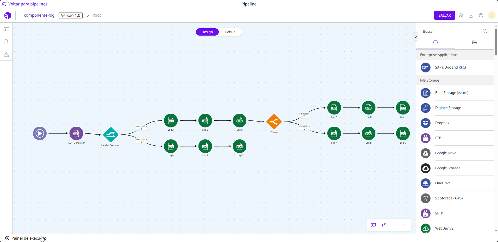

# Log

O **Log** permite criar registros de **logs** dentro do fluxo de um _pipeline_. Ele auxilia na geração de rastreabilidade dos passos.

Quando você está construindo um _pipeline_ e realiza testes na área [Painel de execução](https://docs.digibee.com/documentation/v/pt-br/build/new-canvas-beta-restricted/execution-panel), os resultados ficam disponíveis na aba **Logs**.

<figure><figcaption></figcaption></figure>

Os **logs** gerados também ficam disponíveis em [_**Pipeline Logs**_](https://docs.digibee.com/documentation/v/pt-br/monitor/pipeline-logs) em Monitor.

## Parâmetros

Dê uma olhada nas opções de configuração do componente. Parâmetros suportados por [expressões _Double Braces_](https://docs.digibee.com/documentation/v/pt-br/build/double-braces) estão marcados com `(DB)`.

<table data-full-width="true"><thead><tr><th>Parâmetro</th><th>Descrição</th><th>Valor padrão</th><th>Tipo de dado</th></tr></thead><tbody><tr><td><strong>Log Level</strong></td><td>Como o <em>log</em> gerado será classificado. As opções disponíveis são: Info, Error e Warn.</td><td>N/A</td><td><em>String</em></td></tr><tr><td><strong>Message</strong> <code>(DB)</code></td><td>Mensagem que será registrada no <em>log</em>. É possível usar a funcionalidade de <em>Double Braces</em>, que permite compor a mensagem com dados do fluxo do <em>pipeline</em> (exemplo: “Ocorreu um erro ao tentar registrar o cliente código {{ message.id }}”).</td><td>N/A</td><td><em>String</em></td></tr></tbody></table>


Todos os caracteres de quebra de linha (\n ou \r\n) serão removidos na exibição dos logs.


## Fluxo de Mensagens

### Entrada

O componente aceita qualquer mensagem de entrada e pode fazer uso dela através de _Double Braces_.

### Saída

O componente não altera nenhuma informação da mensagem de entrada. Portanto, ela é retornada para o componente seguinte ou é utilizada como resposta final se este componente for o último passo do _pipeline_.

## Campos sensíveis

Quando configurado campos sensíveis no _pipeline_ ou em seu _realm_, esses campos aparecerão na saída do componente ofuscados com o conjunto de caracteres "\*\*\*".

**Exemplo:**

Imagine que o campo sensível “email” esteja definido no _pipeline_ e a mensagem do componente **Log** esteja configurada conforme abaixo:


```
Ocorreu um erro ao enviar email para {{ message.email }} no dia {{ message.dateTime }}
```


O _log_ será apresentado da seguinte forma:

```
Ocorreu um erro ao enviar email para *** no dia 07/05/2021 10:11:33:5120 
```


A ofuscação dos campos sensíveis necessita de mais recursos de processamento e memória do _pipeline_. Esses recursos adicionais são afetados tanto pela quantidade de campos sensíveis configurados quanto pelo tamanho da mensagem.

