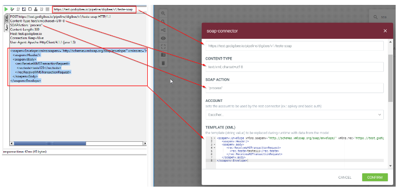

# SOAP V1 (Descontinuado)


O SOAP V1 foi descontinuado e não é mais atualizado. Consulte as documentações das versões mais recentes da _feature_: [SOAP V2](https://docs.digibee.com/documentation/v/pt-br/components/web-protocols/soap-v2) e [SOAP V3](https://docs.digibee.com/documentation/v/pt-br/components/web-protocols/soap-v3-beta).


O **SOAP V1** invoca SOAP _endpoints_ de um _pipeline_. Ele utiliza um _template_ Apache FreeMarker para gerar a mensagem de solicitação SOAP e converte a resposta de SOAP para JSON, tentando ao máximo não corromper a conversão.

## Parâmetros&#x20;

Dê uma olhada nas opções de configuração do componente. Parâmetros suportados por [expressões Double Braces](https://docs.digibee.com/documentation/v/pt-br/build/double-braces) estão marcados com (DB).

| Parâmetro                                      | Descrição                                                                                                                                                 | Valor Padrão | Tipo de Dado |
| ---------------------------------------------- | --------------------------------------------------------------------------------------------------------------------------------------------------------- | ------------ | ------------ |
| **URL**                                        | URL a ser chamada - pode conter os parâmetros seguindo o padrão {:param1}, que serão substituídos pela propriedade correspondente da mensagem de entrada. | -            | _String_     |
| **Content Type**                               | Configura o Content Type e a codificação.                                                                                                                 | -            | _String_     |
| **SOAP Action**                                | _Header_ de chamada XML.                                                                                                                                  | -            | _String_     |
| **Account**                                    | Conta a ser utilizada pelo componente.                                                                                                                    | -            | _String_     |
| **Template**                                   | _Template_ Apache FreeMarker para que a mensagem SOAP seja enviada na solicitação.                                                                        | -            | _String_     |
| **Connection Timeout**                         | Tempo de expiração da conexão (em milissegundos).                                                                                                         | -            | _Integer_    |
| **Reading Timeout**                            | Tempo máximo para leitura (em milissegundos).                                                                                                             | -            | _Integer_    |
| **Stop On Client Error**                       | Se ativada, a opção vai gerar um erro para suspender a execução do _pipeline_.                                                                            | -            | _Boolean_    |
| **Stop On Server Error**                       | Se ativada, a opção vai gerar um erro para suspender a execução do _pipeline_.                                                                            | -            | _Boolean_    |
| **Advanced Settings**                          | Configurações avançadas.                                                                                                                                  | -            | -            |
| **Allow Insecure Calls To HTTPS Endpoints**    | Quando ativada, a opção permite que chamadas não seguras a _endpoints_ HTTPS sejam feitas.                                                                | -            | _Boolean_    |
| **Enable Retries**                             | Quando ativada, a opção permite que sejam feitas novas tentativas.                                                                                        | -            | _Boolean_    |
| **Maximum Number Of Retries Before Giving Up** | Número máximo de tentativas antes de desistir da chamada.                                                                                                 | -            | _Integer_    |
| **Time To Wait Before Each Retry**             | Tempo máximo entre tentativas (em milissegundos).                                                                                                         | -            | _Integer_    |

## Fluxo de Mensagens <a href="#fluxo-de-mensagens" id="fluxo-de-mensagens"></a>

### Entrada <a href="#entrada" id="entrada"></a>

O componente espera uma mensagem no seguinte formato:

```
{
	header: {
		"headerA":"valueA",
		"headerB":"valueB"
	},
	body: {
		// message structure that will be replaced by the Dust template
}
```

### Saída <a href="#sada" id="sada"></a>

* com sucesso

```
{
    status: XXX,
    body: {},
    headers: {}
}
```

* com erro

```
{
    error: "error message",
    code: XXX,
    body: {},  
    headers: {}
}
```


Para alguns erros, _body_ e _headers_ estão indisponíveis.


## SOAP V1 em Ação <a href="#soap-v1-em-ao" id="soap-v1-em-ao"></a>

### Sobre o template variável <a href="#sobre-o-template-varivel" id="sobre-o-template-varivel"></a>

O nome da variável também pode conter menos (-), ponto (.) e dois pontos (:) em qualquer posição, mas devem conter uma barra invertida (\\) antes. Do contrário, eles podem ser interpretados como operadores.

### **Sobre substituição de números** <a href="#sobre-substituio-de-nmeros" id="sobre-substituio-de-nmeros"></a>

```html
  <#assign x=42>
  ${x}
  ${x?string}  <#-- the same as ${x} -->
  ${x?string.number}
  ${x?string.currency}
  ${x?string.percent}
  ${x?string.computer}
```

Saída

```
  42  
  42  
  42  
  $42.00  
  4,200%  
  42
```

**Formato de número**

```
<#setting number_format="0.####">
```

**Para verificar se o campo não é nulo:**

```
<#if varTest??>${varTest}</#if>
```

### &#x20;Reprodução de chamadas SoapUI no SOAP V1 <a href="#reproduo-de-chamadas-soapui-no-soap-v1" id="reproduo-de-chamadas-soapui-no-soap-v1"></a>


