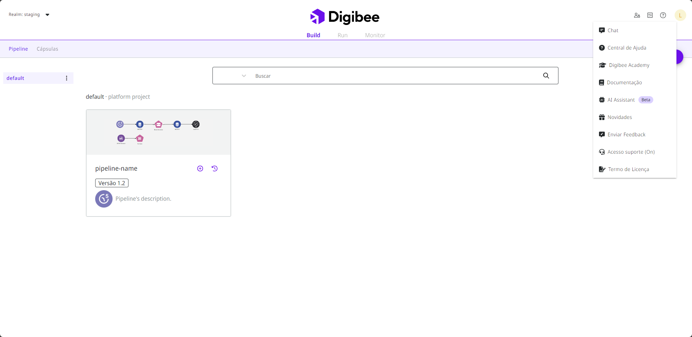

# Suporte ao cliente Digibee

Todos os clientes têm acesso aos serviços prestados pela nossa equipe de Suporte, que estão totalmente preparados para ajudá-lo com quaisquer dúvidas ou eventuais problemas que você possa encontrar. Você pode entrar em contato através do chat no canto superior direito da página inicial da Plataforma.

<figure><figcaption>
Opções do menu Ajuda.
</figcaption></figure>

Selecione a opção **Acesso Suporte** para permitir ou negar que nossa Equipe de Suporte ao Cliente acesse seu _realm_. Observe que todos os usuários são afetados pela desativação. Certifique-se de que não há nenhum incidente ou problema em aberto.

Para saber mais sobre canais de atendimento, solicitações e informações necessárias para atendimento, acesse a documentação sobre o[ Suporte ao Cliente Digibee](https://intercom.help/godigibee/pt-BR/articles/6518706-suporte-ao-cliente-digibee) e [Como usar a Inteligência Artificial do Suporte ao cliente](https://docs.digibee.com/documentation/v/pt-br/general/suporte-ao-cliente-digibee/como-usar-a-inteligencia-artificial-do-suporte-ao-cliente).
