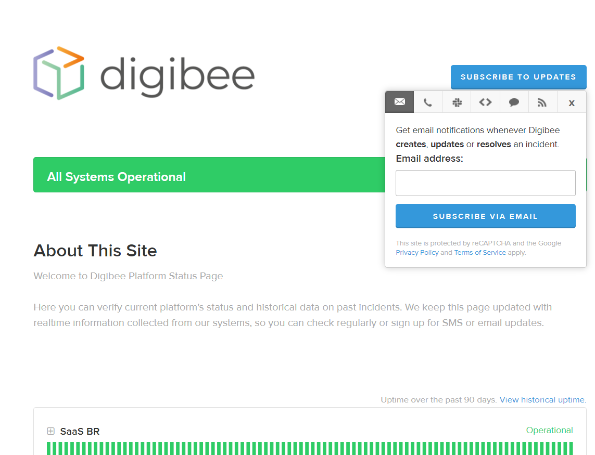
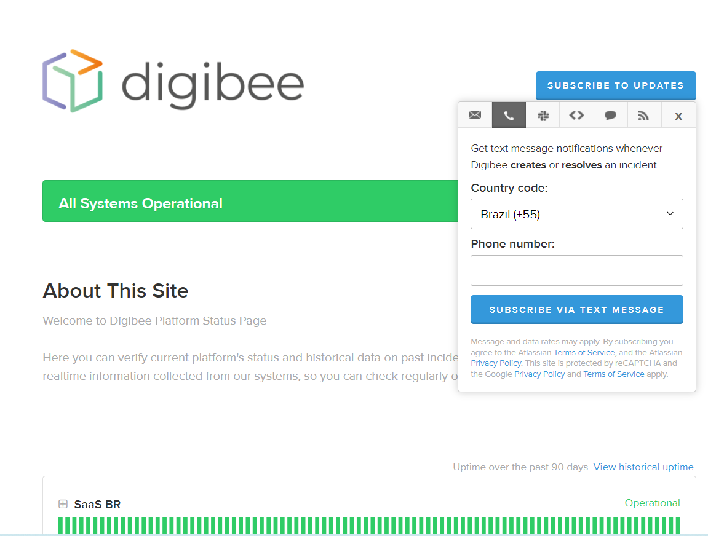
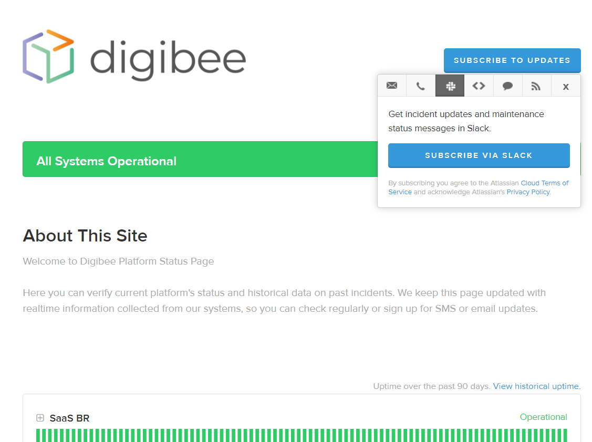
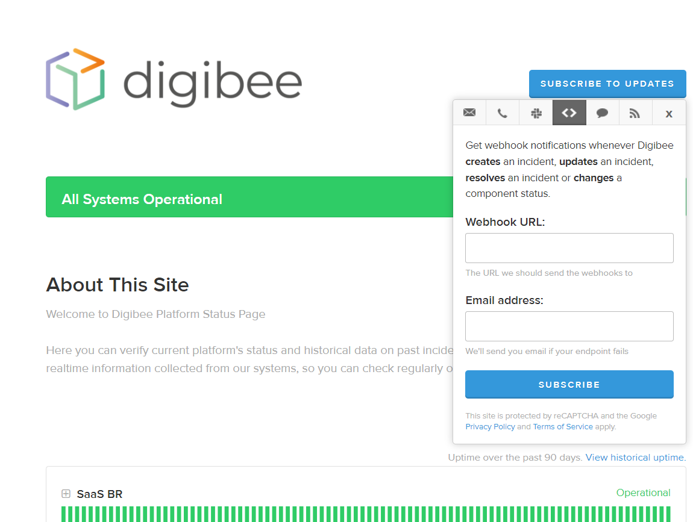

# Status Page

Access the page https://digibee.statuspage.io/ and click on **Subscribe to updates.** A box will open for you to choose the channel for communication.

By email

By SMS

By Slack

<figure><figcaption></figcaption></figure>

By Webhook

<figure><figcaption></figcaption></figure>
