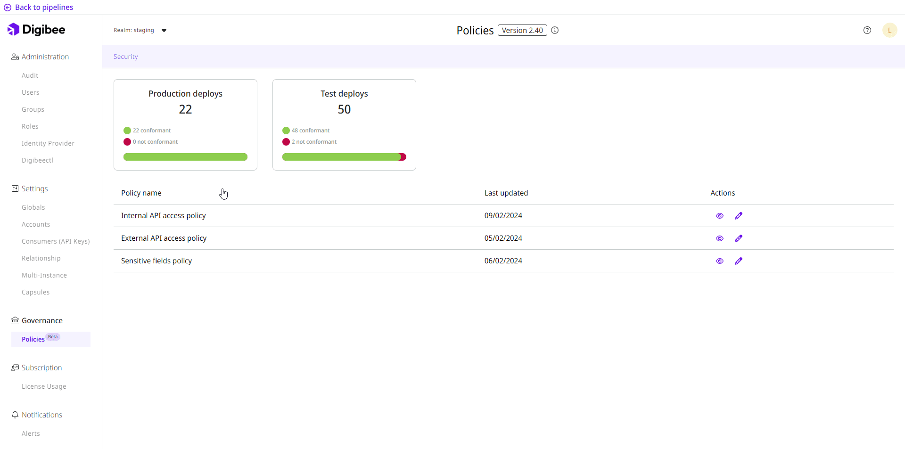

# Policies (beta)


The Policies feature is currently in beta phase. Learn more about the[ Beta Program](https://docs.digibee.com/documentation/general/beta-program).


The Digibee Integration Platform established processes on best practices and policy compliance that you can use for your platform governance, such as External and Internal API Keys, which are security standards used for API calls, allowing pipelines to be safely accessed.  With this solution, you can manage how your developers build, run, and monitor their integrations.&#x20;

The policies are divided into different topics, each with its own settings and characteristics. We also introduce new policies periodically based on the application integration market needs.

Centralizing the platform management is the key to building good governance for your business.&#x20;

## Policy scope

Our policies are applied to each pipeline deployed, taking into account its environment, be it test or production. Note that, when defining a policy, you must set values for all environments. It’s not possible to exclude one or more pipelines from any created policy.

When creating, editing, or removing a policy, a new policy version is created (the version increases with minor changes) and you have real-time access to the compliance and non-compliance numbers.&#x20;

All deployed pipelines must be redeployed to comply with the new Policy version.&#x20;

Since we work with containers and these containers are only created and updated during a deployment, it isn't possible to update the policies automatically.

You can't deploy a pipeline that isn't compliant, but there are cases where the policy came after deployment. For those cases, you can track the number of compliant and non-compliant pipelines.

## How to access the Policies page

Follow these steps to access the Policies page:

1. From the Platform home page, click **Administration** in the upper right corner of the page.
2. In the **Governance** menu, click **Policies**.

On the Policies page, you will see cards showing the number of deployments you have in each environment, as well as the number of deployments that are conformant or non-conformant with the policies. Click the card to see more details about the issues for each pipeline.

<figure><figcaption></figcaption></figure>

Below the cards, you can configure each policy individually. The categories are available to identify the different types of policies and their impact.

Learn more about the configuration of each policy:

* [External API Keys](https://docs.digibee.com/documentation/governance/policies/external-api-key)
* [Internal API Keys](https://docs.digibee.com/documentation/governance/policies/internal-api-key)
* [Sensitive fields](security/sensitive-fields.md)

