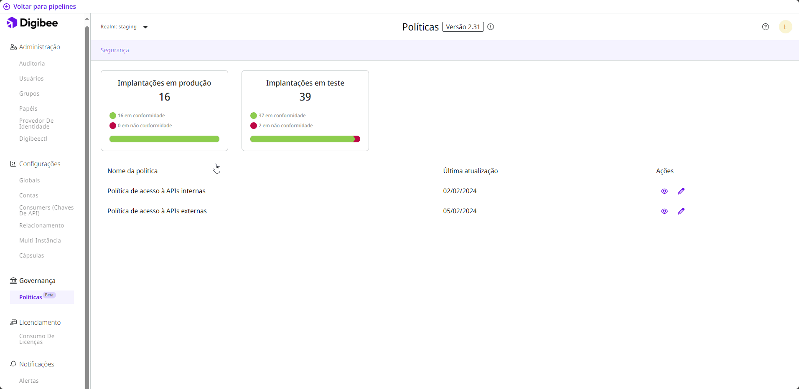

# Políticas (beta)


A funcionalidade Políticas está atualmente em fase beta. Entenda mais sobre o[ Programa Beta](https://docs.digibee.com/documentation/v/pt-br/geral/programa-beta).


A Digibee Integration Platform estabeleceu processos sobre melhores práticas e conformidade com políticas que você pode usar para governança de sua plataforma, como chaves de API externas e internas, que são um padrão de segurança usado para chamadas de API, permitindo que pipelines sejam acessados de forma protegida. Com essa solução, você pode gerenciar como seus desenvolvedores criam, executam e monitoram suas integrações.

As políticas estão divididas em tópicos com as suas próprias definições e características. Periodicamente lançamos novas políticas baseadas nas necessidades do mercado de integração de aplicações.

Centralizar a gestão da plataforma é a chave para criar uma boa governança para o seu negócio.

## Escopo das políticas

Nossas políticas são aplicadas a cada pipeline implantado, considerando o seu ambiente, seja de teste ou prod. Lembre-se de que é preciso configurar valores para todos os ambientes ao criar políticas. Não é possível excluir um ou mais pipelines de qualquer política criada.

Ao criar, editar ou remover uma política, uma nova versão do processo de política é gerada (a versão aumenta com pequenas alterações). O acesso em tempo real aos números de conformidade e não conformidade está disponível.

Todos os pipelines implantados devem ser reimplantados para estar em conformidade com a nova versão da Política. Por trabalharmos com contêineres criados e atualizados durante uma implantação, não é possível fazer a atualização automática de políticas.

Você não pode implantar um pipeline em não conformidade, mas há casos em que a política foi criada depois da implantação. Nessas situações, é possível rastrear o número de pipelines em conformidade e não conformidade.

## **Como acessar a página de Políticas**

Siga estas etapas para acessar a página de Políticas:

1. Na página inicial da Plataforma, clique em **Administração** no canto superior direito da página.
2. No menu **Governança**, clique em **Políticas**.

Na página de Políticas, você verá cartões mostrando o número de implantações que você possui em cada ambiente, bem como o número de implantações que estão em conformidade ou não conformidade com as políticas. Clique acima do cartão para ver mais detalhes sobre os problemas para cada _pipeline_.

<figure><figcaption></figcaption></figure>

Abaixo dos cartões, você pode configurar cada política individualmente. As categorias estão disponíveis para identificar os diferentes tipos de políticas e seu impacto.

Saiba mais sobre a configuração de cada política:

* [Chaves de API Externas](https://docs.digibee.com/documentation/v/pt-br/governance/policies/policies-external-api-key)
* [Chaves de API Internas](https://docs.digibee.com/documentation/v/pt-br/governance/policies/policies-internal-api-key)

\
