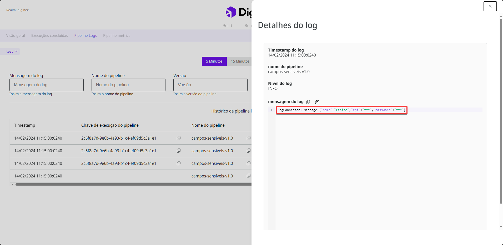

# Política de campos sensíveis


A Política de campos sensíveis está atualmente em fase beta. Entenda mais sobre o[ Programa Beta](https://docs.digibee.com/documentation/v/pt-br/geral/programa-beta).


Campos sensíveis podem ser definidos ao criar uma integração. Esses campos geralmente contêm informações sensíveis, como identificação pessoal ou dados financeiros, que não devem ser divulgadas durante a integração, pois podem levar a falhas de segurança.

Quando você define um campo sensível, as informações nos [_logs_ do _pipeline_](https://docs.digibee.com/documentation/v/pt-br/monitor/pipeline-logs) são ofuscadas com o conjunto de caracteres "\*\*\*". Confira a imagem a seguir:

<figure><figcaption>
Log com campos sensíveis na página Monitor.
</figcaption></figure>

Na Digibee Integration Platform, você tem duas opções para configurar campos confidenciais. Você pode defini-los:

* Para **pipelines específicos** no formulário de configuração do _pipeline_.
* Para **todo o realm**, que se aplica a todos os _pipelines_ simultaneamente, na **Política de campos sensíveis**.

Os campos sensíveis para o _realm_ ou para _pipelines_ específicos podem funcionar independentemente ou de forma combinada.

Suponha que você quer ofuscar o campo sensível “senha” para todos os _pipelines_ no seu _realm_, mas o campo “endereço” somente para um _pipeline_ específico, que iremos chamar de “_Pipeline_ A”. Nesse caso, você pode configurar uma **Política de campos sensíveis** com o campo “senha” e configurar o campo sensível “endereço” no formulário de configuração do _Pipeline_ A.

Quando você implanta o _Pipeline_ A, ambos os campos “senha” e “endereço” são ofuscados nos _logs_ do _pipeline_. Para outros _pipelines_ em seu _realm_, apenas o campo “senha” é ofuscado.

### Campos sensíveis para o nível de realm

Para definir campos sensíveis para todo o _realm_, você deve configurar uma **Política de campos sensíveis**. Proceda da seguinte forma:

1. Na página inicial da Plataforma, clique em **Configurações** no canto superior direito.
2. Clique em **Políticas**.
3. Abra a **Política de campos sensíveis** para configurá-la.
4. Insira os campos sensíveis no campo de texto, separados por vírgula, por exemplo: complementoEndereço, numeroTelefone.


**Informações importantes:**

* O caractere especial hífen \[-] é permitido no nome do campo sensível. Outros caracteres especiais, acentos e cedilha \[ç] não são permitidos.
* Campos sensíveis diferenciam maiúsculas e minúsculas, então “ID” é diferente de “id”.&#x20;
* Não é possível usar expressões regulares (regex) em campos sensíveis.


5. Clique em **Adicionar**. Os campos sensíveis são exibidos em uma lista abaixo. Você pode removê-los clicando no ícone de **X**.
6. Clique em **Salvar**.
7. Uma janela abrirá na página. Escreva “Eu quero editar a política” no campo **Mensagem de confirmação** e clique em **Criar**.

Quando você salva os campos, eles são classificados como confidenciais em todos os _pipelines_ do _realm_.


Os campos sensíveis configurados para todo o _realm_ podem ser visualizados somente na **Política de campos sensíveis** clicando no ícone de **olho**. Eles não são exibidos no formulário de configuração do _pipeline_.


Assista o vídeo abaixo para ver uma demonstração de como configurar uma **Política de campos sensíveis**:

{% embed url="https://files.gitbook.com/v0/b/gitbook-x-prod.appspot.com/o/spaces%2F-MkqXsI0cPgzRnwxNhnH%2Fuploads%2F1FocLENQ5esjEoEBdOQb%2Fdemo-politica-campos-sensiveis.mp4?alt=media&token=773ffa98-c60c-4b4b-90cf-c1b818c29040" %}

### O que acontece se eu editar a Política de campos sensíveis?

Você pode editar a **Política de campos sensíveis** a qualquer momento. No entanto, para refletir as mudanças nos _logs_ do _pipeline_, você deve reimplantar os _pipelines_ que usam essa política para aplicar a nova configuração.&#x20;

Quando você edita a política, você pode:

* **Adicionar novos campos:** os novos campos serão ofuscados nos _logs_ do _pipeline_.
* **Remover campos existentes:** os campos removidos não serão mais ofuscados nos _logs_ do _pipeline_, a não ser que sejam configurados como campos sensíveis em _pipelines_ específicos.
