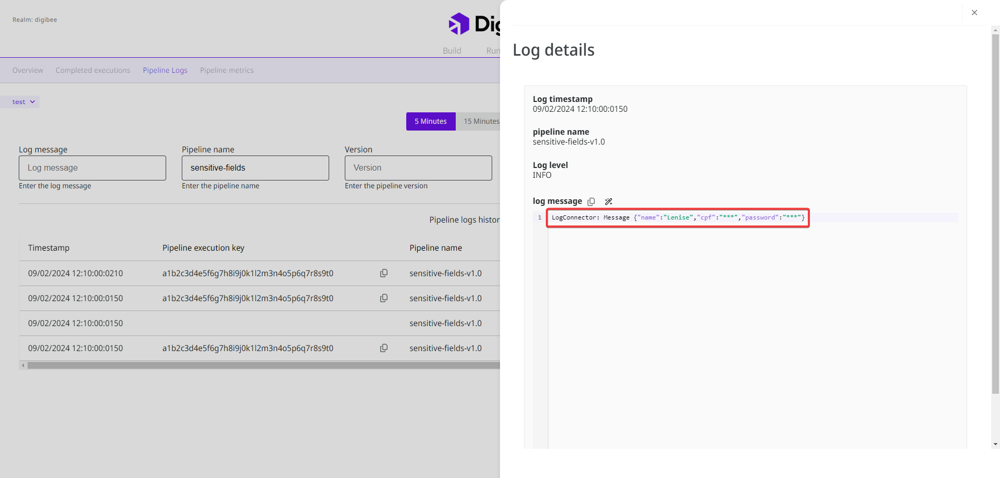

# Sensitive fields policy


The Sensitive fields policy is currently in beta phase. Learn more about the[ Beta Program](https://docs.digibee.com/documentation/general/beta-program).


Sensitive fields can be defined when creating an integration. These fields usually contain sensitive information, such as personal identification or financial data, which should not be disclosed during the integration as they could lead to security breaches.

When you set a sensitive field on the Digibee Integration Platform, the information in the [pipeline logs](https://docs.digibee.com/documentation/monitor/pipeline-logs) is obfuscated with the character set "\*\*\*". Take a look at the following image:

<figure><figcaption>
Log with sensitive fields on the Monitor page.
</figcaption></figure>

On the Digibee Integration Platform, you have two options for defining sensitive fields. You can define them:

* For **specific pipelines** in the [pipeline configuration form](https://docs.digibee.com/documentation/build/canvas).
* For the **entire realm**, which then applies to all pipelines simultaneously, in the **Sensitive fields policy**.

The sensitive fields for the realm and the specific pipelines can function independently or be combined.

Suppose you want to obfuscate the sensitive field “password” for all pipelines in your realm, but the field "address" only for a specific pipeline, that we’ll call “Pipeline A”. In this case, you can configure a **Sensitive fields policy** with the “password” field and configure the sensitive field “address” in the configuration form of Pipeline A.

When you deploy Pipeline A, both the "password” field and the "address” field are obfuscated in the pipeline logs. For the other pipelines in your realm, only the “password” field is obfuscated.

## How to configure a Sensitive fields policy

Follow these steps to configure sensitive fields for the entire realm:

1. On the Platform home page, click **Administration** in the upper right corner.
2. Click **Policies**.
3. Open the **Sensitive fields policy** to configure it.
4. Insert the sensitive fields in the text field, separated by commas, for example: addressCode, addressComplement.


**Important information:**

* The special character hyphen \[-] is allowed in the name of the sensitive field. Other special characters, accents, and cedilla \[ç] are not allowed.
* Sensitive fields are case-sensitive, so “ID” is different from “id”.
* It’s not possible to use regular expressions (regex) on sensitive fields.


5. Click **Add**. The sensitive fields are displayed in a list below. You can remove them by clicking the **X** icon.
6. Click **Save**.
7. A pop-up window will open on the page. Write “I want to edit the policy” in the **Confirmation message** field and click **Create**.

When you save the fields, they are classified as sensitive in all pipelines in the realm.


The sensitive fields configured for the entire realm can only be viewed in the **Sensitive fields policy** by clicking the **eye** icon. They are not displayed in the pipeline configuration.


Watch the video below to see a demonstration of how to configure the **Sensitive fields policy**:

{% embed url="https://files.gitbook.com/v0/b/gitbook-x-prod.appspot.com/o/spaces%2F4523BaA7JfghHEYBbLWY%2Fuploads%2FNtTad1ePWyuxZEBRV82n%2Fsensitive-fields-policy-demo.mp4?alt=media&token=e360dfc5-0b40-42e7-9c0e-c0ad05fc5fe1" %}

### What happens if I edit the Sensitive fields policy?

You can edit the **Sensitive fields policy** at any time. However, to reflect the changes in the pipeline logs, you must redeploy the pipelines that use this policy to apply the new configuration.&#x20;

When you edit the policy, you can:

* **Add new fields:** the new fields will be obfuscated in the pipeline logs.
* **Remove existing fields:** the removed fields will no longer be obfuscated in the pipeline logs, unless they are configured as sensitive fields in specific pipelines.
