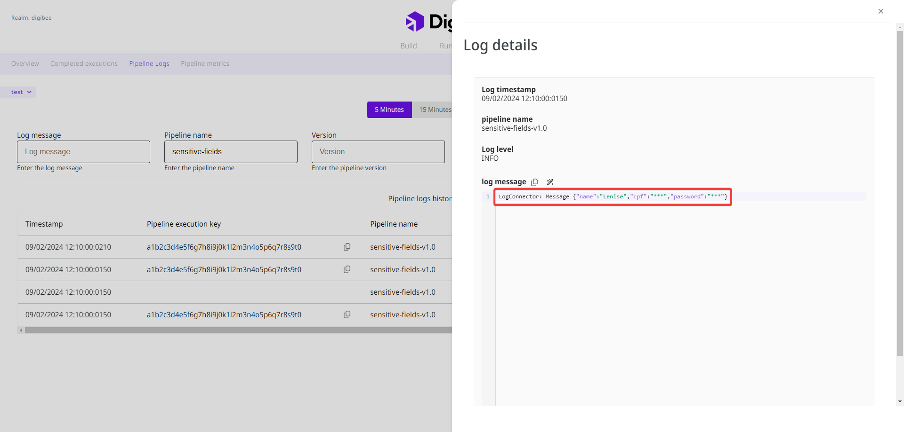
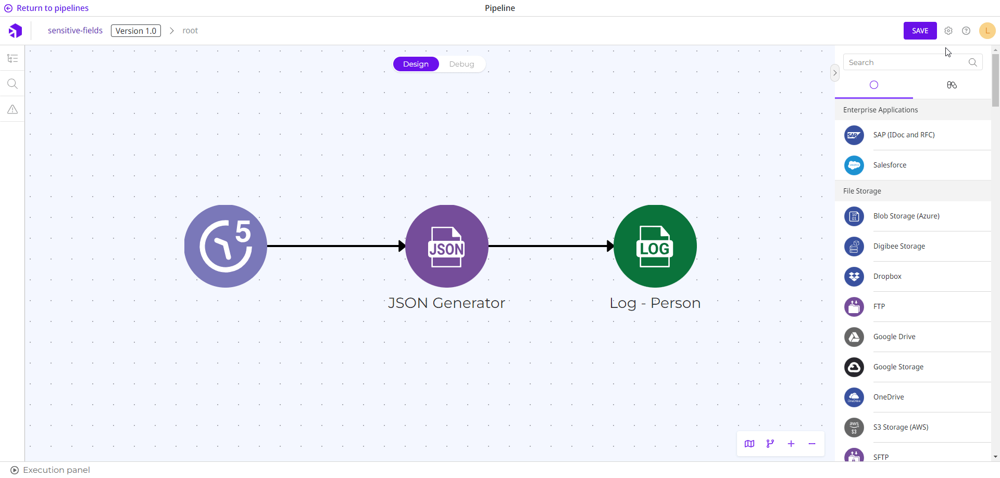

# Sensitive fields

When you create an integration, you can set sensitive fields in the Digibee Integration Platform. These fields usually contain sensitive information, such as personal identification or financial data, which should not be disclosed during the integration as they could lead to security breaches.

## How sensitive fields work

When you set a sensitive field, the information in the [pipeline logs](https://docs.digibee.com/documentation/monitor/pipeline-logs) is obfuscated with the character set "\*\*\*". Take a look at the following image:

<figure><figcaption>
Log with sensitive fields on the Monitor page.
</figcaption></figure>

In the Digibee Integration Platform, you have two options for configuring sensitive fields:

* **Realm level:** you can define sensitive fields for all pipelines in your realm.
* **Pipeline level:** you can define sensitive fields only for the pipeline you are creating.

### Sensitive fields for the realm level


The Sensitive fields policy is in beta phase and will be available on the Digibee Integration Platform from February 19, 2024.


To set sensitive fields for the entire realm, you must configure a **Sensitive fields policy**. Proceed as follows:

1. On the Platform home page, click **Settings** in the upper right corner.
2. Click **Policies**.
3. Open the **Sensitive fields policy** to configure it.
4. Insert the sensitive fields in the text field, separated by commas, for example: addressCode, addressComplement.


The special character hyphen \[-] is allowed in the name of the sensitive field. Other special characters, accents, and cedilla \[ç] are not allowed.


5. Click **Add**. The sensitive fields are displayed in a list below. You can remove them by clicking the **X** icon.
6. Click **Save**.

<figure><figcaption></figcaption></figure>

When you save the fields, they are classified as sensitive in all pipelines in the realm.

### Sensitive fields for the pipeline level

Follow the steps below to define sensitive fields for a specific pipeline:

1. Within the pipeline, click **Settings** next to the **Save** button.
2. Under **Sensitive fields**, add the fields you want to hide and press the **Enter** key.


The special character hyphen \[-] is allowed in the name of the sensitive field. Other special characters, accents, and cedilla \[ç] are not allowed.


3. Click **Confirm**.

<figure><figcaption></figcaption></figure>

When you save the fields, they are only classified as sensitive for this pipeline.
