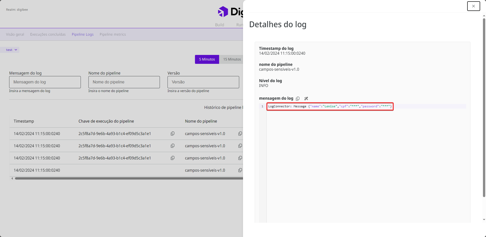

# Campos sensíveis

Ao criar uma integração, você pode definir campos sensíveis na Digibee Integration Platform. Esses campos geralmente contêm informações sensíveis, como identificação pessoal ou dados financeiros, que não devem ser divulgadas durante a integração, pois podem levar a falhas de segurança.

## Como funcionam os campos sensíveis

Quando você define um campo sensível, as informações nos [_logs do pipeline_](https://docs.digibee.com/documentation/v/pt-br/monitor/pipeline-logs) são ofuscadas com o conjunto de caracteres "\*\*\*". Dê uma olhada na imagem a seguir:

<figure><figcaption>
Log com campos sensíveis na página Monitor.
</figcaption></figure>

Na Digibee Integration Platform, você tem duas opções para configurar campos confidenciais:

* **Nível de realm:** você pode definir campos sensíveis para todos os _pipelines_ em seu _realm_.
* **Nível do pipeline:** você pode definir campos sensíveis apenas para o _pipeline_ que está criando.

### Campos sensíveis para o nível de realm

Para definir campos sensíveis para todo o _realm_, você deve configurar uma **Política de campos sensíveis**. Proceda da seguinte forma:

1. Na página inicial da Plataforma, clique em **Configurações** no canto superior direito.
2. Clique em **Políticas**.
3. Abra a **Política de campos sensíveis** para configurá-la.
4. Insira os campos sensíveis no campo de texto, separados por vírgula, por exemplo: complementoEndereço, numeroTelefone.


O caractere especial hífen \[-] é permitido no nome do campo sensível. Outros caracteres especiais, acentos e cedilha \[ç] não são permitidos.


5. Clique em **Adicionar**. Os campos sensíveis são exibidos em uma lista abaixo. Você pode removê-los clicando no ícone de **X**.
6. Clique em **Salvar**.

<figure><figcaption></figcaption></figure>

Quando você salva os campos, eles são classificados como confidenciais em todos os _pipelines_ do _realm_.

### Campos sensíveis para o nível do pipeline

Siga os passos abaixo para definir campos sensíveis para um _pipeline_ específico:

1. Dentro do _pipeline_, clique em **Configurações** próximo ao botão **Salvar**.
2. Em **Campos sensíveis**, adicione os campos que deseja ocultar e pressione a tecla **Enter**.


O caractere especial hífen \[-] é permitido no nome do campo sensível. Outros caracteres especiais, acentos e cedilha \[ç] não são permitidos.


3. Clique em **Confirmar**.

<figure><figcaption></figcaption></figure>

Quando você salva os campos, eles são classificados apenas como sensíveis para esse _pipeline_.
