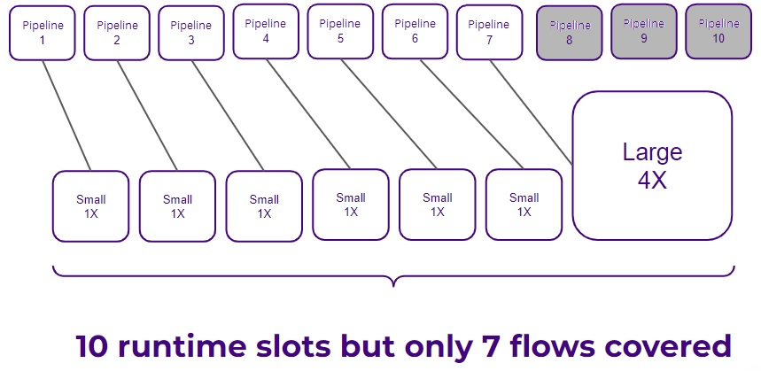

# Pipeline-based model

The Pipeline-based model was the first licensing model Digibee offered to its customers. This licensing is still used by some customers, but is no longer commercially available. Get an overview of what this licensing model offers and how it works in the Digibee Integration Platform.

## Licenses

In the Pipeline-based model, at least ten (10) licenses are offered per customer. Each license includes one (1) Pipeline and one (1) RTU (Runtime Unit). Each deployment, whether in the test or production environment, consumes one (1) license.

Note that you can create as many pipelines as you want. The license is consumed only when you deploy a pipeline.

## Environments

With this licensing model, you can only use the standard Digibee Integration Platform environments: **test** and **prod**. If you want to create more environments, the Capacity-based model gives you the option to have more environments.&#x20;

[If you want to learn more about the Capacity-based model, read this article.](https://docs.digibee.com/documentation/licensing/licensing-models/capacity-based-model)

## Hosted Platform

Digibee Integration Platform is hosted by Google Cloud Platform (GCP), which means that the Platform is developed according to the Software as a Service (SaaS) model. This means that the Cloud infrastructure part of this model is Digibee's responsibility and not the customer's.&#x20;

There is also another licensing model, the Capacity-based model, in which the customer can use their own Cloud provider, where different types of clouds can be used in the Digibee Integration Platform.

## Shared Platform

The Digibee Integration Platform is a shared Platform where all accounts share the same platform and share all available resources. However, each user account belongs to a single realm.&#x20;

Data cannot be shared between realms, and this information is not shared among them. Everything is controlled by Digibee's security system.

## Infrastructure and business needs

An important point in this model is the infrastructure and business needs of the company, that is, one (1) pipeline entitles you to one (1) license corresponding to one Small Runtime (RTU) slot. The deployment sizes offered by Digibee Integration Platform are: Small (1 RTU or 1 license), Medium (2 RTUs or 2 licenses), and Large (4 RTUs or 4 licenses).

| Size   | License consumption |
| ------ | ------------------- |
| Small  | 1                   |
| Medium | 2                   |
| Large  | 4                   |

For example, in this model, if out of 10 pipelines, one has to be used in the Large size (4 RTUs), only 7 flows will be covered in 10 RTUs, always assuming the same environment, as we can see below:

<figure><figcaption></figcaption></figure>

In this case, you would need to buy more licenses to continue using the remaining flows. The **Subscription-based model** works differently: each pipeline has 2 RTUs in Prod and 1 RTU in Test, which makes pipeline deployment easier.

[Learn more about the Subscription-based model in this article.](https://docs.digibee.com/documentation/licensing/licensing-models/subscription-based-model)
