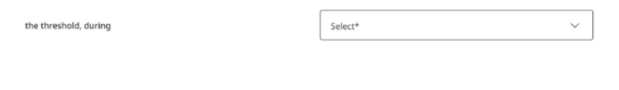

# Pipeline Executions


The **Alerts feature** is currently in restricted beta phase and is only available to specific customers. Learn more about the [Beta Program](https://docs.digibee.com/documentation/general/beta-program).


If you know that the number of executions per second of a pipeline should be within a certain range, you can set up an execution rate alert to inform you when the number assumes a value that is outside of the defined range.

## Setting up a pipeline execution alert

When configuring an alert, you must specify these parameters:

* **Limit value**: the execution rate to use as the limit for triggering the alert. This field accepts numeric values. Decimals must be separated with a period (.).
* **Condition**: whether the alert should be triggered when the number of executions per second is less than, equal or greater than the limit value for the specified time limit.
* **Tolerance limit**: the amount of time that the number of executions per second must be outside the specified limit value before an alert is triggered. The alert will only be triggered if the EPS persists within the threshold and period specified, between 5 and 20 minutes, as per the image below:

<figure><figcaption>
<em>Pipeline configuration form with specific configurations for the alert</em>
</figcaption></figure>

## Fixing a pipeline execution issue

If the number of executions per second of a pipeline is outside the expected range, it could be due to the following:

### Your pipeline is not being triggered as expected

For example, if your pipeline has a **REST trigger** that is activated by a third-party application, a failure in that application will cause that pipeline not to activate. Consequently, the execution rates of your pipeline would take a value lower than the expected one. If this is the case, fixing the issue in the third-party application will return your pipeline execution rate to the expected level.

If, on the other hand, the execution rate of a pipeline is higher than expected, this may be due to an incorrect trigger configuration, such as a cron expression in the settings of a scheduler trigger that was entered incorrectly.

### Your pipeline architecture is inappropriate

An improper pipeline architecture can lead to unexpected execution rates. For example, if you build a pipeline that reprocesses failed executions and forget to set a limit on reprocessing, that pipeline might try to execute an infinite number of times.

An inefficient architecture may also cause pipelines to take longer than expected to execute, decreasing their execution rate. If this is the case, review your pipeline architecture. Consider using an event-driven architecture and/or pagination.

Read the articles [Event-driven architecture](https://docs.digibee.com/documentation/tutorials-and-best-practices/event-oriented-architecture) and [Pagination](https://docs.digibee.com/documentation/tutorials-and-best-practices/pagination-tutorial) to learn more about these concepts.

### Your pipeline deployment size is too small

When the deployment size of a pipeline is too small to support the frequency in which it's triggered, execution requests stack up instead of executing immediately. This can cause the execution rate to take on a value that is lower than expected. If this is the case, consider increasing the deployment size of your pipeline. Read the article about [deployment sizes](https://docs.digibee.com/documentation/run/runtime#size) to learn more.

For more information, [read our Pipeline Metrics documentation](https://docs.digibee.com/documentation/monitor/pipeline-metrics#pipeline-executions-per-second-eps).
