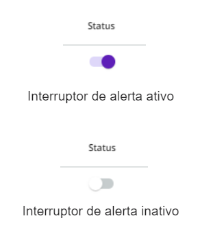

# Como ativar ou desativar um alerta


**Informações importantes:**

* Para acessar a tela Alertas e usar todas as funcionalidades presentes nesse artigo, você precisa ter a permissão ALERT:UPDATE. Aprenda mais na [documentação sobre Papéis](https://docs.digibee.com/documentation/v/pt-br/administration/new-access-control/papeis-do-controle-de-acesso).
* &#x20;Os grupos padrão Support, Developers e Governance Manager já os possuem, mas se preferir pode adicionar o papel de sistema ao seu grupo de acesso.


<figure><figcaption>
<em>Como ativar e desativa alertas</em>
</figcaption></figure>

Siga estes passos para ativar ou desativar um alerta:

1. Vá para a página de **Configurações**.
2. Em Notificações, clique em **Alertas**.
3. Procure na tabela o alerta que deseja ativar ou desativar.
4. Clique no interruptor na coluna **Status** para ativar ou desativar o alerta.

<figure><figcaption></figcaption></figure>
