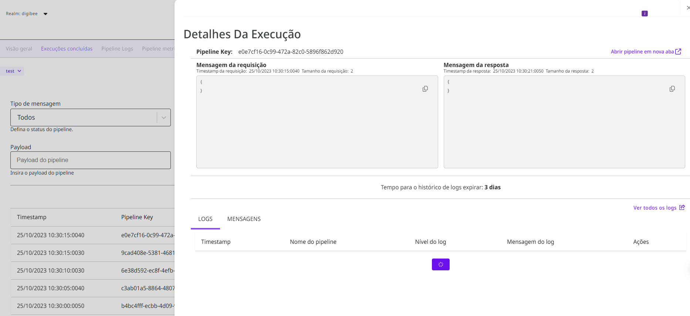

# Execuções concluídas

Execuções concluídas são a execução de ponta a ponta de um _pipeline_, ou seja, o registro do que ocorreu dentro dele, do momento que o _input_ passou pelo _trigger_ até rodar pelo último componente na esteira do _pipeline_.

Na aba de execuções concluídas, você pode acompanhar as execuções dos _pipelines_ e de seu histórico de _logs_, assim como reexecutá-los.

## Seleção de ambiente&#x20;

Você pode selecionar o ambiente desejado no canto superior esquerdo. Quando você seleciona um ambiente, a página inteira é atualizada para mostrar os dados relativos aos _pipelines_ naquele ambiente.

.png>)

## **Campos de busca**

Você pode filtrar execuções de _pipelines_ utilizando os seguintes parâmetros:

* **Período de tempo:** você pode filtrar _pipelines_ executados nos últimos 5, 15 ou 60 minutos, e por intervalo específico de tempo
* **Tipo de mensagem**: o status de execução do _pipeline_
  * **Resposta**: execuções concluídas sem nenhuma interrupção
  * **Erro**: execuções interrompidas
  * **Todos**: qualquer execução
* **Nome do **_**pipeline**_: o nome completo do _pipeline_
* **Versão do **_**pipeline**_ (_major_ ou _minor_)
* **Chave de execução de um **_**pipeline**_**:** identificador único de cada execução de um _pipeline_
* **Payload:** o _input_ ou _output_ do _pipeline_ em formato JSON. Esse campo de busca utiliza [a sintaxe simple query do Elasticsearch](https://www.elastic.co/guide/en/elasticsearch/reference/current/query-dsl-simple-query-string-query.html#simple-query-string-syntax)
* **Origem:** o [_trigger_ do _pipeline_](https://docs.digibee.com/documentation/v/pt-br/components/triggers)
* **Código do erro:** um código de erro de uma execução de _pipeline_, de acordo com o [padrão HTTP de códigos de erro](https://pt.wikipedia.org/wiki/Lista\_de\_c%C3%B3digos\_de\_estado\_HTTP)


**Comando:** é possível realizar uma busca usando o comando CTRL+ENTER (Windows) ou CMD+ENTER (Mac), como alternativa para o botão Pesquisar.


As execuções concluídas são exibidas abaixo, de acordo com os parâmetros especificados:

<figure><figcaption>
Tabela de execuções concluídas
</figcaption></figure>

Você pode clicar no ícone de lupa para ver os [detalhes da execução](./#detalhes-da-execucao) ou no ícone de atualização para reexecutar o _pipeline_.

Para que o _pipeline_ seja reexecutado manualmente, seu _trigger_ deve possuir a opção “Allow redelivery of messages” ativada. É importante notar que você deve reexecutar um _pipeline_ manualmente somente quando estiver buscando solucionar um problema, nunca como parte de seu processo de integração.

## Detalhes da execução

Se você clicar no ícone de lupa na tabela de execuções concluídas, um _sidesheet_ aparecerá exibindo os detalhes da execução.

<figure><figcaption>
Sidesheet de detalhes da execução
</figcaption></figure>

No _sidesheet_ de detalhes da execução, você pode ver o(s):

* **Pipeline key**: um identificador único de uma execução de um _pipeline_
* **Mensagem da requisição:** os dados JSON enviados pelo _trigger_ do _pipeline_
* **Mensagem da resposta:** o _output_ JSON do _pipeline_
* [**Logs da execução**](https://docs.digibee.com/help-center/v/pt-br/monitor/pipeline-logs)

Você também pode clicar no botão no canto superior direito para acessar no Canvas o _pipeline_ cuja execução você está analisando.&#x20;

<figure><figcaption></figcaption></figure>

Chamamos de “[mensagem](https://docs.digibee.com/help-center/v/pt-br/build/pipelines/processamento-de-mensagens)” o dado que é transmitido em formato JSON através do _pipeline_. Cada componente do _pipeline_ recebe, manipula e exporta uma mensagem. Apenas as 50 primeiras mensagens do _pipeline_ serão exibidas, e somente para _pipelines_ executados em modo de teste.

Em alguns casos, a Plataforma apresenta _payloads_ truncados, de acordo com os seguintes critérios:

| Tamanho do payload |               Exibição              |
| :----------------: | :---------------------------------: |
|   Menor que 32kb   |          Exibição completa          |
| Entre 32kb e 320kb |           Exibição parcial          |
|   Maior que 320kb  | Aviso @@DGB\_TRUNCATED@@ é mostrado |

