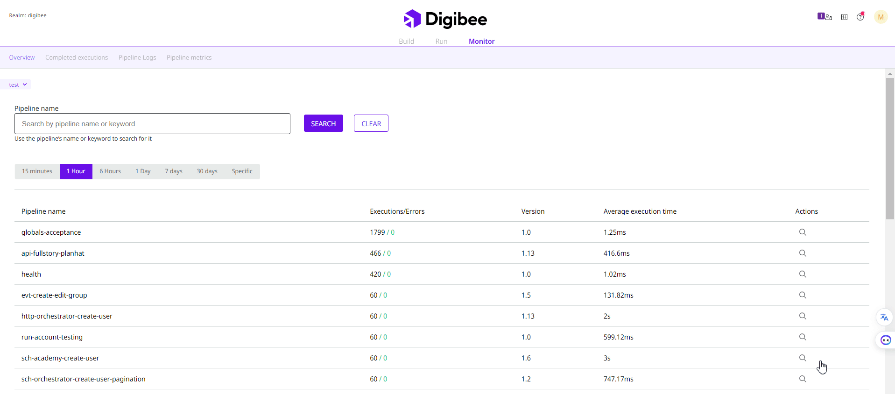

# Monitor overview

On the **Overview** page, you can keep track of created pipelines. By now, this page shows data about the 10 most executed pipelines.

On the top left of the page, you can select the desired environment: **test** or **prod**.&#x20;

Below the environment selector, the **monitoring cards** display the number of created and deployed pipelines, as well as the number of created accounts on the selected environment.

Use the **search bar** to filter pipelines by their name or a keyword, which is a part of a pipeline name.

Use the **time period selector** to filter the time range of the overview report. You can select a predetermined time period between the last 15 minutes and the last 30 days, or specific start and end dates and times.

<figure><figcaption>
Selecting a specific time period
</figcaption></figure>

The **overview table** shows a summary of the executions of the most executed pipelines in the selected period. In it, you can see the:

* Pipeline name
* Total number of executions (failed or successful) and failed executions
* Pipeline version
* Average pipeline execution time

You can click on the magnifying glass icon to see the details of these executions on the **Completed Executions** page.

<figure><figcaption></figcaption></figure>

<figure><figcaption>
Overview table
</figcaption></figure>

In the **overview chart**, you can see the number of successful and failed executions, as well as the average, minimum, and maximum execution time for the pipelines shown in the table.

\

<figure><figcaption></figcaption></figure>

<figure><figcaption>
Overview chart
</figcaption></figure>
