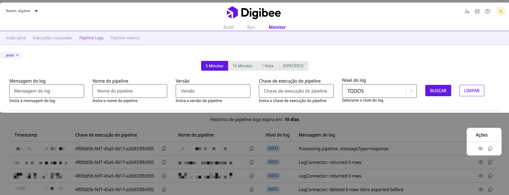

# Pipeline logs

Pipeline logs são dados detalhados que permitem aos usuários ver em profundidade o que ocorre em cada execução presente durante o ciclo de funcionamento do _pipeline_.&#x20;

Na aba Pipeline Logs, você pode acompanhar os _logs_ de eventos que são registrados durante a execução de um _pipeline_.

## Seleção de ambiente 

Você pode selecionar o ambiente desejado no canto superior esquerdo. O histórico de _logs_ expira após 3 dias no ambiente de teste (test) e após 10 dias no ambiente de produção (prod).

Quando você seleciona um ambiente, a página inteira atualiza e mostra os dados correspondentes.

## Campos de busca 

Você pode filtrar os _logs_ de _pipeline_ utilizando os seguintes parâmetros:

* **Período do tempo**: o horário em que um _pipeline_ foi executado. Filtre os _pipelines_ executados nos últimos 5, 15 ou 60 minutos ou selecione um período de tempo específico.
* **Mensagem do **_**log**_**:** informação enviada por um componente que retorna _logs_ durante a execução de um _pipeline_. Você deve buscar por palavras inteiras quando utilizar esse campo.
* **Nome do **_**pipeline**_**:** o nome do _pipeline_, como informado durante sua criação. Você deve buscar por palavras inteiras quando utilizar esse campo.
* [**Versão do **_**pipeline**_](https://docs.digibee.com/documentation/v/pt-br/build/pipelines/historico-de-versoes-de-pipelines)_**.**_
* **Chave de execução de um **_**pipeline**_**:** identificador único de cada execução de um _pipeline._
* **“Ordenar por”** (Beta): um filtro que permite classificar os _pipeline logs_ em ordem crescente (_asc_) ou decrescente (_desc_) de acordo com o _timestamp_.
* **Nível do **_**log**_**:** a classificação da mensagem do _log_, conforme o seguinte critério:
  * INFO: informação acerca de eventos ordinários durante a execução do _pipeline._
  * WARN: informação acerca de possíveis problemas durante a execução do _pipeline._
  * ERROR: informação acerca de erros durante a execução do _pipeline._
  * ALL: qualquer tipo de informação.


**Comando:** é possível realizar uma busca usando o comando CTRL+ENTER (Windows) ou CMD+ENTER (Mac), como alternativa para o botão Pesquisar.


Os _logs_ são mostrados abaixo de acordo com os parâmetros especificados. Você pode clicar no ícone de olho para ver os detalhes do _log_ em um modal ou no ícone de cópia para copiar a mensagem do _log_.

## Como formatar mensagens com JSONs?

Agora é possível formatar mensagens de _logs_ contendo JSONs e copiar o conteúdo formatado.

Para usar a _feature_, siga estes passos:

* Em Pipeline Logs, clique no ícone de **“olho”**, que abrirá os detalhes do log.
* Em Mensagem do log, clique no ícone de **“varinha”** para formatar qualquer JSON disponível. Na mesma aba, há o ícone para copiar o conteúdo.

<figure><figcaption></figcaption></figure>
