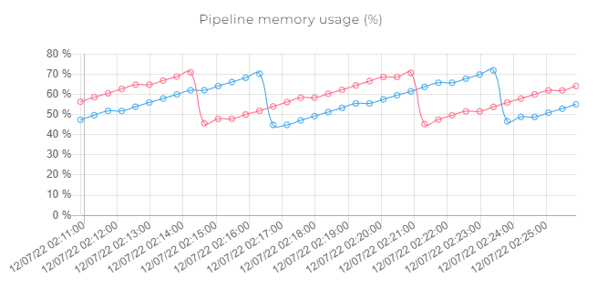

# Pipeline Metrics


Para acessar a página de Pipeline Metrics, você precisa pertencer a um grupo que é associado ao papel **metrics viewer**, como o grupo padrão **support**. Para aprender mais sobre grupos e papéis, [leia nosso artigo sobre controle de acesso](https://docs.digibee.com/documentation/v/pt-br/administration/new-access-control).


Na página Pipeline Metrics, você pode analisar gráficos referentes à performance dos _pipelines_ implantados.

## Campo de busca

<figure><figcaption></figcaption></figure>

Selecione o ambiente desejado no canto superior esquerdo. Quando você seleciona um ambiente, toda a página é atualizada.

Depois, escolha um _pipeline_ na barra de busca e selecione o período desejado para a análise. Os períodos predeterminados são os(as) últimos(as) : 15 minutos, 1 hora, 6 horas, 1 dia ou 7 dias. Você também pode escolher um intervalo de tempo específico.

## Gráficos

### Execuções de _pipeline_ por segundo (eps)

Esse gráfico mostra o número médio de execuções por segundo, em diversos intervalos de tempo durante o período de tempo selecionado, para todas as réplicas.

### Tempo de resposta do _pipeline_ (ms)

Esse gráfico mostra o tempo médio (em milissegundos) decorrido para que o _pipeline_ gerasse uma resposta, em diversos intervalos de tempo durante o período de tempo selecionado, para todas as réplicas.

O tempo de resposta é dado pelo tempo decorrido entre a saída da mensagem da fila de execução e uma resposta ser gerada pelo _pipeline_. Contenções na fila de execução não afetam essa métrica.

Você pode aprender mais sobre filas de execução na seção "Mensagens em fila de um _pipeline_ (mensagens)" abaixo.

### Execuções de _pipeline_ em andamento (_inflights_)

Esse gráfico mostra o número total de requisições simultâneas feitas ao _pipeline_ - para todas as réplicas - durante diversos intervalos no período de tempo selecionado.

Essa informação é útil para determinar se o número de réplicas e execuções simultâneas escolhido durante a implantação foram apropriados.

Para aprender mais sobre tamanho da implantação, execuções simultâneas e réplicas, [aprenda sobre como implantar um _pipeline_](https://docs.digibee.com/documentation/v/pt-br/run/deployment/deployments).

### Tamanho da mensagem do _pipeline_ (bytes)

As linhas nesse gráfico exibem o tamanho médio (em bytes) das mensagens recebidas e retornadas pelo _pipeline_ durante diversos intervalos no período de tempo selecionado. Você pode ver o _label_ de cada linha passando seu cursor por cima dela.

Essa informação é útil para determinar se o tamanho do _pipeline_ escolhido durante sua implantação foi adequado.

Para aprender mais sobre tamanho da implantação, execuções simultâneas e réplicas, [aprenda sobre como implantar um _pipeline_](https://docs.digibee.com/documentation/v/pt-br/run/deployment/deployments).

### Uso de memória do _pipeline_ (%)

Esse gráfico exibe o uso percentual médio de memória para cada réplica do _pipeline_ durante diversos intervalos durante o período de tempo selecionado.

Essa informação é útil para determinar se o tamanho de _pipeline_ escolhido durante sua implantação foi adequado, já que a exaustão da memória disponível levará a um erro do tipo _"Out of Memory"._

Para aprender mais sobre tamanho da implantação, execuções simultâneas e réplicas, [aprenda sobre como implantar um _pipeline_](https://docs.digibee.com/documentation/v/pt-br/run/deployment/deployments).

### Mensagens em fila de um _pipeline_

Esse gráfico mostra o número total de mensagens na fila de execução, isto é, o número de mensagens aguardando para serem processadas, para todas as réplicas do _pipeline_, durante diversos intervalos durante o período de tempo selecionado.

Todas as réplicas consomem mensagens da mesma fila. Um número alto de mensagens indica que o número de réplicas de _pipeline_ ou de execuções simultâneas deve ser aumentado durante a implantação.

Para aprender mais sobre tamanho da implantação, execuções simultâneas e réplicas, [aprenda sobre como implantar um _pipeline_](https://docs.digibee.com/documentation/v/pt-br/run/deployment/deployments).

### Uso de CPU do _pipeline_ (%)

Esse gráfico mostra o uso médio percentual do CPU para cada réplica do _pipeline_, de acordo com o tamanho de implantação escolhido.

Essa informação é útil para determinar se o tamanho de _pipeline_ escolhido durante sua implantação foi adequado, já que a exaustão de CPU poderá levar à lentidão no processamento.

Para aprender mais sobre tamanho da implantação, execuções simultâneas e réplicas, [aprenda sobre como implantar um _pipeline_](https://docs.digibee.com/documentation/v/pt-br/run/deployment/deployments).
