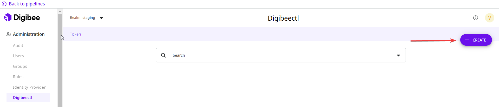

# Como obter arquivo de configuração do digibeectl

Para iniciar o uso do **digibeectl** é necessário baixar o arquivo de configuração criptografado que irá gerar um _token_ único e exclusivo para acesso aos recursos do digibeectl.\
\
\
Para baixar o arquivo basta estar logado na Digibee Integration Platform e seguir este passo a passo:

1\. Clique no botão 'Administração'


\
2\. Clique em 'digibeectl' no menu do lado esquedo da tela.&#x20;


3. Clique no botão CRIAR (CREATE)&#x20;


<figure><figcaption></figcaption></figure>

4. &#x20;Atribua um título ao seu Token


5. Adicione uma lista de permissões que este token obterá. Leia a [documentação do digibeectl](https://docs.digibee.com/documentation/v/pt-br/plataforma/digibeectl) para saber mais sobre permissões.


6. Selecione um prazo para a expiração do token. O prazo pode ser configurado para ter uma duração mínima de 1 hora e duração máxima de até 1 ano.


7. Salve as configurações de permissões e expiração.
8. &#x20;Copie a chave de criptografia gerado pela plataforma através do botão de copiar e salve o conteúdo para utilizá-lo posteriormente. Em seguida, defina a senha de criptografia do seu arquivo.


Guarde a senha e chave em um local seguro pois elas não podem ser recuperadas.



9. Agora é só salvar e baixar o arquivo gerado.
10. Após a instalação do digibeectl utilize o comando abaixo com os dados que você acabou de configurar:

```
digibeectl set config --file "path/file.json" --secret-key "chave-de-criptografia" --auth-key "senha-de-criptografia"
```

