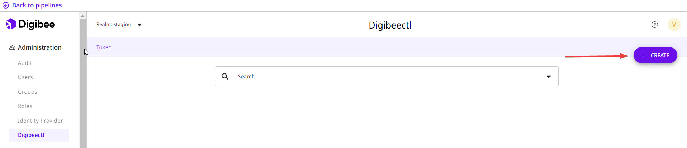

# How to obtain digibeectl configuration file

**digibeectl** requires a configuration file that is encrypted and generates an authentication token. This token is exclusive and mandatory to enable your access to digibeectl resources. Follow the next steps to obtain your own file:

1. Click in the Admin icon.&#x20;


2. Click in digibeectl in the menu on the left side of the screen.&#x20;


3. Click in the CREATE button


<figure><figcaption></figcaption></figure>

4. Give your token a title


5. Add a list of permissions this token will get. Read the [digibeectl documentation](https://docs.digibee.com/documentation/platform/digibeectl) to know more about permissions.&#x20;


6. Set an expiration period for your token. The period ranges from 1 hour to 1 year.


\


7. Save your permissions list and expiration period.
8. Copy the Encryption key using the copy button and save its content somewhere safe. Then, create an encryption passphrase.


Make sure your passphrase and encryption key are saved somewhere else and secure as they can’t be restored.



9. Save and download your file.
10. After installing digibeectl, use the following command with the configuration data you have just set:

```
digibeectl set config --file "path/file.json" --secret-key "encryption-key" --auth-key "encryption-passphrase"
```

\
Click [here ](./)to read the complete digibeectl Use Guide.
