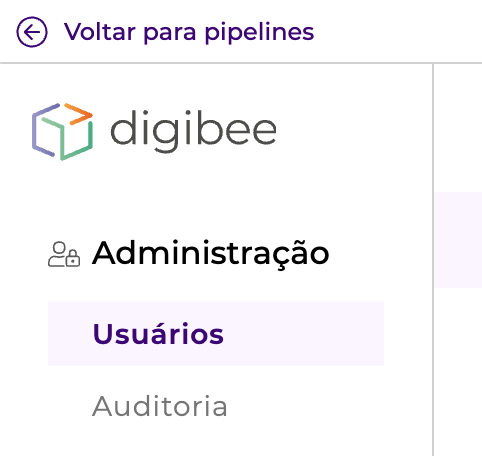

# Platform Layout Overview

The Digibee Integration Platform layout is the first step of the revolution we’re promoting in our interface.

The layout was designed to represent the integrations building cycle. Therefore, you’ll find 3 menus:&#x20;

* **Build:** is the grouping of pipelines and Capsules to ease the construction of the pipelines.
* **Run:** is where you deploy the pipelines.
* **Monitor:** is where you visualize the panels to monitor your integrations.

.png>)

The Configurations and Administration screens are accessed through the **Settings** icon:

.png>)

You’ll find fixed structures that help in the most common tasks:

.png>)
