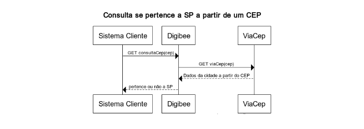

# June

## Release notes 06-21-2022

#### **COMPONENTS** 

* **Blob Storage:** we’ve launched a new component, Blob Storage (Azure). It will allow us to manipulate files in Azure Blob Storage containers, especially when it comes to performing upload and download operations, listing files or deleting them, using Double Braces, etc. Read the [Azure Blob Storage documentation here](../../components/file-storage/azure-blob-storage.md).

#### **GROUPS INTEGRATION WITH IDENTITY PROVIDERS** 

We’ve implemented the Digibee Integration Platform's user and group blocking experience.

Now it’s no longer possible to assign users to integrated groups through the Digibee Integration Platform interface. If the access manager tries to make any changes, a warning is displayed on the group and user details page, informing that the integrations have already been made and edits must be made through the identity provider or on the Groups Integration page. Check out the alerts:

.png>)

To learn more, read the article [Integration of IdP groups with Digibee groups](../../administration/identity-provider-integration/integration-of-idp-groups-with-digibee-groups/).

We’ve also fixed a few bugs:

* **Create button:** we’ve fixed the behavior that displayed the create button even when the user didn’t have the create permission.
* **Trigger HTTP:** we’ve fixed the bug that made using Response Headers in HTTP trigger settings impossible.

## Release notes 06-07-2022

#### **PROJECTS** 

We’ve made an improvement in the navigation of projects in Build. Now, after selecting a project, opening a pipeline contained in it, and returning to list, you’ll be redirected to that pipeline’s project instead of the default project.

#### **GLOBALS** 

We've created a feature that allows a user with read-only permission to have access to the details view on the Globals page by clicking the eye icon.

**IMPORTANT:** we’ll add this functionality on other pages of the Platform soon.

#### **GROUPS AND ROLES** 

We’ve improved the experience of the page Groups and Roles. Now, by positioning your mouse cursor on top of the description of a group or role, you can read its full description and discern its purpose.

**We've also fixed some bugs:**

* **Relationship:** we’ve fixed the error that prevented the creation of new relationships.
* **Empty lists:** we’ve fixed the error that displayed the create button on empty lists when the user did not have creating permission. The error occurred in the lists of: **Users, Groups, Roles, Settings, Global, API keys, Relationship, Multi-instance, Capsules, and digibeectl.**
* **Group creation:** we’ve fixed the error that prevented users from creating groups.
* **Test-mode:** we've added the ability to accurately display fractional numbers with precision in the pipeline test-mode. Now, instead of rounding fractional numbers, the Platform displays the exact fractions of a number. This also helps in cases of re-running a pipeline.

.png>)
