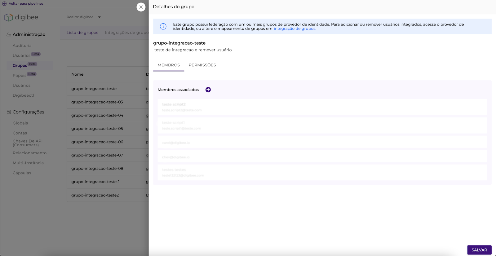
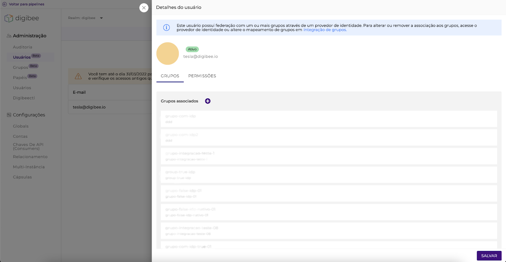
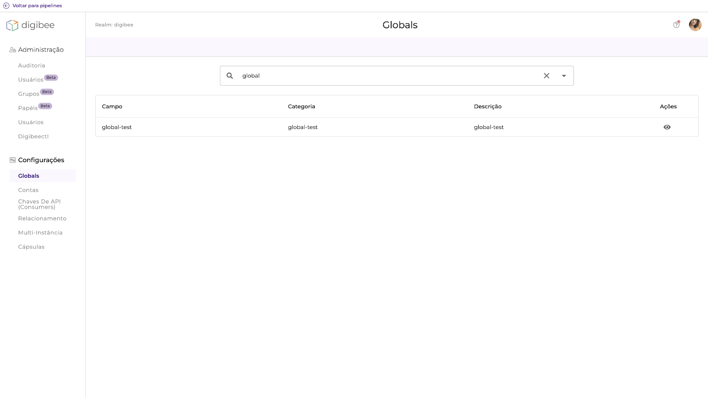
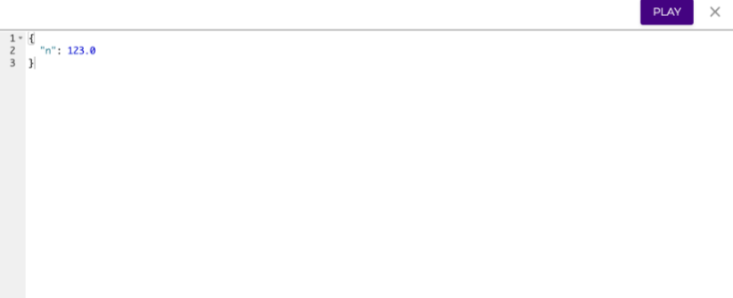
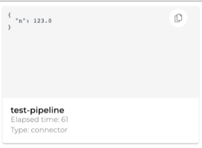

# Junho

## Novidades 21/06/2022

#### **COMPONENTES** 

* **Blob Storage:** Lançamos um novo componente, o _Blob Storage (Azure),_ que permite manipular arquivos que estejam em contêineres _Azure Blob Storage_, especialmente quando é necessário realizar operações de _upload_ e _download,_ listar arquivos \_\_ ou apagá-los\_,\_ usar _Double Braces_, etc. Leia a [documentação sobre o Azure Blob Storage aqui](../../components/file-storage/azure-blob-storage.md).

#### **INTEGRAÇÃO DE GRUPOS COM PROVEDORES DE IDENTIDADE** 

Implementamos a experiência de bloqueio de usuários e grupos integrados da Digibee Integration Platform. Agora, não será possível atribuir usuários a grupos integrados pela interface da Digibee Integration Platform. Se o gestor de acessos tentar realizar modificações, um aviso será exibido nas páginas de detalhes do grupo e usuário, informando que as integrações já foram realizadas, e edições deverão ser feitas via provedor de identidade ou na página de Integração de grupos. Veja os alertas:

Para saber mais, leia o artigo [Integração de Grupos IdP com grupos Digibee](../../administration/identity-provider-integration/integration-of-idp-groups-with-digibee-groups/).

Nós também solucionamos alguns _bugs_:

* **Botão Criar:** corrigimos o comportamento que exibia o botão criar mesmo quando o usuário não possuía permissão de criação.
* **Trigger HTTP:** corrigimos o problema que impossibilitava o uso de _Response Headers_ em configurações de _triggers_ HTTP.

## Novidades 07/06/2022

#### **PROJETOS** 

Realizamos uma melhoria na navegação de projetos em Build. Agora, depois de selecionar um projeto, abrir um _pipeline_ contido nele e voltar à lista, você será redirecionado ao projeto daquele pipeline e não mais ao projeto _default_.

#### **GLOBALS** 

Criamos uma funcionalidade que permite que um usuário com permissão de apenas leitura tenha acesso à visualização de detalhes na página de Globals ao clicar no ícone de olho.

**IMPORTANTE**: em breve adicionaremos essa funcionalidade em outras páginas da Plataforma.

#### **GRUPOS E PAPÉIS** 

Melhoramos a experiência na página de Grupos e Papéis. Agora, ao posicionar o cursor do mouse em cima da descrição de um grupo ou papel, é possível ler sua descrição completa e diferenciar seu propósito.

Nós também solucionamos alguns _bugs_:

* **Relacionamento:** corrigimos o erro que impedia a criação de novos relacionamentos.
* **Lista vazia:** corrigimos o erro que exibia o botão criar em listas vazias quando o usuário não possuía permissão de criação. O erro ocorria nas listas de: **Usuários, Grupos, Papéis, Configurações, Global, Chaves de API, Relacionamento, Multi-instância, Cápsulas** e **digibeectl**.
* **Criação de grupos:** corrigimos o erro que impedia usuários de criarem grupos.
* **Test-mode:** adicionamos a capacidade de exibir números fracionados com precisão no test-mode de _pipelines_. Agora, ao invés de arredondar números fracionados, a Plataforma exibe as frações exatas de um número. Isso também ajuda em casos de re-execução de um _pipeline_.

