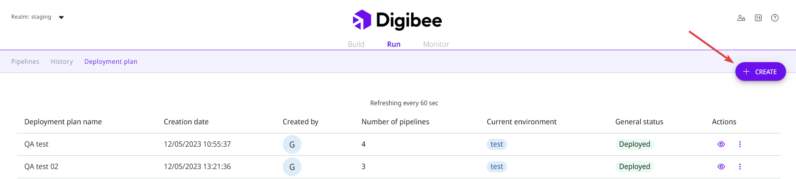
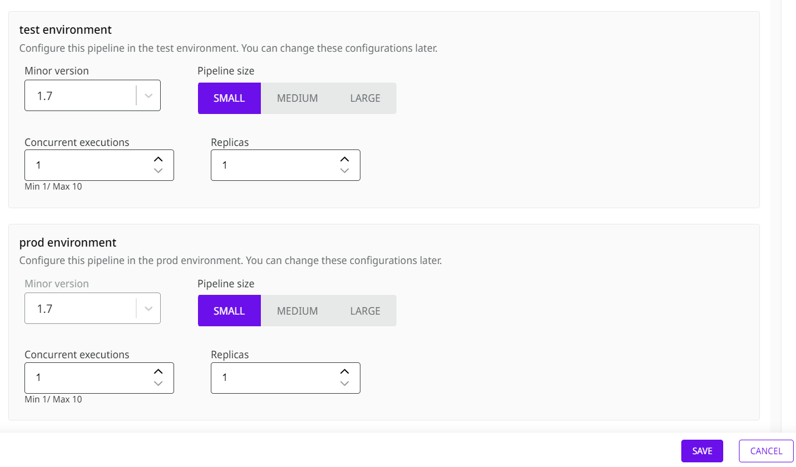

# Como criar um plano de implantação de pipeline (Beta)


Atualmente, essa _feature_ está na [fase **Beta**](https://docs.digibee.com/documentation/v/pt-br/general/programa-beta) e ainda está em aprimoramento.


## Visão geral

O plano de implantação de _pipeline_ permite implantar até cinco _pipelines_ simultaneamente. O conceito por trás da criação deste plano é agilizar e acelerar a implantação de _pipelines_ estratégicos em produção.

Ao criar o plano, você seleciona todos os _pipelines_ que deseja fazer a implantação. Depois que o plano for criado, você poderá fazer a implementação dos _pipelines_ no ambiente de teste e, em seguida, promovê-los para o ambiente de produção.

## Como criar um plano de implantação

Siga estas etapas para criar um plano de implantação:

1. Na página de Run, abra a aba de Deployment Plan (plano de implantação).

<figure><figcaption></figcaption></figure>

2. Clique em **Create.**

<figure><figcaption></figcaption></figure>

3. Digite o nome do plano.

<figure><figcaption></figcaption></figure>

3. Insira uma breve descrição do seu plano de implantação. Por exemplo, “_pipelines_ da Black Friday”.
4. Selecione cada _pipeline_ que você deseja implantar individualmente. Os _pipelines_ serão adicionados à lista abaixo.


Um _pipeline_ com erro não pode ser adicionado ao seu plano de implantação.


6. Para cada _pipeline_ que você deseja implantar, selecione o tamanho dos ambientes de teste e produção, o número de execuções simultâneas e o número de réplicas.

<figure><figcaption></figcaption></figure>

7. Clique em **Save.**&#x20;

Depois de salvar o plano, você poderá acessá-lo na aba Deployment Plan e realizar as seguintes ações:

* **Implantar:** faça a implantação dos _pipelines_ no ambiente de teste.
* **Promover para:** promova os _pipelines_ implantados para o ambiente de produção.

<figure><figcaption></figcaption></figure>

Se você clicar no ícone de expansão, poderá ver em qual etapa do processo você está. As etapas são: **Criar**, **Teste** e **Prod**. Você também pode excluir o plano clicando no ícone da lixeira.


Se você quiser excluir seu plano de implantação, é importante lembrar que isso não excluirá os _pipelines_ implantados. Você deve executar esta ação manualmente na página de Run.

