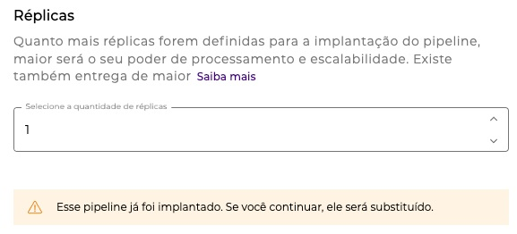

# Implantando um pipeline

Uma vez que o fluxo do _pipeline_ tenha sido criado, o próximo passo é disponibilizá-lo para uso, isto é, implantá-lo. Na aba _Run_, você consegue implantar seu _pipeline_ em segundos com base no tamanho da implantação. Essa implantação pode acontecer tanto no ambiente de teste (_test_) quanto no ambiente de produção (_prod_).

[Se quiser saber mais sobre a etapa de Run, onde é feita a gestão das implantações, consulte o artigo Conceitos de Run.](https://docs.digibee.com/documentation/v/pt-br/run/runtime)


Para ter acesso à **Implantação**, você deve ter a **permissão** de _**Deployment:**_** Ler** e _**Deployment:**_** Criar nos ambientes desejados (test/ prod)**, para sua conta de usuário ou um grupo ao qual você pertence.


## **Como implantar um **_**pipeline**_**?** 

O processo para implantar o _pipeline_ em teste ou em produção é simples. Veja:

### Tela de Run

Acesse a tela de _Run_ e clique no botão **+ CRIAR**.

<figure><figcaption></figcaption></figure>

### Configurando o _pipeline_ a ser implantado

#### 1. Selecionando o _pipeline_, a versão e o tamanho

Selecione um pipeline e sua versão. Depois de selecionar o pipeline, são exibidas informações sobre o projeto ao qual ele pertence e a instância, se for um pipeline multi-instância.&#x20;

Em seguida, selecione o tamanho do pipeline desejado. Se for um pipeline de multi-instância, selecione uma instância também.


**Importante:** _Pipelines_ arquivados são uma _Minor version_ de um _pipeline_ que não está mais ativo e não está disponível para implantação. [Para saber mais sobre versões de pipeline, leia este artigo.](https://docs.digibee.com/documentation/v/pt-br/build/pipelines/historico-de-versoes-de-pipelines)


As opções de configuração serão mostradas como no exemplo abaixo:

<figure><figcaption></figcaption></figure>

Caso o _pipeline_ já esteja implantado, uma seção será exibida informando as configurações atuais, e essas serão automaticamente aplicadas à nova implantação. [Para saber mais sobre o status da implantação do pipeline, leia este artigo.](https://docs.digibee.com/documentation/v/pt-br/run/status-de-implantacao-do-pipeline)

Ainda nesta seção, é possível visitar o _pipeline_ atualmente implantado através do _link_ **Abrir o **_**pipeline**_** em uma nova aba**.

<figure><figcaption></figcaption></figure>

#### 2. Selecionando a quantidade de execuções simultâneas&#x20;

Selecione a quantidade de execuções simultâneas, como no exemplo abaixo:

<figure><figcaption></figcaption></figure>

#### 3. Selecionando a quantidade de réplicas  

Defina a quantidade de réplicas a serem utilizadas na implantação:

<figure><figcaption></figcaption></figure>

Caso o _pipeline_ já tenha sido implantado anteriormente, uma mensagem irá aparecer logo abaixo da seleção de réplicas.

### Implantar o _pipeline_ 

Clique no botão **IMPLANTAR**. Ao clicar no botão **IMPLANTAR**, um resumo de todas as escolhas feitas será exibido. Após clicar em **IMPLANTAR**, a tela será redirecionada para o projeto o qual pertence o _pipeline_, auxiliando a rastrear o _pipeline_.

Para usuários com Modelo Baseado em _Pipeline_ será exibida uma tela com o cálculo das licenças consumidas.

<figure><figcaption></figcaption></figure>

Para usuários com Modelo Baseado em _Subscription_ será exibida uma tela com o cálculo de RTUs e subscrições.

> Note que a partir de 01/04/2022 adotamos um novo modelo de controle e precificação de implantação, por isso, existe uma tela de confirmação com novas informações. [Saiba mais sobre o Modelo Baseado em _Subscription_.](https://docs.digibee.com/documentation/v/pt-br/licenciamento/modelo-baseado-em-subscription)

<figure><figcaption></figcaption></figure>

## Histórico de implantação do _pipeline_&#x20;

A aba de **Histórico** fornece acesso a todo o histórico de implantação do _pipeline_, a visão geral das implantações mais recentes, facilitando o rastreamento de alterações recentes no _pipeline_ e a visualização de quais alterações foram implantadas. [Para saber como verificar _pipelines_ implantados, consulte este artigo.](https://docs.digibee.com/documentation/v/pt-br/run/historico-de-implantacao-de-pipeline)

## **Feedback** 

Gostaríamos de saber quais são os seus comentários e sugestões sobre essa funcionalidade. Veja como é fácil enviar o seu feedback:

