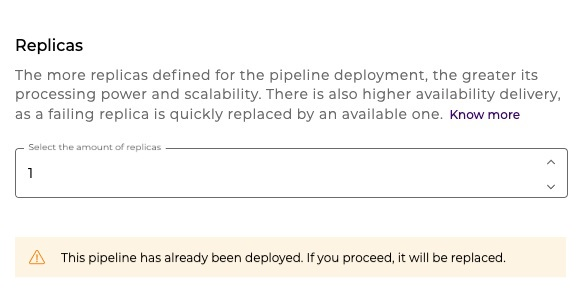

# Deploying a pipeline

Once the pipeline flow has been created, the next step is to make it available for use, that is, deploy it. On the Run tab, you can deploy your pipeline in seconds, depending on the size of your deployment. This deployment can be done both in the test environment (test) and in the production environment (prod).

If you want to know more about the Run step, where deployments are managed, see the [article Run concepts](../runtime.md).


To have access to **Deployment**, you must have been **assigned** the **Deployment: Read and Deployment: Create permission or role on the desired environment (test/prod)**, for your user account or for a group to which you belong.


## **How to deploy a pipeline?** 

The process to deploy the pipeline to a test or production environment is simple. Follow these steps:

### Run screen

Access the Run screen and click the **+ CREATE** button.

<figure><figcaption></figcaption></figure>

### Configure the pipeline to be deployed

#### 1.  Select the pipeline, version and size

Select a pipeline and its version. After you select the pipeline, information about the project it belongs to and the instance, if it is a multi-instance pipeline, is displayed. Then select the desired pipeline size. If it is a multi-instance pipeline, select an instance as well.


**Important:** Archived pipelines are a minor version of a pipeline that is no longer active and are not available for deployment. [To learn more about pipeline versions, read this article.](https://docs.digibee.com/documentation/build/pipelines/pipelines-version-history)


The configuration options are displayed as in the example below:

<figure><figcaption></figcaption></figure>

If the pipeline is already deployed, a section is displayed informing the current deployment configuration, which is automatically applied to the new deployment. [To learn more about the status of pipeline deployment, read this article.](https://docs.digibee.com/documentation/run/pipeline-deployment-status)

Also in this section, it is possible to visit the pipeline currently deployed through the link **Open the pipeline in a new tab**.

<figure><figcaption></figcaption></figure>

#### 2. Select the number of concurrent executions

Select the number of concurrent executions, as in the example:

<figure><figcaption></figcaption></figure>

#### 3. Select the number of replicas 

Define the number of replicas to be used.

<figure><figcaption></figcaption></figure>

If the pipeline has been previously deployed, a message will appear just below the replica selection.

### Deploy the pipeline

Click on the **DEPLOY** button. Clicking the **DEPLOY** button will display a summary of all selections made. After you click **Deploy**, the screen will redirect to the project the pipeline belongs to, so you can track the pipeline.

For Pipeline Based Model users, the system will be displayed a screen with the calculation of licenses consumed for deployment.

<figure><figcaption></figcaption></figure>

For Subscription Based Model users, the system will be displayed a screen with the calculation of RTUs and subscriptions.

> Note that as of 04/01/2022 we have adopted a new implementation control and pricing model, so there is a confirmation screen with new information. [Learn more about the Subscription Based Model.](https://docs.digibee.com/documentation/licensing/subscription-based-model)

<figure><figcaption></figcaption></figure>

## Pipeline deployment history

The **History** tab gives you access to the entire pipeline deployment history, the overview of the latest deployments, which makes it easy to track recent pipeline changes and see what changes have been deployed. [To learn how to check deployed pipelines, see this article.](https://docs.digibee.com/documentation/run/pipeline-deployment-history-beta-restricted)

## **Feedback** 

We would like to hear your comments and suggestions on this feature. See how easy it is to send your feedback:

