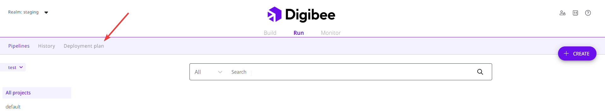
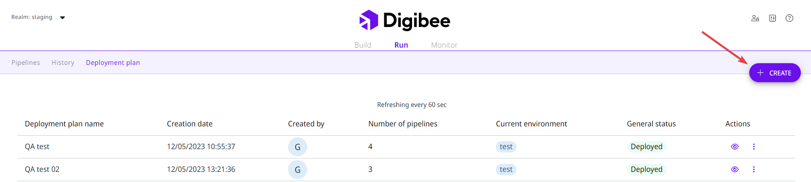
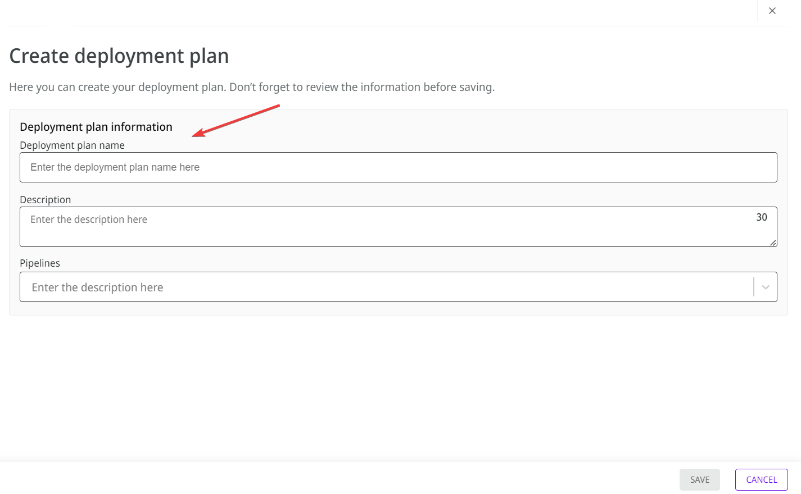
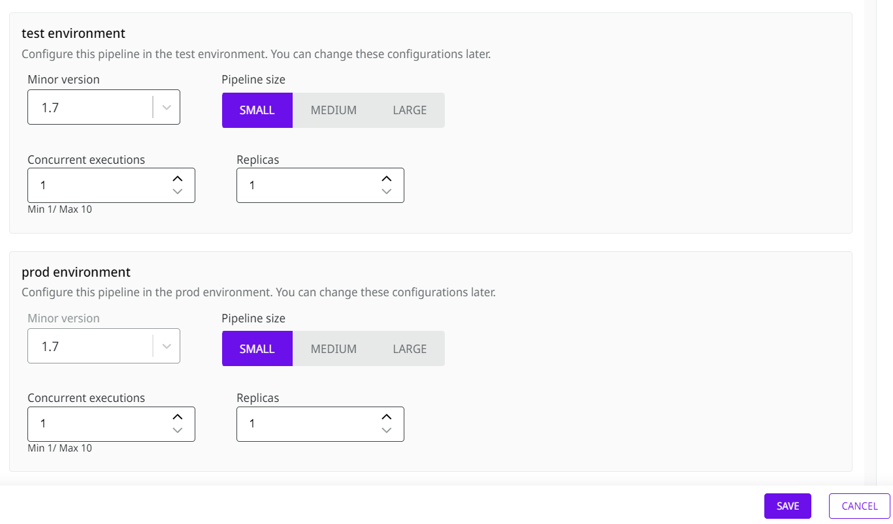

# How to create a pipeline deployment plan (Beta)


Currently, this feature is in [**Beta** phase](https://docs.digibee.com/documentation/general/beta-program) and is still under improvement.&#x20;


## Overview

The pipeline deployment plan allows you to deploy up to five pipelines simultaneously. The concept behind creating this plan is to streamline and accelerate the implementation of strategic pipelines into production.

When you create the plan, you select all the pipelines you want to deploy. Once the plan is created, you can deploy the pipelines to the test environment and then promote them to the production environment.

## How to create a deployment plan

Follow these steps to create a deployment plan:

1. On the Run page, open the **Deployment Plan** tab.

<figure><figcaption></figcaption></figure>

2. Click on **Create**.

<figure><figcaption></figcaption></figure>

3. Enter the name of the plan.

<figure><figcaption></figcaption></figure>

4. Enter a brief description of your deployment plan. For example, “Black Friday pipelines”.
5. Select each pipeline you want to deploy individually. The pipelines will be added to the list below.


A pipeline with an error cannot be added to your deployment plan.


4. For each pipeline you want to deploy, select the size for test and prod environments, the number of concurrent executions, and the number of replicas.

<figure><figcaption></figcaption></figure>

7. Click on **Save**.

Once you have saved the plan, you can access it on the Deployment Plan tab and perform the following actions:

* **Deploy:** deploy the pipelines in the test environment.
* **Promote:** promote the deployed pipelines to the prod environment.

If you click on the expand icon, you can see which step of the process you are in. The steps are: **Create**, **Test**, and **Prod**. You can also delete the plan by clicking on the trash icon.

<figure><figcaption></figcaption></figure>


If you want to delete your deployment plan, it is important to remember that this will not delete the deployed pipelines. You must perform this action manually on the Run page.

