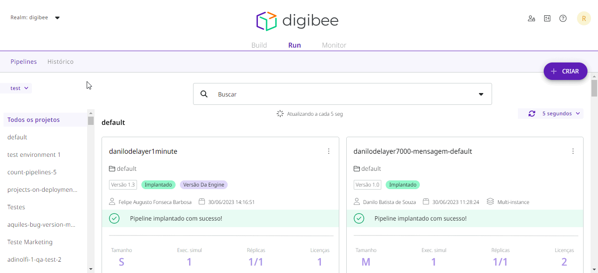

# Como fazer rollback de versão implantada

Se ocorrerem erros depois de implantar uma nova versão de um _pipeline_ em qualquer ambiente, você poderá reverter para uma versão anterior da implantação. A reversão volta para a versão anterior que foi implantada com sucesso.&#x20;

Caso tenham sido feitas alterações em _Globals_ e Contas (_Accounts_), o _rollback_ mantém a versão atual e não traz de volta a configuração antiga. Aqui está como você pode fazer isso.


Para ter acesso à **Implantação**, você deve ter a **permissão** de _**Deployment:**_** Ler** e _**Deployment:**_** Criar nos ambientes desejados (test/ prod)**, para sua conta de usuário ou um grupo ao qual você pertence.


## Selecionando _pipeline_

No ambiente desejado, selecione o _pipeline_ que foi implantado anteriormente. Depois de identifica-lo, clique nos três pontinhos no canto superior direito do _card_ do _pipeline_. Em seguida, clique em _**Rollback**_ e siga as instruções que aparecem.

<figure><figcaption></figcaption></figure>

## _Rollback_

Ao clicar em _**Rollback**_, uma janela _pop-up_ aparecerá informando que você reverterá esse _pipeline_ implantado para a versão anterior no ambiente atual e que essa ação não poderá ser desfeita. Depois de fazer sua escolha, clique em **CONTINUAR** para manter a ação ou **CANCELAR** para cancelar a reversão.

<figure><figcaption></figcaption></figure>

Se você continuar com sua escolha e selecionar **CONTINUAR**, o _pipeline_ selecionado será restaurado para sua versão anterior em funcionamento no ambiente atual. Uma mensagem é exibida na parte inferior da página informando que a reversão foi bem sucedida e você pode confirmar as alterações no _card_ do _pipeline_ também.

<figure><figcaption></figcaption></figure>

## Verificação do atual status do Pipeline

Para rastrear as ações feitas em um _pipeline_ implantado, você pode verificar seu **Histórico**. No histórico do _pipeline_, você pode verificar o status e o ambiente de cada implantação. [Neste artigo, você aprenderá mais sobre como verificar o histórico de _pipelines_ implantados. ](https://docs.digibee.com/documentation/v/pt-br/run/historico-de-implantacao-de-pipeline)

Você também pode verificar o status atual de um pipeline pelo _card_ do _pipeline_, que mostra se o _pipeline_ já foi implantado no ambiente. [Para saber mais sobre os status disponíveis no _card_, leia este artigo.](https://docs.digibee.com/documentation/v/pt-br/run/status-de-implantacao-do-pipeline)
