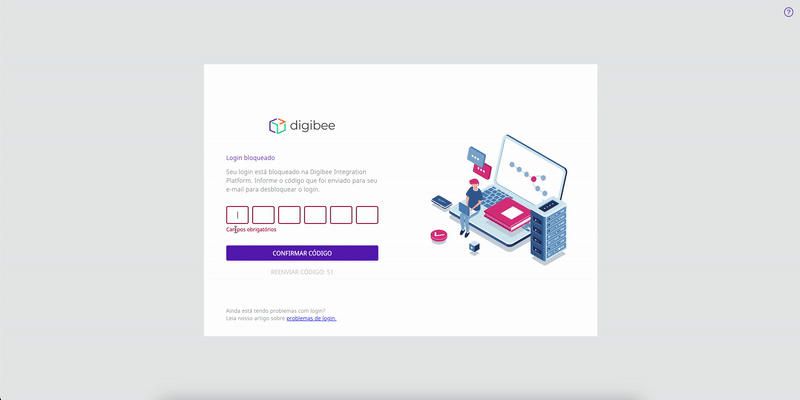

# How to rollback to a previous deployment version

If errors occur after you deploy a new version of a pipeline in any environment, you can rollback to a previous version of the deployment. The rollback goes back to the previous version that was successfully deployed.&#x20;

If changes have been made in Global and Account, the rollback maintains the current version and doesn't bring back the old configuration. Here is how you can do that.


To have access to **Deployment**, you must have been **assigned** the **Deployment: Read and Deployment: Create permission or role on the desired environment (test/prod)**, for your user account or for a group to which you belong.


## Select the desired pipeline

In the environment you want, select a pipeline that has been previously deployed. After identifying the pipeline, click on the three dots in the upper right corner of the pipeline card. Then click **Rollback** and follow the instructions that appear.

<figure><figcaption></figcaption></figure>

## Rollback

When you click **Rollback**, a pop-up window appears informing you that you will revert this deployed pipeline to the previous version in the current environment and that this action cannot be undone. After you make your choice, click **CONTINUE** to keep the action or **CANCEL** to cancel the rollback.

<figure><figcaption></figcaption></figure>

If you proceed with your choice and select **CONTINUE**, the selected pipeline will be restored to its previous version in the current environment. A message is displayed at the bottom of the page stating that the rollback was successful, and you can confirm the changes in the pipeline card after it.

<figure><figcaption></figcaption></figure>

## Checking the current status of a pipeline

To track the actions made to a deployed pipeline, you can check its **History**. In the pipeline history, you can check the status and environment of each deployment. [In this article, you will learn more about how to check the history of deployed pipelines.](https://docs.digibee.com/documentation/run/pipeline-deployment-history-beta-restricted)

You can also check the current status of a pipeline by the pipeline card, which shows whether the pipeline has already been deployed in the test environment. [To learn more about the available status on the card, read this article.](https://docs.digibee.com/documentation/run/pipeline-deployment-status)

\
