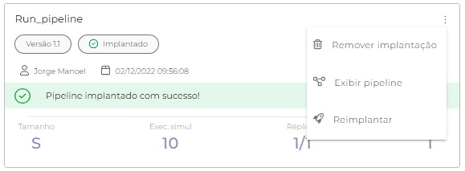
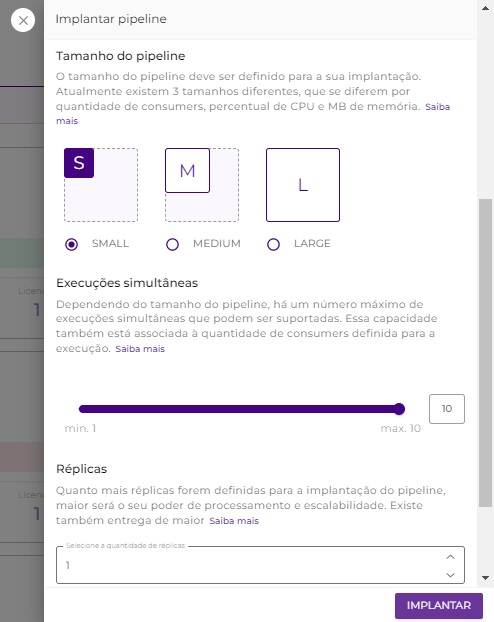

# Como reimplantar um pipeline

Depois que o fluxo do _pipeline_ foi criado e implantado, às vezes é necessário reimplantar o _pipeline_. Essa situação pode ocorrer porque um aviso é exibido no _card_ do _pipeline_ ou porque uma nova versão do _pipeline_ precisa ser implantada.

Com o recurso **Reimplantar**, esse processo se torna mais fácil e rápido e pode ser executado tanto em ambientes de teste quanto de produção.


Para ter acesso à **Implantação**, você deve ter a **permissão** de _**Deployment:**_** Ler** e _**Deployment:**_** Criar nos ambientes desejados (test/ prod)**, para sua conta de usuário ou um grupo ao qual você pertence.


## Visualização do _pipeline card_

No _card_ do _pipeline_, as opções das ações a serem realizadas no _pipeline_ podem ser feitas nos três pontos localizados no canto superior direito.&#x20;

Existem três opções listadas aqui: **Excluir implantação** e **Mostrar **_**pipeline**_, que existiam antes, e o mais recente recurso **Reimplantar**. [Para saber mais sobre as opções, leia este artigo.](https://docs.digibee.com/documentation/v/pt-br/run/visao-geral#opcoes-no-pipeline)

Ele é exibido no _card_ do _pipeline_, conforme mostrado abaixo.

<figure><figcaption></figcaption></figure>

## Operação de reimplantar

Com esta funcionalidade, não é necessário clicar em **CRIAR** e definir todas as informações como antes. Então, ao clicar no botão **Reimplantar**, mostrará as informações da implantação existente, bem como o projeto ao qual o _pipeline_ pertence e a instância, se for um _pipeline_ multi-instância, e todas as informações definidas anteriormente já estão preenchidas.

<figure><figcaption></figcaption></figure>

As únicas alterações que precisam ser feitas são as opções desejadas para reimplantar a versão do _pipeline_ escolhida, como tamanho, execuções simultâneas e réplicas. \
Uma vez selecionado, basta clicar em **IMPLANTAR** e o _pipeline_ será reimplantado. Após essa ação, a tela será redirecionada para o projeto o qual o _pipeline_ pertence.

<figure><figcaption></figcaption></figure>

Esse é um recurso importante que permite que um _pipeline_ seja reimplantado mais rapidamente quando ocorre um erro, levando a alterar o tamanho do _pipeline_ para uma implantação completa sem a necessidade de preencher todos os campos do _pipeline_ que deve ser reimplantado.

\

\

\
