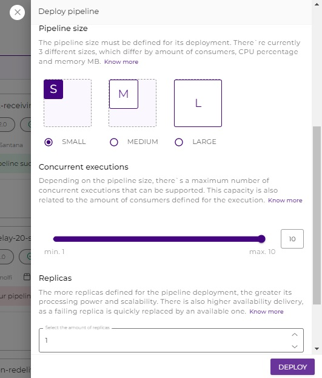

# How to redeploy a pipeline

After the pipeline flow has been created and deployed, it's sometimes necessary to redeploy the pipeline. This situation can happen either because a warning is displayed in the pipeline card or because a new version of the pipeline needs to be deployed.

With the Redeploy feature, this process becomes easier and faster and can be performed in both Test and Prod environments.


To have access to **Deployment**, you must have been **assigned** the **Deployment: Read** and **Deployment: Create, for permission or role on the desired environment (test/prod)**, for your user account or for a group to which you belong.


## Pipeline card view

In the pipeline card, the options for the actions to be done in the pipeline can be made in the three dots located in the upper right.&#x20;

There are three options listed here: **Delete deploy** and **Show pipeline**, which existed before, and the more recent **Redeploy** feature. [To learn more about the options, read this article.](https://docs.digibee.com/documentation/run/overview#pipeline-options)

It is displayed in the pipeline card, as shown below.

<figure><figcaption></figcaption></figure>

## Redeploy operation

With this feature, it's no longer necessary to click on **CREATE** and set all the information as before. Then, when clicking the **Redeploy** button, it shows the information of the existing deployment, as well as the project to which the pipeline belongs to and the instance, if it is a multi-instance pipeline, and all the previously set information is already filled in.

<figure><figcaption></figcaption></figure>

The only changes that need to be made are the desired options to redeploy the pipeline version chosen, such as size, concurrent executions, and replicas.

Once selected, just click **DEPLOY** and the pipeline will be redeployed. After this action, the screen is redirected to the project to which the pipeline belongs.

<figure><figcaption></figcaption></figure>

This is an important feature that allows a pipeline to be redeployed more quickly when an error occurs, leading to change the pipeline size to a complete deployment without having to fill in all the fields in the pipeline that are to be redeployed.

\

\
\
