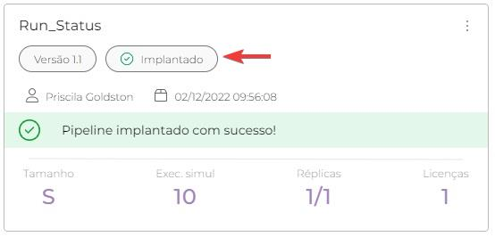
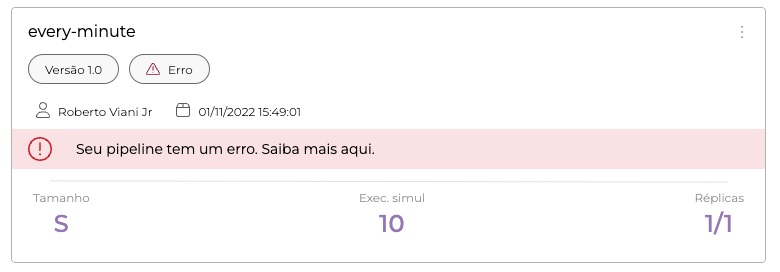
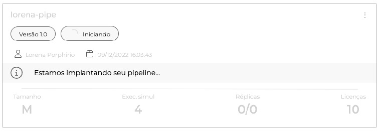
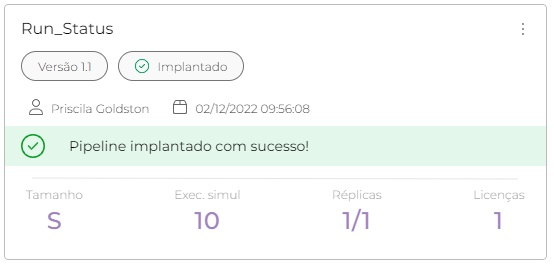
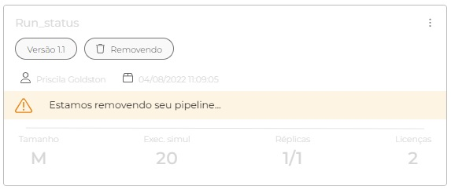

# Status de implantação do pipeline

Ao executar um _pipeline_ na fase de _Run_, algumas informações são exibidas no _card_ do _pipeline_, como o dia e a hora em que foi implantado.

Com o novo visual do _card_, agora é possível obter informações sobre o _pipeline_ em tempo real e saber como ele funciona.

## Intervalo de auto refresh

Agora na fase de _Run_, existe uma nova funcionalidade que permite selecionar o tempo em que a página principal de _Run_ seja atualizada.

<figure><figcaption></figcaption></figure>

Existem quatro opções de seleção de tempo: **5 segundos**, **10 segundos**, **30 segundos** e _**OFF**_, caso não queira atualizar a informação da página.

<figure><figcaption></figcaption></figure>

## Informações em tempo real

Agora, quando o _pipeline_ é implantado, é possível ver o status da implantação em tempo real. Com as seguintes informações: **Erro**, **Iniciando,** **Implantado** e **Removendo.**

<figure><figcaption></figcaption></figure>

### Status: Erro

Se as informações no _pipeline_ aparecerem como **Erro**, isso significa que algo de errado aconteceu e a implantação foi interrompida. Essas informações podem ser usadas para determinar o que causou a falha do _pipeline_.&#x20;

Por exemplo, pode ser um erro na etapa de _**Build**_ ou uma seleção de **Tamanho** que não tem suporte porque o _pipeline_ é muito grande.

<figure><figcaption></figcaption></figure>

### Status: Iniciando

O status **Iniciando** informa que o _pipeline_ está pronto para implantação, é um status no início da implantação. Indica como está o andamento da implantação do _pipeline_.&#x20;

Essas informações permitem gerenciar o tempo de implantação dos _pipelines_ e planejar a próxima implantação.

<figure><figcaption></figcaption></figure>

### Status: Implantado

Se o status do _pipeline_ for **Implantado**, significa que a implantação do _pipeline_ foi concluída com sucesso. Com essas informações, você já pode começar a implantar outro _pipeline_. Dessa forma, você pode gerenciar os _pipelines_ que deseja implantar.

<figure><figcaption></figcaption></figure>

### Status: Removendo

Ao clicar nos três pontos, aparecem duas opções: **Remover implantação**, **Exibir **_**pipeline**_ e **Reimplantar**. Com a primeira opção, **Remover implantação**, você pode excluir a implantação realizada. Esta ação exclui apenas a implantação com a versão selecionada, deixando as outras versões inalteradas.\
O status **Removendo** é exibido no _card_ do _pipeline_ a seguir.

<figure><figcaption></figcaption></figure>
