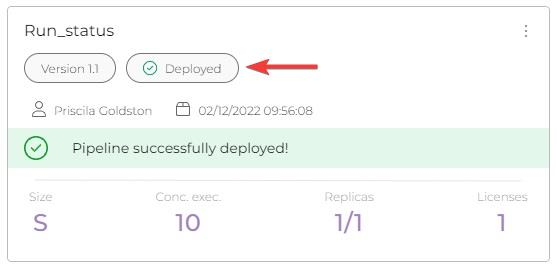
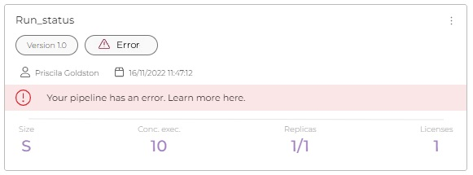
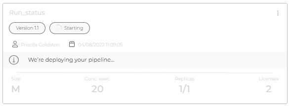
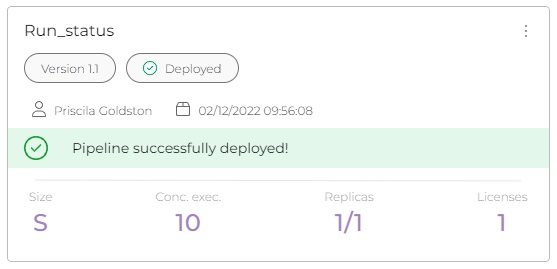

# Pipeline deployment status

When running a pipeline in the Run phase, some information is displayed on the pipeline card, such as the day and time it was deployed.

With the new visual card, it is possible to get information about the pipeline in real time and know how it works.

\
Auto refresh interval
---------------------

Now in the Run phase, there is a new feature that allows you to select the time you want the main page in Run to be updated.

<figure><figcaption></figcaption></figure>

There are four options for time selection: **5 seconds**, **10 seconds**, **30 seconds** and **OFF**, in case you do not want to update the information on the page.

<figure><figcaption></figcaption></figure>

## Real time Information

Now when the pipeline is deployed, you can now see the status of the deployment in real time. With the following information: **Error**, **Starting**, **Deployed,** and **Deleting**:

<figure><figcaption></figcaption></figure>

### Status: Error

If the information in the pipeline appears as **Error**, it means that something wrong happened and the deployment stopped. This information can be used to determine what caused the pipeline to fail.

For example, it could be an error in the **Build** stage or a **Size** selection that is not supported because the pipeline is too large.

<figure><figcaption></figcaption></figure>

### Status: Starting

The status **Starting** informs that the pipeline is ready for deployment, it is a status at the beginning of deployment starts. It indicates how the deployment of the pipeline is proceeding.&#x20;

This information allow to manage the deployment time of the pipelines and to plan the next deployment.

<figure><figcaption></figcaption></figure>

### Status: Deployed

If the status of the pipeline is **Deployed**, it means that the deployment has been completed successfully. With this information, you can start deploying another pipeline. This way it is possible to manage the pipeline you want to deploy.

<figure><figcaption></figcaption></figure>

### Status: Deleting

When you click on the three dots, two options appear: **Delete deploy** and **Show pipeline**. With the first option, **Delete deploy** you can delete the deployment made. This action only deletes the deployment with the selected version, leaving other versions unaffected.

The status **Deleting** is displayed in the pipeline card as follows.\

<figure><figcaption></figcaption></figure>
