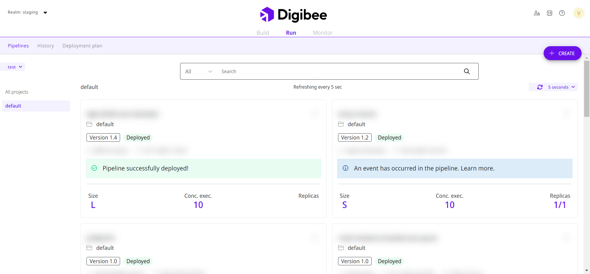
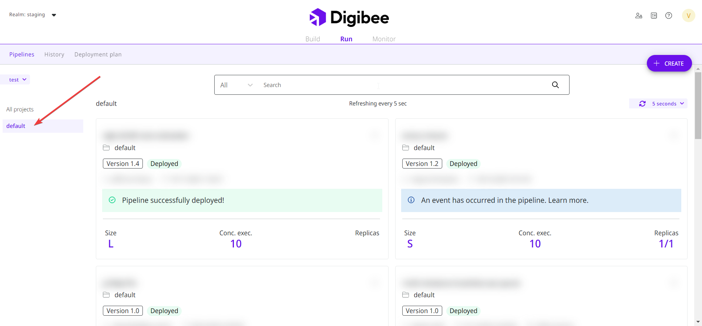
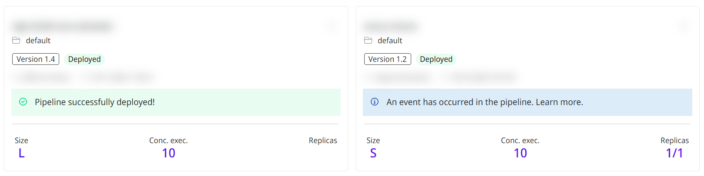
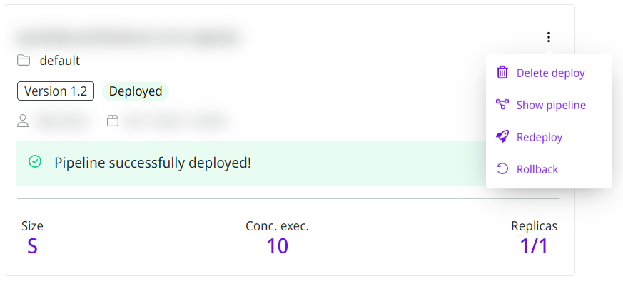
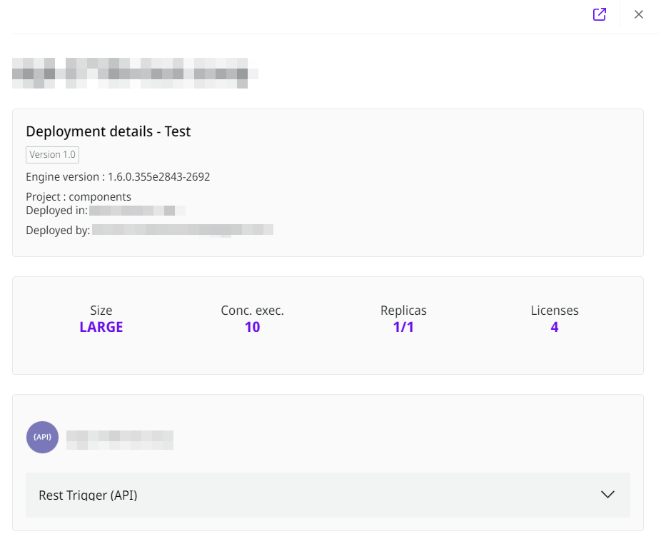
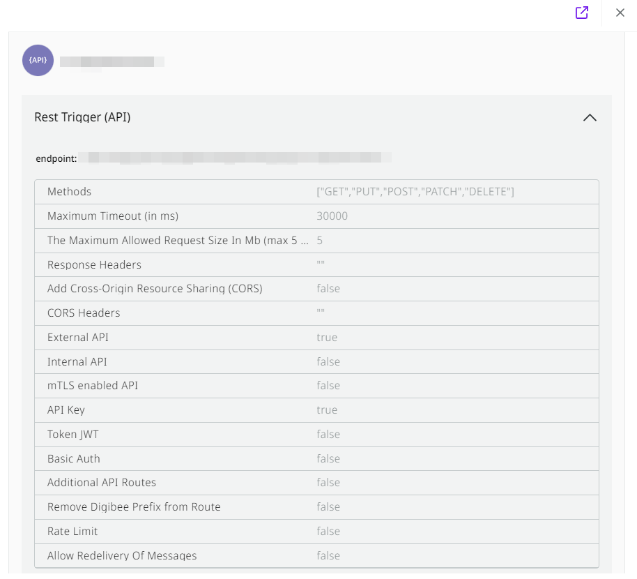

# Run overview

Run is one of the three phases of the Digibee Integration Platform, after the building of the pipeline in the previous Build phase. Its goal is to deploy the pipeline, which is already configured with triggers, run it and put the integration into production.

## **Run layout**

When you select the Run phase, the page layout appears as shown in the figure below. In the upper left corner are the test and prod environments of the pipelines to be executed.

<figure><figcaption></figcaption></figure>

## Global search for deployed pipelines

On the Run page, you can perform a global search for deployed pipelines across all your projects by using any keyword from the pipeline name, in test and production environments.\
\
In the search results, the name of deployed pipelines are immediately displayed together with the corresponding project, so that users can clearly see which project the respective pipeline belongs to.

## **Environments**

There are two environments in which you can deploy the pipelines: **test** or **prod.**

<figure><figcaption></figcaption></figure>

The **test** environment is used to evaluate the pipeline build, that is, to test and modify its applications. This way you have an environment where you can validate pipelines before moving them to the prod environment.

In the **prod** environment is where the final pipeline deployment process takes place after it has been tested and validated to go into production.

If a pipeline is in the production environment and an evolutive change has to be made or if it presents some failure, we suggest your changes to be made in the **test** environment and, only after it, the pipeline can go back to production.

## **Select project**

After you choose the environment, in the left corner of the screen select the project you want to deploy. Read the [full article](https://docs.digibee.com/documentation/build/pipelines/projects) to know how to create a project.&#x20;

All developed versions of the pipelines will be displayed on the screen for selection. [In this article you can find more information about pipelines versioning.](https://docs.digibee.com/documentation/build/pipelines/pipeline-versioning)\
\
As the user scrolls further or interacts with the Run page, additional data is gradually loaded in the background. This infinite scroll mode makes it possible to quickly display the essential content of the page.

<figure><figcaption></figcaption></figure>

Each pipeline contains the size, concurrent executions, replicas and licenses information. For more details about each item, [read the article about Run concepts](https://docs.digibee.com/documentation/run/runtime).

<figure><figcaption></figcaption></figure>

## **Pipeline options**

There are some options available in the pipeline. If you click the three dots, four options will appear: **Delete deploy**, **Show pipeline, Redeploy** and **Rollback**.&#x20;

<figure><figcaption></figcaption></figure>

The first option is **Delete deploy** and, by clicking it, you can delete the deployment made. This action will remove only the deployment with its selected version, not affecting other versions.

The second option is **Show pipeline**. When you click it, the entire architecture of the developed pipeline is displayed, as well as the information selected in the trigger.

The third option is **Redeploy**. The main function of Redeploy is to deploy the same pipeline but change its configurations. Read the [article ](https://docs.digibee.com/documentation/run/deployment/redeploying-a-pipeline)to learn more about redeploying a pipeline.&#x20;

The fourth option is **Rollback**. If errors occur after you deploy a new version of a pipeline, the rollback goes back to the previous version that was successfully deployed. Learn [How to rollback to a previous deployment version](https://docs.digibee.com/documentation/run/deployment/how-to-rollback-to-a-previous-deployment-version) in our documentation.&#x20;

## **Select pipeline**

After you deploy a new pipeline or select an existing one, some information will appear, such as the pipeline name, version, date and who deployed it.

Besides that, the size, concurrent executions, replicas and licenses information chosen previously will be displayed as well. See more in [the article about how to deploy a pipeline](https://docs.digibee.com/documentation/run/deployments).

<figure><figcaption></figcaption></figure>

When you click [Rest Trigger (API)](https://docs.digibee.com/documentation/components/triggers/rest-trigger), you get access to more details about: endpoint, maximum timeout, additional API routes, API key, token JWT, the maximum allowed request sinc., external API, allow redelivery of messages, methods and internal API. We have [a list of articles about the available triggers](https://docs.digibee.com/documentation/components/triggers).

<figure><figcaption></figcaption></figure>

## Pipeline deployment history

The **History** tab gives you access to the entire pipeline deployment history, the overview of the latest deployments, which makes it easy to track recent pipeline changes and see what changes have been deployed. Read [our article](https://docs.digibee.com/documentation/run/deployment/pipeline-deployment-history-beta-restricted) to learn how to check deployed pipelines.&#x20;

## **Next phase**

You can see how the pipeline is working in the next phase of the Digibee Integration Platform, called Monitor.

There you can find information such as the number of pipelines created and deployed, the amount of created accounts, a monitoring graph and also an individual report. To learn more about this phase, [read the article we prepared](https://docs.digibee.com/documentation/monitor/dashboards).
