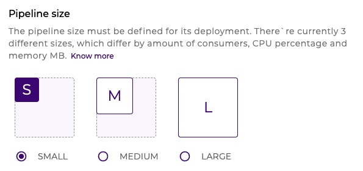
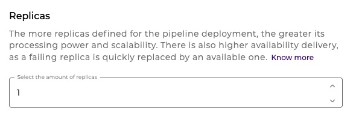
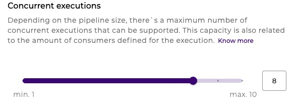

# Run concepts

## **What is deployment?** 

Deployment is the process of enabling pipelines with previously configured triggers. This enabling can occur both in the test or prod environment, such as shown in the following figure:

<figure><figcaption></figcaption></figure>

[If you want to learn more about how to deploy a pipeline, read this article.](https://docs.digibee.com/documentation/run/deployment/deployments) \
Also, you can read about all the features related to deployment in the following Deployment Documentation box.



## Run concepts 

Have a better understanding of the main Run concepts. Learn about available Sizes, Replicas, and Concurrent Executions in deployment.&#x20;

The deployment covers three parts. These are they:

### **Size**

The deployment size is directly related to the processing capacity and the memory of each one of the replicas.

<figure><figcaption></figcaption></figure>

The three deployment size ranges are:

* **SMALL:** 1 to 10 consumers
* **MEDIUM:** 1 to 20 consumers
* **LARGE:** 1 to 40 consumers

For example, if you configure 10 consumers (SMALL) for your pipeline executions, it means that 10 messages can be concurrently processed.

### **Replicas**

The replicas role is to determine the amount of replicas that will be enabled to attend your integrations with high availability. This guarantees autonomy, concurrent executions and redundancy.

<figure><figcaption></figcaption></figure>

### **Concurrent executions**

Consumer covers the concept of concurrent executions that each deployed replica supports.

The maximum number of consumers is defined based on three deployment size ranges.

<figure><figcaption></figcaption></figure>

[For more details on pipeline sizes, replicas, and concurrent executions, see our Pipeline Engine article.](https://docs.digibee.com/documentation/platform/pipeline-engine#pipeline-sizes)
