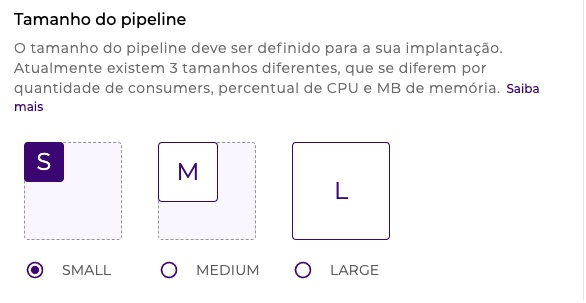

# Conceitos de Run

## **O que é implantação?** 

Implantação (_deployment_) é o processo de disponibilização dos _pipelines_ que já possuem _triggers_ configurados.

Essa disponibilização pode acontecer tanto no ambiente de teste (_test_) quanto no ambiente de produção (_prod_), como mostrado na figura a seguir:

<figure><figcaption></figcaption></figure>

[Se quiser saber mais sobre como implantar um _pipeline_, leia este artigo.](https://docs.digibee.com/documentation/v/pt-br/run/deployment/deployments) Além disso, você pode ler sobre todos os recursos relacionados à implantação no seguinte _box_ de documentação de implantação.



## Conceitos de Run 

Tenha uma melhor compreensão dos principais conceitos do Run. Saiba mais sobre Tamanhos, Réplicas e Execuções Simultâneas disponíveis na implantação.

A implantação abrange três partes. Saiba quais são elas:

### **Tamanho**

O tamanho da implantação está diretamente relacionado ao poder de processamento e memória de cada uma das réplicas.

<figure><figcaption></figcaption></figure>

As três faixas de tamanho de implantação são:

* **SMALL:** 1 a 10 _consumers_
* **MEDIUM:** 1 a 20 _consumers_
* **LARGE:** 1 a 40 _consumers_

Por exemplo, se você configurar 10 _consumers_ (SMALL) para a execução do seu _pipeline_, isso significa que 10 mensagens poderão ser processadas simultaneamente.

### **Réplicas**

A função das réplicas é determinar a quantidade de réplicas que serão disponibilizadas para atender às suas integrações com alta disponibilidade. Isto garante autonomia, quantidade de execuções simultâneas e redundância .

<figure><figcaption></figcaption></figure>

### Execuções simultâneas

_Consumer_ (ou consumidor) contempla o conceito de execuções simultâneas que cada réplica implantada suporta.

A quantidade máxima de _consumers_ é definida com base em três faixas de tamanho de implantação.

<figure><figcaption></figcaption></figure>

[Saiba mais detalhes específicos sobre tamanhos, réplicas e execuções simultâneas dos _pipelines_ em nosso artigo de _Pipeline Engine_.](https://docs.digibee.com/documentation/v/pt-br/plataforma/pipeline-engine#tamanhos-de-pipeline)
