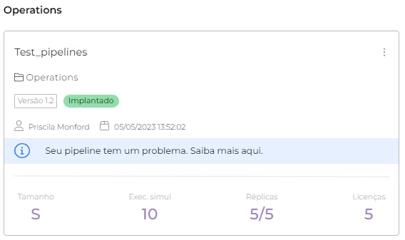

# Como os alertas funcionam nos pipelines em Run

Quando você executa um _pipeline_ no ambiente _**Test**_ and _**Prod**_ em Run, alguns avisos podem aparecer no _card_ do _pipeline_. Abaixo mostraremos alguns dos avisos que podem aparecer nos _pipelines_ e o que você pode fazer a respeito.


Para ter acesso à **Implantação**, você deve ter a **permissão** de _**Deployment:**_** Ler** e _**Deployment:**_** Criar nos ambientes desejados (test/ prod)**, para sua conta de usuário ou um grupo ao qual você pertence.


## Mensagem de Reciclado


**Importante:** Quando esse aviso aparece, o _pipeline_ continua funcionando normalmente. Recomenda-se reimplantá-lo para que a notificação no _card_ deixe de aparecer.


Quando ocorre algum possível problema no _pipeline_, um aviso é exibido no _card_ do _pipeline_ no formato mostrado abaixo:

<figure><figcaption></figcaption></figure>

Se você clicar no _card_ do _pipeline_, após as informações do _Trigger_, verá a seguinte mensagem: "Seu pipeline foi reciclado. Nenhuma ação é necessária. A reciclagem acontece durante as frequentes atualizações internas da Digibee, causando confusão entre movimentos naturais de atualizações e erros. Para remover o status, por favor, reimplante o pipeline."

<figure><figcaption></figcaption></figure>

### Por que isso acontece?

A Digibee realiza atualizações de infraestrutura regularmente em sua plataforma. Parte dessa atualização é reciclar as máquinas que dão suporte à infraestrutura. No entanto, é importante lembrar que o _pipeline_ continua funcionando normalmente.

Quando isso acontece, os _pipelines_ em execução são movidos automaticamente para as máquinas disponíveis no momento. Esse processo causa confusão entre os movimentos naturais e os erros. O aviso Reciclado aparece nos _pipelines_ que foram movidos devido à reciclagem natural das máquinas.

### Removendo o alerta do _card_

Para remover a notificação do _card_ do _pipeline_, o mesmo deverá ser reimplantado. No entanto, a reimplantação não é obrigatória já que o _pipeline_ permanece em funcionamento normalmente, a reimplantação seria apenas para eliminar o aviso do _card_.&#x20;

[Para saber mais sobre como reimplantar um _pipeline_, leia este artigo sobre Reimplantação de um _pipeline_.](https://docs.digibee.com/documentation/v/pt-br/run/como-reimplantar-um-pipeline)

## Alerta: _Out of memory_

Este aviso é exibido quando não há memória suficiente para processar mensagens do _pipeline_, ou seja, ocorre quando o _pipeline_ tenta consumir mais memória do que foi alocada durante a implantação.&#x20;

[Para saber mais sobre como solucionar os erros de _Out of Memory_ no _pipeline_ implantado, leia este artigo o qual explica suas causas e soluções para o problema.](https://docs.digibee.com/documentation/v/pt-br/run/solucionando-erros-de-out-of-memory-na-implantacao)

<figure><figcaption></figcaption></figure>

Quando você clica no _card_ do _pipeline_, logo abaixo da informação da _Trigger_, uma mensagem é exibida informando que o _pipeline_ precisa ser reimplantado em um tamanho maior, o qual pode solucionar esse problema.

<figure><figcaption></figcaption></figure>

No entanto, se a data de implantação for mais antiga que a versão mais recente, recomendamos que você execute uma reimplantação para atualizar o _pipeline_. Vá para o _card_ de _pipeline_ e clique nos três pontos e, em seguida, clique em Reimplantar, conforme mostrado abaixo.

<figure><figcaption></figcaption></figure>
