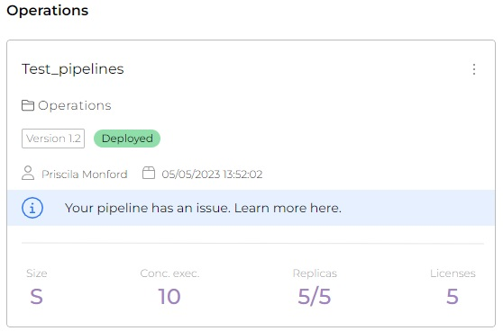
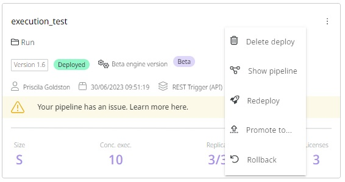

# How warnings work on pipelines in Run

When you run a pipeline in the Test and Prod environment in the Run page, some warnings may appear on the pipeline card. Below we show you some of the warnings that can appear in pipelines and what you can do about them.


To have access to **Deployment**, you must have been **assigned** the **Deployment: Read and Deployment: Create permission or role on the desired environment (test/prod)**, for your user account or for a group to which you belong.


## Recycled message


**Important:** When this information appears, the pipeline continues to operate normally. It is recommended to redeploy it so that the notification no longer appears on the card.


When a potential issue occurs in the pipeline, a information is displayed on the pipeline card in the format shown below:

<figure><figcaption></figcaption></figure>

If you click on the pipeline card, after the Trigger information, you will see the following message: "Your pipeline has been recycled. No actions are needed. Recycling happens during the Digibee's regular internal updates, causing confusion between natural update moves and actual. To remove the status, please redeploy the pipeline."

<figure><figcaption></figcaption></figure>

### Why does this happen?

Digibee regularly performs infrastructure updates on its platform. Part of this update is to recycle the machines that support the infrastructure. However, it is important to remember that the pipeline continues to work normally.

When this happens, running pipelines are automatically moved to machines that are available at the moment. This process causes confusion between natural moves and errors. The Recycled warning appears on pipelines that have been moved due to natural recycling of machines.

### Removing the information on card

To remove the card notification from the pipeline, the card must be redeployed. However, the redeployment is not mandatory as the pipeline continues to run normally, the redeployment would only remove the card warning.

[To learn more about how to redeploy a pipeline, read this article on Redeploying a pipeline.](https://docs.digibee.com/documentation/run/redeploying-a-pipeline)

## Warning: Out of memory

This warning is displayed when there is not enough memory to process messages from the pipeline, that is, when the pipeline attempts to consume more memory than it was allocated during deployment.

[To learn more about how to solve the Out of Memory errors in the deployed pipeline, read this article, which explains the causes and solutions to the problem.](https://docs.digibee.com/documentation/run/solving-the-out-of-memory-errors-in-deployment)

<figure><figcaption></figcaption></figure>

When you click on the pipeline card, below the Trigger information, a message is displayed that the pipeline needs to be redeployed at a larger size, which may resolve this issue.

<figure><figcaption></figcaption></figure>

However, if the deployment date is older than the latest version, we recommend that you perform a redeployment to update the pipeline. Go to the pipeline card and click the three dots and then click Redeploy, as shown below.

<figure><figcaption></figcaption></figure>
