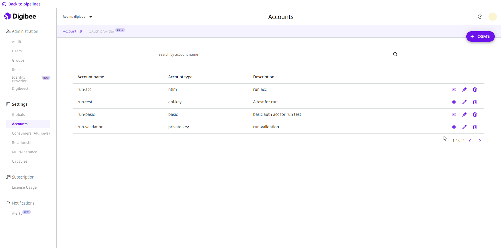
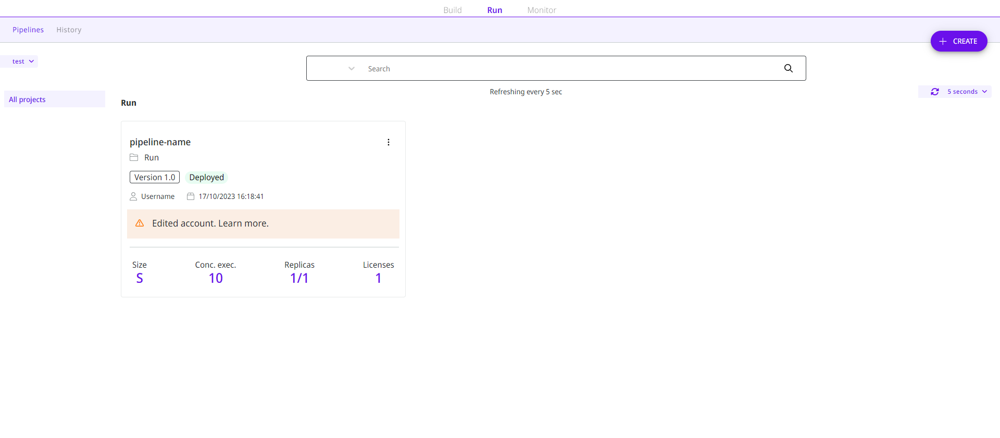

# Monitor changes to account settings in deployed pipelines

Account variables are intended to support and accelerate pipeline development by allowing the same parameters to be used in different projects. This optimizes time and allows information to be shared between different users. You can learn more in the [Accounts documentation](https://docs.digibee.com/documentation/settings/accounts).

However, when you change the settings of an account, you need to redeploy the pipelines that use that account to update them with the new data. In this article, you will learn how to see which pipelines are associated with the account to redeploy them.

## List of pipelines associated to the account

In the Digibee Integration Platform settings, you can find the **Accounts** page with a list of all accounts in the realm. In this list you can find more information about the accounts and perform some actions, such as view the details, edit, or delete the account by clicking on the respective icons.

The account details include data about all the pipelines in which the account is used, as well as a link to easily open the pipeline in canvas. The list of associated pipelines is also displayed when you edit the account.

<figure><figcaption></figcaption></figure>

After editing an account, you must redeploy the associated pipelines to keep them up to date and ensure that the integration continues to work. You can use this list to see which pipelines will be affected by the change to the account.

## Warnings in pipelines after changes to accounts

In addition to the list of associated pipelines in the account details on the **Accounts** page, you can get an overview of all pipelines that need to be redeployed on the **Run** page. The cards of these pipelines include a warning that the account has changed and further instructions on redeployment.

<figure><figcaption></figcaption></figure>
