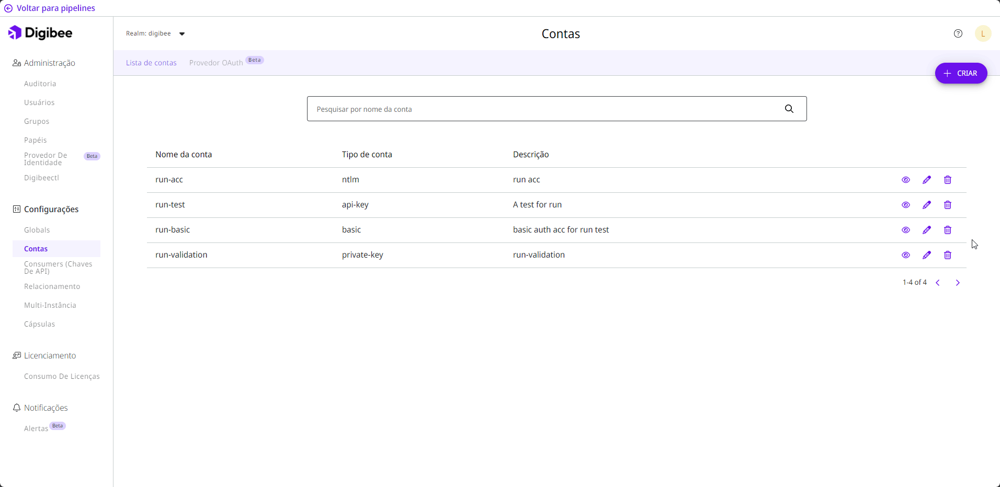
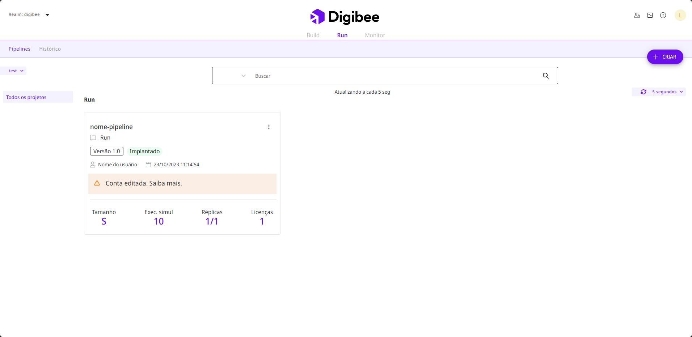

# Monitore alterações nas configurações da conta em pipelines implantados

As variáveis ​​de conta tem como objetivo apoiar e acelerar o desenvolvimento do _pipeline_, permitindo que os mesmos parâmetros sejam usados ​​em diferentes projetos. Isso otimiza o tempo e permite que as informações sejam compartilhadas entre diferentes usuários. Você pode aprender mais na [documentação sobre Contas](https://docs.digibee.com/documentation/v/pt-br/configurations/accounts).

No entanto, ao alterar as configurações de uma conta, você precisa reimplantar os _pipelines_ que usam essa conta para atualizá-los com os novos dados. Neste artigo, você aprenderá como ver quais _pipelines_ estão associados à conta para reimplantá-los.

## Lista de _pipelines_ associados à conta

Nas configurações da Digibee Integration Platform, você pode encontrar a página **Contas** com uma lista de todas as contas no _realm_. Nesta lista você pode encontrar mais informações sobre as contas e realizar algumas ações, como visualizar os detalhes, editar ou excluir a conta clicando nos respectivos ícones.

Os detalhes da conta incluem dados sobre todos os _pipelines_ em que a conta é usada, bem como um link para abrir facilmente o _pipeline_ no canvas. A lista de _pipelines_ associados também é exibida quando você edita a conta.

<figure><figcaption></figcaption></figure>

Depois de editar uma conta, você deverá reimplantar os _pipelines_ associados para mantê-los atualizados e garantir que a integração continue funcionando. Você pode usar a lista de _pipelines_ associados para ver quais _pipelines_ serão afetados pela alteração na conta.

## Avisos em _pipelines_ após alterações nas contas

Além da lista de _pipelines_ associados nos detalhes da conta na página de **Contas**, você pode obter uma visão geral de todos os pipelines que precisam ser reimplantados na página **Run**. Os cartões desses _pipelines_ incluem um aviso de que a conta foi alterada e mais instruções sobre a reimplantação.

<figure><figcaption></figcaption></figure>
