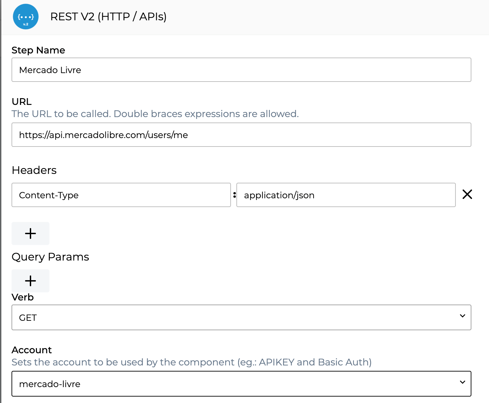

# New OAuth2 Architecture


This feature is in Beta phase. [To learn more about this, read our article on Digibee's Beta program.](https://docs.digibee.com/documentation/general/beta-program)


OAuth2 is a standard authorization protocol commonly used for web APIs. To create integrations that use OAuth2, just log into a provider - which could be Google, Microsoft, Mercado Livre, Amazon, etc. - and receive an access token. With this token, it is possible to access users' data without having to share their credentials.

To add it to our platform, it is necessary to previously create an application on the provider you want to use. Once the application is created in the provider, it will be possible to register and use the OAuth2 protocol on the Digibee Integration Platform.

### **Registering a new OAuth provider from an existing one**

To create your application, follow the instructions according to the provider you want to add to the Platform by clicking on the links below:

* [Google](https://developers.google.com/identity/protocols/oauth2)
* [Microsoft](https://docs.microsoft.com/en-us/azure/active-directory/develop/scenario-spa-app-registration)
* [Mercado Livre](https://developers.mercadolivre.com.br/en\_us/my-first-application)

In the **Redirect URI** field, you will need to use the following address:

* For SaaS: [https://www.godigibee.io/oauth2/success](http://www.godigibee.io/oauth/success)
* For dedicated SaaS: [https://www.${DEDICATED\_SAAS\_HOST}/oauth2/success](http://www.godigibee.io/oauth/success)

Once the application is created, you will have the **Client ID** and the **Client Secret**, which are the OAuth authentication keys that must be informed during the creation of the new provider, in a new Account within the Digibee Integration Platform (read the tutorial at the end of this article).

### **How do token requests work?**

In order to explain how to obtain the token, we will use the Google flow, which is the same for all OAuth2 providers that follow the Code Grant Type flow:

.png>)

1. The first step is to request an intermediate token. This occurs when the user, during login, accepts the scopes and consents to the use of their data;
2. After the user consents, an intermediate token (named **code**) is generated, which is used to return the access token, the final token;
3. With the access token in hand, it is possible to make requests to the provider's services.

### **How does token lifetime work?**

The access token expiration time is given by the **expires\_in** property. For example, the value "7200" means that the access token will expire in two hours from the time the response was generated.

Concerning providers registered by Digibee, we have the following expiration times:

* 6 months duration for Google and Mercado Livre;
* 3 months duration for Microsoft.


**Important:** It is necessary to log in again to the accounts screen after the refresh token expires.


### **What to do if the refresh token is not returned?**

The refresh token may not return for a variety of reasons, but often the cases where it is not returned are due to an excessive number of logins. If your new account has not been saved by the refresh token, you must remove the OAuth2 app from your email account following the guidelines of the provider used to log in to the Platform.

To find out how, visit the link below:

* [Google Provider](https://myaccount.google.com/u/1/permissions);
* [Microsoft Provider](https://account.live.com/consent/Manage);
* [Mercado Livre Provider](https://appstore.mercadolivre.com.br/apps/permissions).

After that, you will need to log in to the provider again via the Digibee Integration Platform and finally save your account.

### **Learn how to request new providers**

To request a provider that is not on our list, contact us through the Digibee Integration Platform chat. Then, we will be able to add it manually.

### **Learn how to use the token in the pipeline**

Once the **oauth-2** account is created on the Platform, just use it in the Account field by selecting the Rest V2 connector on the canvas. It is also necessary to inform the URL of the service to be requested, headers, and query parameters necessary for the request to be made using the generated access tokens.

**Examples of requests:**

* **Google:**

Requesting Google Drive File Listing API in Rest V2 component:

**URL**: [https://www.googleapis.com/drive/v3/files](https://www.googleapis.com/drive/v3/files)

**Verb**: GET

.png>)

* **Microsoft**

Requesting OneDrive File Listing API in Rest V2 component:

**URL**: [https://graph.microsoft.com/v1.0/me/drive](https://graph.microsoft.com/v1.0/me/drive)

**Verb**: GET

.png>)

* **Mercado Livre:**

Requesting the API that returns information about your Mercado Livre account:

**URL**: [https://api.mercadolibre​.com/users/me](about:blank)

**Verb**: GET


**Important:** Once the previously created OAuth account is informed in the Account field of the Rest V2 component, the Authorization header will be automatically added.


Once the application is created, it will be possible to register your new OAuth2 provider on the Digibee Integration Platform following the tutorial in [Registration of new OAuth providers](registration-of-new-oauth-providers.md).
