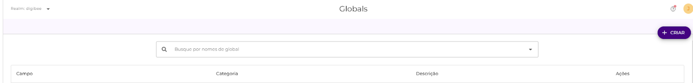

# Registration of new OAuth providers

OAuth 2.0 is a token-based authorization protocol that allows an application to access a user's resources and information without requiring the user's credentials. Previously, it was possible to integrate new OAuth2 providers by submitting a request to the support team.&#x20;

Knowing that this process was limiting our customers’ choices and performance, we implemented a new OAuth2 architecture where Digibee Integration Platform users can register new providers and use them independently and autonomously in their integrations.

So now it is possible to add new OAuth providers on top of the existing ones on Digibee Integration Platform. All you need is the **Client ID** and the **Client Secret** of your OAuth application. [To learn how to create your application, read the article New OAuth2 Architecture.](https://docs.digibee.com/documentation/settings/accounts/new-oauth2-architecture)

Once the application is created on the provider, it will be possible to register your new OAuth2 provider on the Digibee Integration Platform by following the instructions below:

### **1. How to register a new provider**

In Settings, access the **Account** screen. On this screen, click on the **OAuth provider** submenu. Here, it will be possible to register new providers from an existing provider registered in the Digibee Integration Platform.

So, to create a new provider, click **+Create**. You can then configure the authentication of the new provider over an existing provider so that it can be used later in your pipeline.

### **2. Define the settings of the new provider**

.png>)

On this screen, select an existing base provider that is registered in the Digibee Integration Platform so that the **Auth URL** field is automatically filled in. You will also need to define the name of your new provider according to the example below:

.png>)

Once this step is completed, click on the **Continue** button.

### **3. Configure the credentials to access the provider**

After entering the details of the new provider, you need to configure the credentials to be able to access it. In this step, you will need the **Client ID** and **Client Secret**, which are the OAuth authentication keys. [To learn how to get them, read the article New OAuth2 Architecture.](https://docs.digibee.com/documentation/settings/accounts/new-oauth2-architecture)

In addition, you also need to specify the scopes of the provider that you want to use in your application, that is, the actions that you want to allow the platform to do through that provider. Take a look at the following example:

.png>)

After you have entered all the requested information, click the **Finish** button to complete the process of creating the new provider, which will redirect you to the **OAuth provider** screen.&#x20;

On this screen, your new provider is now available for use.

.png>)

Once the new provider is created, it will be possible to manage, edit and even delete it in the **OAuth providers** screen.

**Terms of Use**\
When using the OAuth Architecture, you automatically make your adhesion to the Beta program and agree with the terms of use. [You can find more information about beta versions on this article.](https://docs.digibee.com/documentation/general/beta-program)
