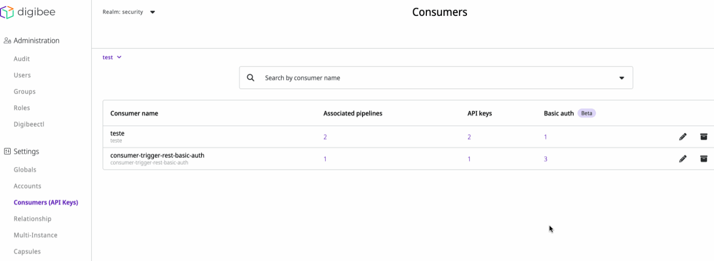
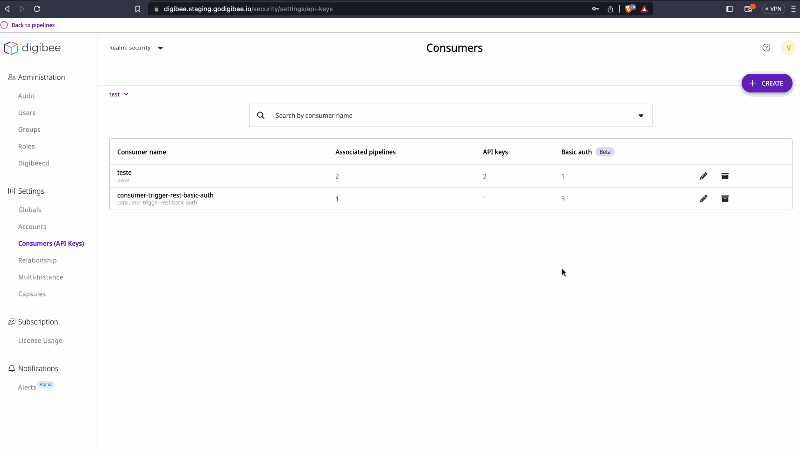
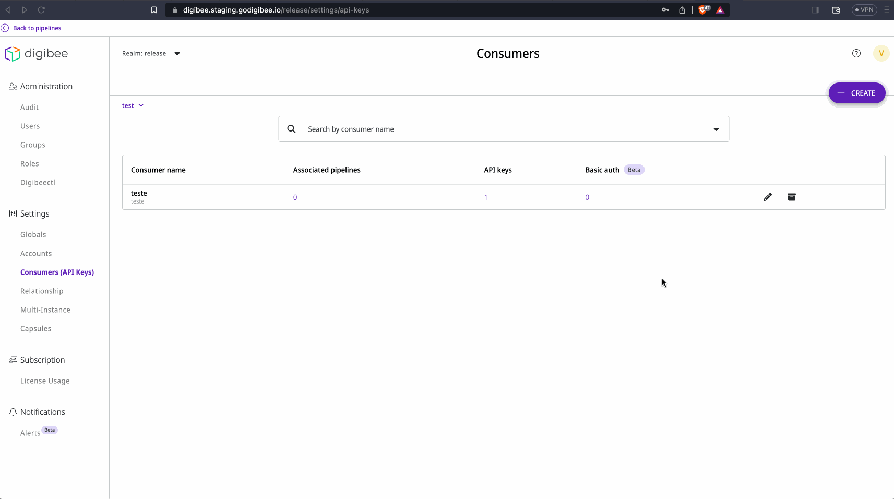

# Consumers (API Keys)

Within the Digibee Integration Platform, a Consumer is a nominal entity that can be associated with API Keys or Basic Auth. When you create a Consumer, an API Key is automatically generated.

API Keys are access credentials that are provided for queries in pipelines using [REST](../components/triggers/rest-trigger.md), [HTTP](../components/triggers/http-trigger.md), and [HTTP File](../components/triggers/http-file-trigger/) triggers. The use of API Keys is required as a minimum security guarantee. A Consumer can contain any number of API Keys.

Basic Auth is an authentication method for REST, HTTP, and HTTP File Triggers. This option ensures access only to users who have a registered username and password. A Consumer can contain any number of Basic Auth credentials.


**Important:** currently, the Basic Auth feature is only available in Beta phase. [To learn more about this, read the article Beta program.](https://docs.digibee.com/documentation/general/beta-program)


The Consumers, API Keys, and Basic Auth related to your pipeline can be found on the **Consumers (API Keys)** page, which is structured as follows:

* A list with the Consumer’s name.
* The number of associated pipelines.
* The number of related API Keys.
* The number of related Basic Auth credentials.
* Two icons for edit and remove options.

You can also search for a specific Consumer/API Key using the search box above the list.

<figure><figcaption></figcaption></figure>


**Important:** to call a pipeline, the use of API Keys is mandatory. However, you can also use Basic Auth as an additional layer of security.


## **How to create a Consumer**

1. Access the **Settings** menu.
2. Click on **Consumers (API Keys)**.
3. Select the environment (test or prod) and click **Create**. A new screen will be displayed.
4. Define a name and description for the Consumer, and then click the plus symbol “+” to associate pipelines.
5. Select the project and pipelines that will use the Consumer and the associated API Key. Click **Confirm** to validate the configuration.

## **Edit options**

The generated Consumer is displayed at the end of the list. Clicking the pencil icon gives you access to the following editing options:

* View, copy, and remove the associated API keys by clicking on the respective icons;
* Add a new API key (learn more about this in the following section);
* Set the API key for new pipelines;
* Edit the list of pipelines that use the API key.

## **How to create an API Key**

1. Access the **Settings** menu.
2. Click on **Consumers (API Keys)**.
3. Select the environment (test or prod) and click on the pencil icon associated with the desired Consumer. A new screen will be displayed.
4. Select the **API Keys** tab and click **Add API Key**.

<figure><figcaption></figcaption></figure>


**Important**: Create a different API key for each consuming system in your API to restrict access to only the desired pipelines. In addition to API Keys, it’s also recommended to use JWT (JSON Web Token) to increase security.


## **How to create a Basic Auth credential**

1. Access the **Settings** menu.
2. Click on **Consumers (API Keys)**.
3. Select the environment (test or prod), choose a Consumer, and click on the pencil icon associated with the desired Consumer. A new screen will be displayed.
4. Select the **Basic Auth** tab, define an user and password, and then click **Add Basic Auth**. Note that the username cannot be repeated.

<figure><figcaption></figcaption></figure>


**Important**: when configuring a Basic Auth credential, the username always receives the prefix {realm}, which references the consumer’s realm. Example: **{realm}-{username}**.


## **How to use API Keys and Basic Auth in requests to the exposed pipeline**

Follow these steps to use an API Key:

1. In the header, set the value of the key for the apikey parameter. Also, specify the Content-Type expected by the pipeline (example: application/json).
2. If it is not possible to change the request header on the legacy system, you can include the API key as a request parameter in the URL. However, this is not a safe option for exposed services. In this case, ensure that only authorized services can request the API exposed by Digibee (consumers control).

<figure><figcaption></figcaption></figure>

If you want to use Basic Auth, follow the steps below:

1. In the header, set the value of the key for the Authorization parameter.
2. The Authorization value must be a Base64 content formed by Basic + Base64 (username:password). For example: Basic YXF1aWxlcy1iYXNpYy0xMjM6MTIzNDU

<figure><figcaption></figcaption></figure>

